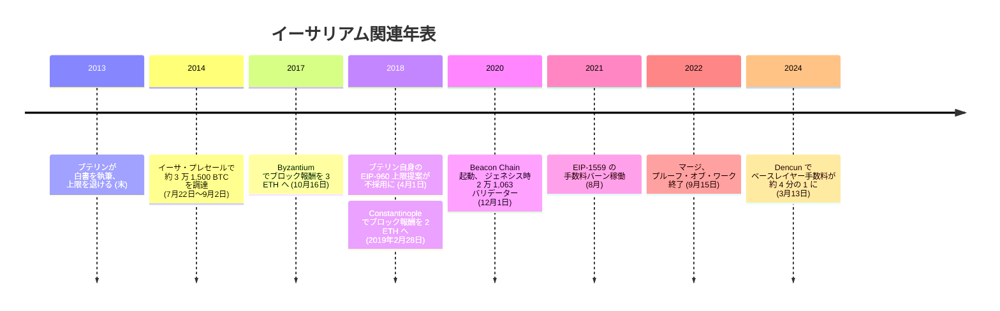

<!-- audit:quote-skip -->
> 「ETH の総量に上限を設けることで合意しようと提案する。」

2018 年 4 月 1 日、[ヴィタリック・ブテリン](/BitcoinArchive/ja/participants/vitalik-buterin/)は GitHub にそう書き出す提案を投稿した。イーサリアムの総発行量を 120,204,432 ETH に固定する EIP-960 である。プレセール発行量のちょうど 2 倍にあたるこの数字を書いたのは、4 年前に「上限つき供給ではなく」を選んだ、その白書の著者自身である。提案は採用されず、issue は stale として閉じられている。日付はエイプリルフールに当たるが、issue 本文はハードフォークに必要な報酬単位の計算をブロック単位で正確に詰めており、冗談めいた気配はどこにもない。

白書が退けた上限を、白書の著者自身が一度は提案し直した。この往復こそが、イーサリアムの通貨設計を読む出発点になる。上限のない発行、使用量に応じて燃え尽きる手数料、採掘から検証への合意形成の乗り換え。[アルトコインの数と設計の比較](/BitcoinArchive/ja/entries/analysis/2026-07-26-altcoin-count-and-design-comparison/)は 12 チェーンの中でイーサリアムだけを「動的、市場媒介」の列に置くが、その列の中身がどう動くかは、この一覧には書かれていない。

## 白書が語る自己像

<!-- audit:quote-skip -->
> 「彼らがやろうとしていた方法はやや見当外れだと感じるようになった... そこで、ビットコインを拡張してあらゆることをやらせようとするのではなく、最初から汎用的なスクリプト言語を備えた、まったく新しい基盤が必要だと判断した。」

2013 年末、当時 19 歳だったブテリンは白書の序文でこう記した。『Bitcoin Magazine』の主筆としてビットコインのスクリプト言語の限界を 2 年近く論じ続けた末の結論である。表題の `Ethereum: A Next-Generation Smart Contract and Decentralized Application Platform` は、次世代のスマートコントラクトと分散アプリケーションの基盤を意味する。

供給についても、白書は同じ調子で自らの立場をビットコインと並べて書いている。

<!-- audit:quote-skip -->
> 「恒久的な線形供給の増加モデルは、ビットコインで過度と見られる富の集中を和らげ、現在と将来のいずれの時代に生きる個人にも通貨単位を手に入れる公平な機会を与える。同時に、供給の増加率は年々ゼロに近づいていくため、イーサを取得し保有する強い動機は保たれる。」

上限を設けない選択は、後年の方針転換ではなく最初の設計文書に書かれていた。

## 発行設計の仕組み：上限のない供給と EIP-1559 のバーン

上限を設けない代わりに、イーサリアムの発行は 3 度書き換えられている。ローンチ時のプルーフ・オブ・ワーク下では、ブロック報酬はブロックあたり 5 ETH の固定額だった。2017 年 10 月 16 日のハードフォーク Byzantium で 3 ETH に（EIP-649）、2019 年 2 月 28 日の Constantinople で 2 ETH に（EIP-1234）、それぞれ切り下げられている。いずれの EIP も、新しい報酬額をフォークブロック以降に適用される定数として書いており、ネットワークの状態を示す値には紐付けていない。

2021 年 8 月、EIP-1559 がこの発行の隣にもう一つの力を置いた。トランザクションの手数料を「基本手数料」と「優先手数料（チップ）」の 2 つに分け、基本手数料をバリデーターに支払うのではなく焼却する仕組みである。基本手数料は固定額ではない。直前のブロックが目標のガス使用量（ブロック上限の半分）を上回れば上がり、下回れば下がる。1 ブロックあたりの変動幅は最大 8 分の 1 に抑えられており、利用者が次のブロックの手数料をおおむね予測できるよう設計されている。優先手数料だけがバリデーターの取り分として残る。

発行が増やす分と、バーンが減らす分。この 2 つの綱引きの結果として、供給は増えることも減ることもある。増え続けながらいずれゼロに漸近するビットコインのカーブとは、対照的な形だ。

## コンセンサスの転換：プルーフ・オブ・ワークからステークへ

2020 年 12 月 1 日、イーサリアムはメインネットとは別に、新しい合意形成の仕組みだけを走らせるチェーン、Beacon Chain を立ち上げた。32 ETH をステークした 2 万 1,063 のバリデーターを起点とし、プルーフ・オブ・ステークの検証ロジックだけを 2 年近く実地で試す期間が置かれた。

2022 年 9 月 15 日、マージがこの並走を終わらせた。残高とコントラクトの状態を保持してきた旧来の実行層（プルーフ・オブ・ワーク側）と、Beacon Chain の合意層が一つに結合され、ブロックを掘るマイナーはその日を境に検証するバリデーターに置き換わった。採掘によるブロック報酬はゼロになり、代わってバリデーターへの報酬が新規発行の全量を占めるようになった。

合意の決め方そのものも変わった。チェーンの先頭を選ぶ規則は LMD-GHOST（各バリデーターの最新の投票だけを数え、最も重い履歴を持つ分岐を選ぶ）、確定性を与える規則は Casper FFG（32 スロット・約 6.4 分ごとの「エポック」を単位に、連続する 2 つのチェックポイントが全ステークの 3 分の 2 以上の賛成票を得ると、前のチェックポイントが確定する）。合わせて Gasper と呼ばれるこの二重の仕組みは、チェーンの確定を覆すには全ステークの 3 分の 1 を握る必要がある、という前提の上に立つ。

この乗り換えは発行の量も変えた。採掘時代の新規発行は日量約 13,000 ETH、マージ後のバリデーター報酬は日量約 1,700 ETH で、およそ 88% の減少である。EIP-1559 のバーンと組み合わさり、マージ直後の高稼働期には、燃やされる ETH が新規発行を上回る日が続いた。供給は縮んだ。

その縮小は長く続かなかった。2024 年 3 月 13 日のアップグレード Dencun（EIP-4844、レイヤー 2 向けの安価なデータ領域を新設）が、手数料の主戦場をメインネットからロールアップへ移した。手数料はおよそ 4 分の 1 に下がり、燃やされる ETH も同じだけ細った。2024 年 4 月以降、供給は 2022 年以来もっとも速いペースで増加に転じている。上限を設けない発行が、使用量ひとつでこれだけ向きを変える。その振れ幅こそが、イーサリアムの供給設計の実体だ。

## 統治と初期配分：財団、プレセール、現役の創業者

2014 年 7 月 22 日から 9 月 2 日までの 42 日間、イーサリアムは 6,000 万 ETH を売るクラウドセールを行った。価格は開始 2 週間の 1 BTC = 2,000 ETH から終了時の 1 BTC = 1,337 ETH まで段階的に切り下げられ、約 3 万 1,500 BTC（当時のレートで約 1,830 万米ドル）を集めた。売却分とは別に、調達額の 9.9 パーセントにあたる 590 万 ETH が 83 人の初期貢献者に、同額の 590 万 ETH が財団に割り当てられ、ローンチ時点の総供給量は 7,200 万 ETH となった。ブテリン自身の取り分は約 55.3 万 ETH で、初期貢献者への割当のうち最大である。

[ビットコインの構造的特徴の分析](/BitcoinArchive/ja/entries/analysis/2008-10-31-bitcoin-digital-gold-structural-features/)が「人・組織の分散化」と呼ぶ層で、イーサリアムはビットコインと対をなす形を取る。ブテリンは現在も一貫して公に活動し、イーサリアム財団はイーサリアム改善提案（EIP）の審査を通じてプロトコルの改定手続きを差配する。プレセールで生まれた財団という当事者も、発言がロードマップを動かし続ける創業者も、サトシの離脱後のビットコインには存在しない。

## ブテリンが名指しで語るビットコイン

2021 年 5 月、香港で開かれた StartmeupHK フェスティバルで、ブテリンはビットコインのプルーフ・オブ・ワークについて問われ、自らのチェーンの転換を答えとして示した。

<!-- audit:quote-skip -->
> 「プルーフ・オブ・ステークは、ビットコインの環境問題への解決策だ ― 維持に必要な資源がはるかに少ない。」

イーサリアム財団は移行が成功すればエネルギー消費を最大 99.95 パーセント削減できると事前に見積もり、実際の乗り換え（2022 年 9 月 15 日）後もその見積もりに近い削減が確認された。

ビットコインの発行方式そのものへの評価としては、本稿冒頭で見た「恒久的な線形供給」という白書の一節が最も直接的だ。上限つき供給を「ビットコインで過度と見られる富の集中」という言い方で名指し、その集中を避けることを自らの発行モデルの理由に挙げている。ビットコインを名指しで論じるとき、ブテリンが繰り返し戻ってくるのは、プルーフ・オブ・ワークの資源消費と、供給に上限を置く設計という 2 点であり、いずれについても、彼はイーサリアムを反対方向に設計することで答えている。

イーサリアムの上限のない供給を、ビットコインおよび他 10 通貨と同じ指数チャートで並べる。

<!-- chart: supply-curve-comparison -->

## ビットコインにおける意義

イーサリアムがビットコインにとって意味を持つのは、離れた場所で別の答えを出したからではない。供給を誰がどう決めるか、合意をどう作るか、創業者はどこにいるべきか、という同じ問いに、ほぼ正反対の答えを出し、しかもその答えを 11 年間、実地で運用してきたからだ。[固定供給 vs 自動調整通貨の分析](/BitcoinArchive/ja/entries/analysis/2008-10-31-fixed-supply-vs-adjustable-money/)が記すとおり、上限を退けて使用量に発行を連動させる設計は、2022 年には供給の縮小に振れ、2024 年には再び増加に転じた。半減という固定スケジュール以外のいかなる状態にも応答しないビットコインの 2100 万枚とは、対照的な挙動である。

[アルトコインの数と設計の比較](/BitcoinArchive/ja/entries/analysis/2026-07-26-altcoin-count-and-design-comparison/)が挙げる「システムの分散化」「人・組織の分散化」「フェアローンチ」「創業者の離脱」「固定供給」「先発者優位」の 6 特徴のうち、イーサリアムが成立させているのはシステムの分散化ひとつだけだ。財団があり、創業者は現役で、プレセールがあり、上限もない。ビットコインの「デジタルゴールド」という立場が単一の技術ではなく複数の性質の同時成立に支えられているという[構造的特徴の分析](/BitcoinArchive/ja/entries/analysis/2008-10-31-bitcoin-digital-gold-structural-features/)の主張は、イーサリアムという最も長く運用された対照例によって裏づけられている。
