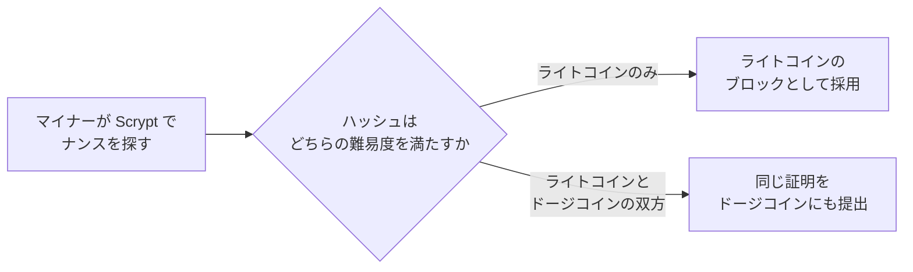
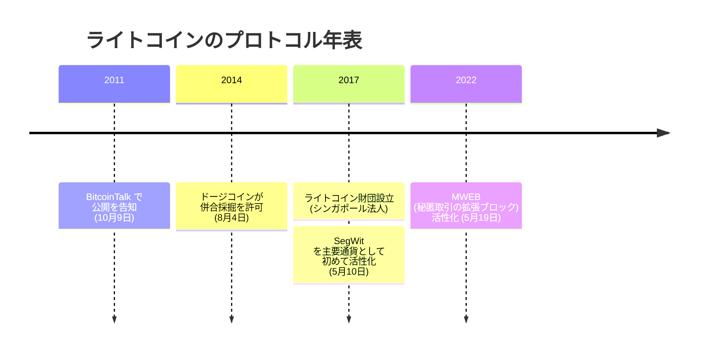

2011 年 10 月 9 日、チャーリー・リーは BitcoinTalk への投稿でライトコインの公開を告げ、変更点を自ら一行に絞っていた。

<!-- audit:quote-skip -->
> ライトコインの目標の一つは、正当な理由がない限り、（ビットコインで）動いているものを変えないことである。

この宣言をそのまま数えると、実際に変わった値は四つしかない。プルーフ・オブ・ワークの関数、ブロック間隔、供給上限、半減間隔の四つだ。このうち三つは、ビットコインの数値をちょうど 4 倍か 4 分の 1 にしただけの値であり、残る一つ、プルーフ・オブ・ワークの関数だけは、数値ではなく仕組みそのものを丸ごと入れ替えている。

## 変わったのは四つだけ

| 設定値 | ビットコイン | ライトコイン | 倍率 |
|---|---|---|---|
| プルーフ・オブ・ワーク | SHA-256 | Scrypt | 数値ではなく関数そのものを置換 |
| ブロック間隔 | 10 分 | 2.5 分 | 4 分の 1 |
| 供給上限 | 2,100 万枚 | 8,400 万枚 | 4 倍 |
| 半減間隔 | 210,000 ブロック | 840,000 ブロック | 4 倍 |

ブロック間隔を 4 分の 1 にしながら、半減までのブロック数を 4 倍にすると、二つの倍率はちょうど打ち消し合う。ビットコインは 21 万ブロック × 10 分でおよそ 210 万分、ライトコインは 84 万ブロック × 2.5 分で同じくおよそ 210 万分になる。どちらも初回の半減までおよそ 4 年である。ブロックが 4 倍の速さで生まれても、暦の上での半減のリズムはビットコインと寸分違わない。ブロックあたりの新規発行も、ビットコインと同じ 50 枚から始まる。ブロック生成の速さだけを変え、貨幣の増え方の形そのものは複製した。[固定供給の比較](/BitcoinArchive/ja/entries/analysis/2008-10-31-fixed-supply-vs-adjustable-money/)が並べる 15 通貨の中でも、ライトコインは規模だけを変えて上限つきの側にそのまま残った一例である。

ただし、四つの変更点の外側に、比率で動いていない値が一つ残っている。難易度の再調整幅は 2,016 ブロックごとで、ビットコインの値がそのまま据え置かれた。ブロックが 4 倍の速さで生まれる以上、再調整の周期はおよそ 3.5 日に縮む。ビットコインの再調整はおよそ 2 週間に一度で、ライトコインはその 4 倍の頻度でハッシュレートの変化に追随している。

## Scrypt の誤算と、併合採掘が生まれた理由

プルーフ・オブ・ワークの関数を丸ごと入れ替えた理由を、リーは同じ投稿でこう説明している。

<!-- audit:quote-skip -->
> 我々は Tenebrix の Scrypt プルーフ・オブ・ワークをとても気に入った。Scrypt を使えば、ビットコインを採掘しながらライトコインも採掘できる。

Scrypt は、単なるハッシュ関数ではない。FreeBSD 開発者コリン・パーシバルが 2009 年、バックアップサービス Tarsnap 向けに設計した鍵導出関数がその正体で、ライトコインが採用したパラメーターは `N=1024`、`r=1`、`p=1` である。この設定では、1 回のハッシュ試行のたびに約 128 キロバイトの作業領域をメモリー上に確保し、その領域を繰り返し読み書きしながら答えを導く。SHA-256 は純粋な計算の速さで殴れる関数で、専用回路に焼き付ければ汎用の CPU の何百倍もの速度が出る。Scrypt はそこにメモリーという制約を足した。計算を速くしても、メモリーへのアクセスがボトルネックになる設計なら専用チップを作る優位性は薄まるという見立てだった。

この見立ては長くは続かなかった。ライトコインが選んだ 128 キロバイトという作業領域は、メモリーの中でも小さな部類で、専用チップに載せる余地は十分にあった。2014 年以降、Scrypt 専用の採掘機が市場に出回り、ライトコインの採掘もビットコインと同じく専用機の世界になった。Bitmain を率いた[ジハン・ウー](/BitcoinArchive/ja/participants/jihan-wu/)の記録が、採掘機の側からこの過程を追っている。

Scrypt を共有するという選択は、思わぬところで別の意味を持つことになった。[ドージコイン](/BitcoinArchive/ja/entries/aftermath/2013-12-06-dogecoin-launch/)は 2013 年 12 月、ライトコインのコードをそのまま流用して生まれたチェーンで、同じ Scrypt を使っていた。だが単独のハッシュレートは薄く、悪意あるマイナーがチェーンを乗っ取る 51% 攻撃への耐性が乏しかった。2014 年 8 月、ドージコインの開発陣は AuxPoW（併合採掘を可能にする補助的な証明の仕組み）を使い、ライトコインとの併合採掘を許可すると発表した。

仕組みは単純だ。マイナーはライトコインのブロックへ向けてナンスを探す作業をそのまま続ける。見つかったハッシュがライトコインの難易度を満たしていれば通常どおりライトコインのブロックになるが、同じハッシュがドージコインのより低い難易度も満たしていれば、追加の計算を一切せずに、その証明はドージコインのブロックとしても提出できる。以来、ドージコインのハッシュレートはライトコインのそれと連動して動くようになった。

## 統治と分配 — 財団はあっても、決めるのは協力者

プロトコルの決定権を握る単一の主体は、ライトコインにも存在しない。2017 年、リーは Coinbase の技術部門ディレクター職を退き、同年シンガポールで法人登記された非営利団体ライトコイン財団の運営に専念した。財団の役割は開発への資金提供と普及であって、プロトコルそのものを一存で書き換える権限ではない。[アルトコイン横断比較](/BitcoinArchive/ja/entries/analysis/2026-07-26-altcoin-count-and-design-comparison/)がライトコインの統治を「寄稿者。創設者は公に活動中」と位置づけるのは、資金を出す主体とコードを書く主体が分かれているこの構造を指している。

その低い温度の統治構造が実際に動いたのが、2017 年 5 月 10 日、ブロック高 1,201,536 で活性化した SegWit（分離署名）である。署名データを取引データから切り離して実質的な処理容量を増やすこの変更は、主要な暗号通貨としては初めての採用例だった。同じ年の 8 月にビットコイン本体が同じ変更を採用する前に、ライトコインで先に実地試験を終えたことになる。

台帳そのものは、2011 年の公開から一貫して透明なままだ。唯一の例外が 2022 年 5 月 19 日、ブロック高 2,257,920 で活性化した MWEB（取引の金額と送受信先を隠せる、選択制の拡張ブロック）である。資産を任意でこの拡張ブロックへ移す仕組みで、参加は選択制にとどまる。既定の台帳が透明であることに変わりはない。この機能が守るプライバシーについて、リー自身の言い方はいつもどおり控えめだった。

<!-- audit:quote-skip -->
> たいていの人には、それで十分だ。ガラス張りの家に住むか、窓のある家に住むかの違いに過ぎない。

## リーが語り続けたビットコイン

ビットコインについて、リーは一貫して同じ順位を口にしてきた。2018 年の取材では、自らの通貨を明確に二番手に置いている。

<!-- audit:quote-skip -->
> ビットコインは明らかにこの空間でもっとも健全な貨幣であり、ライトコインは、私が言うなら二番目に健全だ。

2025 年の取材では、両者の関係をこう言い換えた。

<!-- audit:quote-skip -->
> ビットコインは王のための通貨、ライトコインは民のための通貨だ。

その順位づけは、2017 年 12 月 20 日の決定と矛盾しない。リーはこの日、自身のライトコイン保有をすべて売却または寄付したと公表し、理由を利益ではなく自分の発言の重みに置いた。

<!-- audit:quote-skip -->
> 私が LTC を空売りしていると考える人さえいる。だからある意味で、LTC を持ちながらそれについて発言するのは利益相反なのだ。私はそれほどの影響力を持ってしまっている。

自分が作った通貨について語る資格を、リーは保有を手放すことで自ら制限した。ビットコインについては、その制限を課さないまま語り続けている。

ライトコインの供給推移を、ビットコインおよび他 10 通貨と同じ指数チャートで並べる。

<!-- chart: supply-curve-comparison -->

## ビットコインにとっての意味

ライトコインが示しているのは、ビットコインの設定値が物理法則ではなく選択だったという事実だ。ブロック間隔も、供給上限も、半減の間隔も、4 倍・4 分の 1 という一定の比率で動かしてなお、内部で矛盾なく機能する通貨は作れる。[ビットコインの構造的特徴](/BitcoinArchive/ja/entries/analysis/2008-10-31-bitcoin-digital-gold-structural-features/)が数え上げる六つの特徴のうち、公平な立ち上がりと固定供給の二つを、ライトコインはそのまま引き継いだ。

引き継げなかったのは、残る特徴、創設者の不在である。サトシは 2011 年を境に消え、二度と語らなかった。リーは残り、10 年以上にわたってビットコインについて語り続けている。その語り続けた当人が 2017 年、自分の発言が持つ影響力を理由に保有だけを手放すという決定をした。プロトコルを書き換える権限を最初から持たない設計と、コインを持たないと自ら決めた創設者。サトシの不在が沈黙によって成立した条件だとすれば、リーが試みたのは、語りながら関与だけを断つという、別の道筋からの接近だった。
