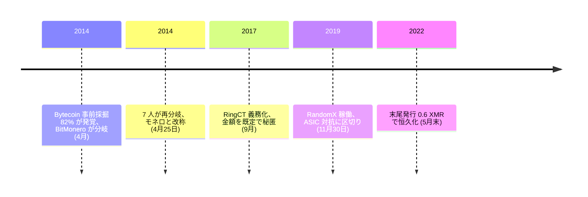

<!-- audit:quote-skip -->
> 実際のところ、コインの 82% は「公開」前にすでに採掘されていた。仮に悪意なく事前採掘されたのだとしても、コインの 82% が、正体も所在も見えない者たちの手にあるという事実は変わらない。

2014 年、後にモネロの主任保守者となるリカルド・スパーニはこう書いた。名指しした相手は Bytecoin だ。CryptoNote 方式を最初に実装した通貨で、供給 1,840 億 BCN のうち 1,510 億枚が、外部にその存在を知られる前にすでに掘り尽くされていた。

掲示板の一投稿者 thankful_for_today は 4 月 9 日にこの分岐を発表し、4 月 18 日に BitMonero を起動する。事前採掘は一枚もなかった。だが起動からわずか 7 日後の 4 月 25 日、当の thankful_for_today 自身が非協力的だとしてコミュニティに見限られ、7 人の開発者があらためて分岐させ、名前から bit を落としてモネロと改めた。[アルトコインの数と設計の比較](/BitcoinArchive/ja/entries/analysis/2026-07-26-altcoin-count-and-design-comparison/)がこの通貨を分配と統治の軸でビットコインにもっとも近い行に置くのは、偶然ではない。だがモネロが選び直したのは分配だけではない。台帳の見え方と、発行がいつか止まるかどうかという二点で、モネロはビットコインと正反対の答えを出している。

## CryptoNote 技術文書が語る自己像

モネロが実装する CryptoNote の技術文書は、ビットコインの何を問題として名指ししているかを隠さない。電子現金の条件を二つ挙げ、ビットコインは片方を満たさないと明言する。

<!-- audit:quote-skip -->
> 追跡不能性 — 受け取った各取引について、送り手となりうる者はすべて等確率であること。連結不能性 — 送出された任意の二つの取引について、それらが同じ相手に送られたと証明できないこと。……残念ながら、ビットコインは追跡不能性の要件を満たさない。

もう一つの異議は採掘に向けられており、サトシ自身の言い回しをネットワークに突き返している。

<!-- audit:quote-skip -->
> したがってビットコインは、参加者の投票力に大きな開きが生じる条件を作り出している。GPU や専用機の保有者は CPU の保有者よりはるかに大きな投票力を持つのだから、「1 CPU につき 1 票」の原則を破っているからである。

この二つの異議は、この文書の中で終わらない。前者はリング署名とステルスアドレスという具体的な仕組みに、後者は RandomX という具体的な演算方式に、それぞれ後年のコードとして実装されることになる。

## 台帳を秘匿する仕組み — リング署名・ステルスアドレス・RingCT

| 技術 | 隠す対象 | 導入時期 |
|---|---|---|
| リング署名 | 送り手 | 発足時から |
| ステルスアドレス | 受け取り手 | 発足時から |
| RingCT | 金額 | 2017 年 1 月導入、同年 9 月に義務化 |
| Bulletproofs | 金額証明のデータ量 | 2018 年 10 月、取引サイズを約 8 割削減 |

送金者が実際に使う出力は、過去のブロックから無作為に選んだ他人の出力と一つの環にまとめられる。リングサイズはかつて送金者が自由に選べたが、小さいリングサイズの取引自体が目立つ痕跡になっていたため、2018 年 10 月の Bulletproofs 導入と同時に固定値 (11) へ変えられた。その値は 2022 年 8 月の「Fluorine Fermi」ハードフォークでさらに引き上げられ、現在のリングサイズは 16、内訳は本物 1 個とおとり 15 個だ。署名は「この環の中の誰か一人が送金者である」ことだけを数学的に証明し、どれが本物かは示さない。ノードは環全体を検証しなければならず、外部の観測者にとって本物とおとりは見分けがつかない。

受け取り手の秘匿はまた別の仕組みだ。受信者は公開鍵を二つ (view 鍵と spend 鍵) 持つアドレスを一つだけ公開する。送金者は乱数を一つ生成し、ディフィー・ヘルマン鍵交換と同じ原理を使って、その取引専用の使い捨てアドレスを毎回新しく計算する。受信者は自分の秘密鍵を使ってその使い捨てアドレス宛の資金を発見できるが、外部からは、同じ相手への複数回の支払いであっても、宛先が毎回別人に見える。

金額を隠す仕組みは後から加わった。2017 年 1 月に導入され同年 9 月に義務化された RingCT は、取引の金額をチェーン上から消す。金額を隠したまま「入力の合計と出力の合計が一致する」ことを証明する必要があるため、この証明にはデータ量がかかる。2018 年 10 月に導入された Bulletproofs はこの証明の方式を差し替え、典型的な取引でおよそ 8 割のサイズ削減を実現した。

## 採掘の仕組み — RandomX という消耗戦の終着点

CryptoNote の技術文書がビットコインの採掘に向けた異議を、モネロは一度で解決してはいない。発足時に採用した CryptoNight は、メモリーを大量に使うことで専用回路の優位性を薄める設計だったが、2018 年前後には専用の採掘機が実際に市場へ現れ始めた。モネロの対応は、アルゴリズムの細部を書き換えるハードフォークをおよそ半年ごとに実施し、そのたびに新顔の専用機を型落ちにするという消耗戦だった。

2019 年 11 月 30 日、ブロック高 1,978,433 でこの消耗戦に区切りをつけたのが RandomX である。あらかじめ固定された演算手順を並べるのではなく、ブロックごとにランダムなプログラムをその場で生成し実行する。整数演算・浮動小数点演算・分岐命令を織り交ぜた命令列であり、約 2 ギガバイトのデータセットを読み書きしながら答えを導く。このデータセットは 2,048 ブロック (およそ 2.8 日) ごとに丸ごと作り直される。汎用の CPU はこの一連の命令をそのまま実行できるが、演算の形そのものが絶えず変わる以上、特定の回路へ焼き付けて高速化する余地は薄い。導入前には Trail of Bits・QuarksLab・Kudelski Security・X41 D-Sec の 4 社による 4 か月の監査を経ている。

## 発行設計 — 上限ではなく終わらない末尾発行

| 項目 | ビットコイン | モネロ |
|---|---|---|
| 発行の減り方 | 21 万ブロックごとに半分へ (階段状) | 1 ブロックごとに、残り供給に比例してなめらかに減衰 |
| 上限の性質 | 2,100 万枚。設計者が選んだ丸い数字 | 約 1,844 万 6,744 枚。整数型の選択が生んだ副産物 |
| 発行の終着点 | 2140 年頃にゼロへ | 2022 年 5 月末、0.6 XMR/ブロックで下げ止まり恒久化 |

モネロのブロック報酬は、(供給の上限定数 − すでに生成された枚数) を 2 の 20 乗で割った値として計算される。ビットコインが 21 万ブロックごとに階段状へ半分に落ちるのに対し、この式は 1 ブロックごとに、残りの供給へ比例してなめらかに減っていく連続関数だ。CryptoNote の技術文書は、ビットコインの半減をこう批判していた。

<!-- audit:quote-skip -->
> 当初の意図は指数的に減衰するなめらかな発行だったが、実際にあるのは区分線形の発行関数であり、その折れ点はビットコインの基盤に問題を起こしうる。

この式が使う供給の上限定数は、偶然の数字ではない。コードに書かれた値は 2 の 64 乗から 1 を引いた 18,446,744,073,709,551,615、すなわち 64 ビット符号なし整数が表現できる最大値である。モネロの最小単位 (1 XMR の 1 兆分の 1) で割ると、およそ 1,844 万 6,744 XMR に相当する。ビットコインの 2,100 万枚が設計者の選んだ目標であるのに対し、モネロのこの数字は目標として選ばれてすらいない。整数型をどう選ぶかという実装上の決定が、後から供給の天井として現れただけだ。

計算結果が 1 分あたり 0.3 XMR (2 分のブロック時間で 0.6 XMR) を下回った時点で、コードは減衰の計算をやめてこの値に固定する。2022 年 5 月末、モネロはこの下限に達し、以後 1 ブロックあたり 0.6 XMR の発行が恒久的に続く。発行がゼロへ近づくビットコインと違い、モネロの供給は増え続ける。年率にしておよそ 1% の、終わりのない希釈だ。

## 統治と分配 — 財団を持たない資金調達

モネロの立ち上がりに事前採掘はなく、会社も最高経営責任者も存在しない。thankful_for_today は改称後まもなく姿を消し、二度と表に出ていない。その点はサトシの離脱と同じ形に見える。だが違いも一つある。ビットコインには離脱後の後継者がいない一方、モネロの分岐に加わった開発者の一部、中でもスパーニは、その後十年近く公にプロジェクトを代表し続けた。創設者不在という一点は完全には一致しない。

開発資金の集め方にも、単一の資金提供者は存在しない。Community Crowdfunding System (CCS) と呼ばれる仕組みでは、誰でも開発提案を公開の場に投稿でき、資金は寄付として預託され、定めた作業の完了ごとに支払われる。サーバー代や雑務など基礎的な支出は別枠の General Fund が受け持つ。財団の理事会が予算を決めるのではなく、提案ごとに公開の場で資金が集まるかどうかが決める。プロトコルの権限を握る単一の組織が存在しないという、[アルトコイン横断比較](/BitcoinArchive/ja/entries/analysis/2026-07-26-altcoin-count-and-design-comparison/)の位置づけを支える具体的な仕組みである。

## スパーニが名指ししたビットコイン

[リカルド・スパーニ](/BitcoinArchive/ja/participants/riccardo-spagni/)は、ビットコインが失敗したとは考えていない。ビットコインの透明性は帰結を伴う性質であり、その帰結の一つがモネロだとみている。

<!-- audit:quote-skip -->
> ビットコインが匿名ではないと判明した以上、モネロには大きく明白な用途がある。

その透明性は、もう一つ別の帰結も持つとスパーニは指摘する。供給が監査できるという主張は、ビットコインの歴史の中ですでに実地に試されている。

<!-- audit:quote-skip -->
> 結局のところ、ビットコインも監査可能性の危険から免れてはいない。それは、ビットコインに明白な増発バグが二件あったことから分かる。一件目は 2010 年に実際に悪用され、誰かが数十億ビットコインを作り出した……二件目はもう少し厄介で、2018 年の CVE、取引出力の二重支払いにあたるものだ。

[2010 年のバリュー・オーバーフロー事件](/BitcoinArchive/ja/entries/aftermath/2010-08-15-value-overflow-incident/)は本番のチェーン上で実際に悪用され、[CVE-2018-17144](/BitcoinArchive/ja/entries/analysis/2010-08-15-overflow-incident-structure-and-paradox/) は調整された開示の中で悪用される前に見つかっている。どちらもこのアーカイブの記録にあり、彼の主張の前半は支持され、後半には条件が付く。透明な供給は原理として監査できるが、バグが存在しないことの保証にはならない。ただし二件を発見可能にしたのも、その同じ透明性だった。[リカルド・スパーニの記録](/BitcoinArchive/ja/participants/riccardo-spagni/)がこの主張をより詳しく検証している。

モネロの末尾発行を、ビットコインおよび他 10 通貨と同じ指数チャートで並べる。

<!-- chart: supply-curve-comparison -->

## ビットコインにとっての意味

モネロは[フォークと隣接通貨の系譜](/BitcoinArchive/ja/entries/analysis/2008-10-31-bitcoin-fork-and-altcoin-genealogy/)がたどる血統の外にある。CryptoNote のリング署名はビットコインのコードから独立している。それでもモネロが比較の対象になるのは、[ビットコインの構造的特徴](/BitcoinArchive/ja/entries/analysis/2008-10-31-bitcoin-digital-gold-structural-features/)が挙げるフェアローンチとシステムの脱中央集権を、モネロがビットコインと同じ形で満たしているからだ。事前採掘はなく、供給を握る単一の組織もない。

その一致の上で、モネロは二つの点だけ、意図してビットコインと逆の答えを選んだ。台帳は読めるべきか、隠すべきか。発行はいつか止まるべきか、止まらないべきか。前者の答えの違いは、ビットコインの二つの増発バグという形ですでに試された。読める台帳だからこそ見つかった不具合だ。後者の答えの違いは、まだ試されていない。2,100 万枚という設計者の選んだ天井と、64 ビット整数の副産物として現れた約 1,844 万 6,744 枚という天井では、生まれ方が違う。片方は意図して選ばれ、もう片方は選ばれてすらいない。この対比こそが、モネロという通貨がビットコインの記録に加わる理由である。
