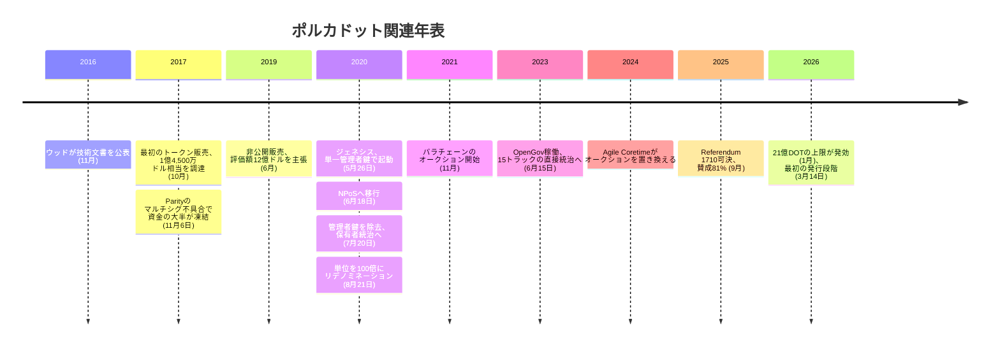

2016 年 11 月、ギャヴィン・ウッドは自らの技術文書にこう書いた。

<!-- audit:quote-skip -->
> トークン保有者の集団が最終的な正当性を保持し、超多数決によってこの仕組みを補強・再設定・置換・解体できるようにする。いずれ必要になることを疑っていない ― マーク・トウェインの言葉として、「政府もおむつも、頻繁に取り替える必要がある。理由は同じだ」。

技術文書の題は『Polkadot: Vision for a Heterogeneous Multi-Chain Framework』(異種混在の多重チェーンに向けた構想)。ウッドが「いずれ必要になる」と書いた取り替えの矛先が、9 年後に自分自身の書いた発行規則へ向くとは、この一文からは読み取れない。2025 年 9 月、ポルカドットのトークン保有者は 81% の賛成で Referendum 1710 を可決し、ウッド自身が技術文書に書いた「年およそ 10%」の無期限発行目標を廃して、供給に 21 億 DOT の上限を課した。

## 白書が名指しした「五つの失敗」

技術文書の要旨はこう書き出される。

<!-- audit:quote-skip -->
> 現在のブロックチェーン設計はどれも、拡張のしやすさとスケーラビリティに関わる実務上の課題を抱えている。原因は、合意形成の仕組みの中でも特に重要な二つの要素 ― 正史性 (canonicality) と妥当性 (validity) ― を密結合させすぎたことにあると、我々は考える。

ウッドが序文で挙げる既存技術の失敗は、スケーラビリティ、分離性、開発のしやすさ、統治、適用可能性の五つ。このうち技術文書が実際に取り組むと明言するのは最初の二つだけだ。スケーラビリティの具体例として、技術文書はビットコインとイーサリアムを名指しする。Parity が実装したイーサリアムクライアントは、性能の高い一般的なハードウェア上で秒間 3,000 件を超える取引を処理できるが、実際に稼働しているブロックチェーンの多くは秒間 30 件程度に留まる。技術文書はこの落差の原因を、合意形成の仕組みそのものに求める。

技術文書が示す答えは、単一のチェーンを増強することではなく、チェーンを分割することだった。中心に「リレーチェーン」と呼ぶ土台を置いて検証だけを担わせ、個々のアプリケーションは「パラチェーン」としてそこにぶら下がる。技術文書自身の言葉を借りれば、ポルカドットは「イーサリアム、イーサリアム・クラシック、ネームコイン、ビットコインを含む集合」と機能的には等価だが、二点だけ違う。共有された安全性と、相互に信頼を必要としないチェーン間取引だ。ビットコインは、この構想の中で「変える対象」としてではなく「並べる対象の一つ」として名指しされている。

## リレーチェーンと四つの役割

技術文書が定めた参加者は四種。バリデーターはリレーチェーンのクライアントを動かし、ブロックを検証・確定する最高位の担い手。ノミネーターはバリデーターの保証金に自分のトークンを預けて信頼を示すだけの存在で、技術文書自身が「現行のプルーフ・オブ・ワークにおけるマイナーに近い」と位置づけている。コレーターは個々のパラチェーンの完全ノードを維持し、検証すべきブロック候補をバリデーターへ差し出す。フィッシャーマンは、バリデーターの二重署名や不正なブロックの承認を見つけ出した者に一度きりの報酬を払う、独立した「賞金稼ぎ」だ。この四者を組み合わせた選出方式に、技術文書は指名式プルーフ・オブ・ステーク (NPoS) という名前を与えている。

実際に動き出した仕組みは、この設計をさらに時間で区切っている。6 秒に 1 回の「スロット」が積み重なって 4 時間の「セッション」を作り、セッションが 6 回積み重なって 24 時間の「エラ」を作る。バリデーターの入れ替えはエラの区切りごとに起こり、ブロックの生成は BABE、確定は GRANDPA という別々の仕組みが担う。生成と確定を分けることで、ブロックを積む速さと、覆せなくする速さの両方を別々に追える設計になっている。

パラチェーンがリレーチェーンに接続する権利も、当初と今とでは仕組みが違う。2021 年 11 月から 2024 年にかけては、最長 96 週間のリース権を DOT の担保付きオークションで競り落とす方式だった。担保に回した DOT は新規発行にも取引にも使えないまま固定される。2024 年に始まった Agile Coretime はこの担保をまるごと外し、パラチェーン側はリレーチェーンの実行時間そのものを月極めか都度払いで購入する。参入の代償は、ロックされた資本から使った分だけの支払いへ置き換わった。

| 項目 | ビットコイン | ポルカドット |
|---|---|---|
| 合意形成の参加者 | 電気代を払える者なら誰でも参加できるマイナー | 枠の限られたバリデーターと、それを支えるノミネーター |
| ブロックの生成と確定 | 最長チェーンという一つの規則が両方を兼ねる | BABE (生成) と GRANDPA (確定) が分かれている |
| チェーンの数 | 単一のチェーン | リレーチェーン 1 本と、そこにぶら下がる複数のパラチェーン |
| 新規チェーンの参加費用 | 存在しない (単一チェーンのため) | 2024 年以前は DOT の担保付きオークション、以後は実行時間の購入 |
| 発行規則を変える主体 | 存在しない | トークン保有者の投票 (OpenGov) |

## 発行の設計 — 「およそ 10%」から投票による上限へ

技術文書自身が、発行の設計をこう書いていた。

<!-- audit:quote-skip -->
> トークン基盤の拡張によって得られる資金は、年率にして最大 100%、ただしより現実的にはおよそ 10% 程度になるだろう。

上限を設けない代わりに、発行率そのものにゆるやかな目標を持たせる。これがウッドの原案だった。2020 年 5 月 26 日、この設計は稼働を始める。ただし最初の姿は、ウッドが書いた「トークン保有者の集団による統治」とは程遠い。ジェネシスブロックは、単一の管理者鍵 (Sudo) が全権を握るプルーフ・オブ・オーソリティのネットワークとして立ち上がった。6 月 18 日に NPoS へ移行し、7 月 20 日に Sudo モジュールが取り除かれて統治は初めて DOT 保有者の手に渡る。8 月 18 日に送金機能が有効になり、その 3 日後の 8 月 21 日、保有者は自らの投票で通貨単位そのものを 100 倍に切り直した。賛成は 86%、Web3 財団と Parity は棄権している。

その後の数年間、発行は年およそ 1 億 2,000 万 DOT という固定の枚数で続いた。ウッドが「およそ 10%」と書いた目標は、ジェネシス直後の供給規模を基準にした比率であり、供給そのものが積み上がるにつれて、同じ枚数が占める割合は静かに下がっていった。2025 年 9 月時点で流通する DOT はおよそ 16 億枚。同じ 1 億 2,000 万枚の発行は、もはや 10% ではなく 8% に満たない比率まで薄まっていた計算になる。

その 2025 年 9 月、保有者は「Wish For Change」というトラックで Referendum 1710 を提出し、81% の賛成で可決した。この決定は無期限だった目標を廃し、供給に 21 億 DOT という上限を置く。上限までの歩みは半減期のような一度きりの操作ではなく、2 年ごとに残余供給 (21 億から既発行分を引いた分) の 13.14% を発行するという、段階を踏む形で組まれている。最初の段は 2026 年 3 月 14 日で、この日を境に、それまでの発行モデルに比べて新規発行はおよそ 53.6% 減る。上限そのものに完全に届く年は 2160 年と試算されており、ビットコインの 2,100 万枚が半減を重ねてゼロへ漸近するのと同じ形の、届かないまま近づいていく上限だ。

## 統治と初期配分 — 2017 年のセールから OpenGov へ

2017 年 10 月 14 日から 27 日にかけて、Web3 財団はポルカドットの最初のトークン販売を行い、当時の相場でおよそ 1 億 4,500 万ドル相当のイーサを集めた。売られたのは 1,000 万 DOT (リデノミネーション前の単位) のうち半分。ところがこの資金の三分の二近く、およそ 9,800 万ドル相当が、販売からわずか 10 日後の 11 月 6 日に消えかけている。ウッド自身が創業した Parity Technologies が提供するマルチシグウォレットの共有ライブラリーに欠陥があり、ある利用者がこのライブラリーを誤って削除したことで、500 を超えるウォレットに眠っていた資産がまとめて動かせなくなった。ポルカドットの資金はそのうちの一つに過ぎない。この穴を埋めるため、ポルカドットは 2019 年に改めて非公開販売を行い、50 万 DOT を売って評価額 12 億ドルを主張している。

分配の設計そのものも、2016 年の技術文書に書かれていた「保有者の超多数決」という統治思想を土台にしている。2023 年 6 月 15 日、評議会と技術委員会という代表制の仕組みを廃し、DOT 保有者が 15 の専用トラックに分かれて直接提案・投票する「OpenGov」が稼働を始めた。トラックごとに必要な賛成の閾値と投票期間が異なり、長く預けるほど票の重みが増す「確信度投票」も組み込まれている。21 億枚の上限を決めた Referendum 1710 は、この仕組みの上で可決された数ある投票の一つに過ぎない。

## ウッドが名指しで語るビットコイン

2021 年 1 月、Real Vision のインタビューでウッドはビットコインの採掘についてこう語っている。

<!-- audit:quote-skip -->
> 自分を守るためだけに、どこかの小国の消費量に相当する電力を使い果たしている。

同じ会話の中で、ウッドはビットコインの処理能力にも触れ、平均は 10 分でも実際には承認に一時間かかることがあると指摘している。もっとも、ウッドの評価は否定一色ではない。ポルカドットの公式発信が伝える別の場面で、ウッドはこう位置づけている。

<!-- audit:quote-skip -->
> ビットコインは強靭性を切り拓いた。イーサリアムはそれを汎用化した。ポルカドットは規模という一段をさらに積み上げた。

電力消費と処理速度への異議は、ビットコインの設計思想そのものではなく、その運用コストに向けられている。強靭性の先駆者としての評価は、ウッドがその設計自体は退けていないことを示している。

Referendum 1710 以後のポルカドットの供給を、ビットコインおよび他 10 通貨と同じ指数チャートで並べる。

<!-- chart: supply-curve-comparison -->

## ビットコインにとっての意義

ポルカドットがビットコインにとって意味を持つのは、リレーチェーンという設計そのものよりも、その設計を支える統治の形にある。[デジタルゴールドを支える構造的特徴の分析](/BitcoinArchive/ja/entries/analysis/2008-10-31-bitcoin-digital-gold-structural-features/)が数える条件のうち、ポルカドットが最初から手放しているのは供給の不変性であり、しかもその手放し方には特徴がある。上限が「無い」のではなく、上限を「保有者が投票で決め、また投票で変えられる」という形を取っている。ウッドが技術文書に書いた「政府もおむつも、頻繁に取り替える必要がある」という一節は、統治機構そのものへの心構えとして書かれたものだったが、9 年後に実際に取り替えられたのは、彼自身が定めた発行率だった。ビットコインの 2,100 万枚に上限を動かせる主体が存在しないのに対し、ポルカドットの 21 億枚は、動かした主体であるトークン保有者自身の名前をはっきりと持っている。[固定供給 vs 自動調整通貨の分析](/BitcoinArchive/ja/entries/analysis/2008-10-31-fixed-supply-vs-adjustable-money/)が問う「供給の規則を誰がどう変えられるか」という軸に、ポルカドットほど明快な答えを持つチェーンは他にない。[十二のチェーンを横断した比較](/BitcoinArchive/ja/entries/analysis/2026-07-26-altcoin-count-and-design-comparison/)が「上限は投票で決めたものであり、投票で変わる」と一行で記しているのは、この経緯のことだ。
