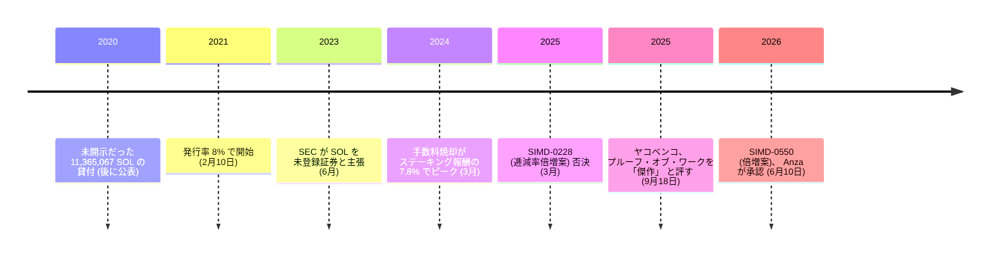

<!-- audit:quote-skip -->
> プルーフ・オブ・ワークは……見事だ — 傑作だ。[中略] 優雅さと単純さの点で傑作なんだ。[中略] 破られていない理由は、それがあまりに単純だからだ。

ソラナを作った当人が、2025 年 9 月にビットコインの合意形成をこう評した。同じ人物が書いた技術文書は、ビットコインとは正反対の場所に賭けている。時計を共有しない合意形成ではなく、時計を共有する合意形成。上限を持つ発行ではなく、先細りながらも止まらない発行。その賭けが具体的にどう組まれているかは、称賛や酷評の言葉より雄弁だ。

## 時計を組み込んだ合意形成

合意形成の心臓部には、ソラナ自身が Proof of History と名付けた暗号学的な時計がある。仕組みはこうなっている。ある検証者が SHA-256 を自分自身の出力へ絶えず食わせ続ける。前段の出力が次段の入力になる連鎖なので、途中の一段を飛ばして偽ることができない。この連鎖の一段一段が「ティック」で、ティックの束が「スロット」を作る。一人のリーダーには一度に連続する 4 スロット、時間にしておよそ 1.6 秒分 (1 ブロックあたり 400 ミリ秒) が割り当てられ、リーダーはこの時間の枠内でしかブロックを提出できない。誰がいつリーダーになるかは、432,000 スロット (2 日から 3 日ほど) ごとのエポックの始めに、ステークの大きさに比例する確率で決められる。

時計そのものは合意形成ではない。合意を担うのは、検証者が自分のステークを賭けてフォークへ投票する仕組みである Tower BFT だ。ティックという共有の物差しがあるおかげで、投票の締切をあらかじめ計算だけで決められ、応答の遅いリーダーのスロットを検証者同士のやり取りなしに読み飛ばせる。ビットコインの検証者がブロック伝播の順序だけで合意にたどり着くのに対し、ソラナは時計を先に共有してから合意を取りにいく。技術文書自身が挙げる動機は、共有され検証可能な時間の観念を持たないブロックチェーンでは、メッセージの受け取り順に参加者全員が同じ判断を下す保証がない、というものだ。

## 上限のない発行と、それを動かせる二つの名前

上限は、そもそも設けられていない。発行率は 2021 年 2 月 10 日に 8% で始まり、毎年 15% ずつ逓減し、最終的に 1.5% の一定率へ近づいていく設計だ。今の逓減ペースのままなら、1.5% に届くのはおよそ 2032 年ごろになる。検証者が受け取るステーキング利回りは、発行率に稼働率と手数料の取り分を掛け、ステークされた比率で割って決まる。発行そのものが利回りの原資であり、取引手数料の一部焼却による目減りは今のところ計算に響かないほど小さい。

この発行スケジュールを誰が動かせるかも、決まっている。逓減率を 15% から 30% へ倍にする提案は 2025 年 3 月にも一度否決され、同じ趣旨の提案 (SIMD-0411) が同年 11 月に出し直されたが、前進には Anza と Firedancer、二つのクライアント実装チームそれぞれの承認がいる。両方の承認を得られないまま、この提案は 2026 年 1 月に停止した。三度目の提案 SIMD-0550 が 2026 年 6 月に同じ倍増案として出され、将来の発行から約 1,890 万 SOL を削減する形で提示された。Anza は 6 月 10 日に承認したが、Firedancer の審査はまだ続いている。ビットコインの上限は、動かせる主体がいないまま守られている。ソラナの発行率にも終着点はあるが、それを動かせる主体は Anza と Firedancer という二つの名前として名指しできる。

## 検証者になるための入場料

検証者になるには、参入そのものに費用がかかる。ソラナが要求するハードウェアは、128 GB 以上のメモリー (目安は 192 から 256 GB)、シングルスレッド性能の高い CPU (Intel Core i9-13900K/14900K や AMD Ryzen 9 7950X 級)、そして PCIe 4.0/5.0 世代の NVMe ストレージだ。クラウド事業者で中位規模の検証ノードを動かす試算では、月間 150 テラバイト前後の通信量を要し、費用はひと月 8,600 ドル前後、その大半が通信費で占められる。年間では 10 万ドルを超える。

この参入障壁は、検証者の顔ぶれにも跡を残している。2023 年 3 月には 2,500 を超えていた稼働検証者数は、2025 年第 4 四半期末には 791 まで落ち込んだ。約 68% の減少だ。ホスティング上位 2 事業者 (Teraswitch と Latitude.sh) だけでステーク全体の 43.4% を担い、ナカモト係数 (共謀すれば全体の 3 分の 1 を制しうる最小の独立主体数) は 19 で、ここ 1 年ほど大きくは動いていない。ビットコインの検証コスト、すなわちフルノードの実行が一般的な家庭用コンピューターで足りるのに対し、ソラナの検証コストは専用のサーバー投資を前提にしている。処理量を追う設計が、参入障壁という形で分散性に跳ね返っている。

## 事前配分と、開示されなかった融資

発行の反対側には、配分がある。ソラナの供給は財団と投資家への事前配分から始まっており、その内訳の一部は当初、公にされていなかった。

<!-- audit:quote-skip -->
> 問題はこうだ。我々はこの情報を、貸付の規模と性質も含めて、CoinList の入札とその後の Binance 上場の際に公衆へ開示していなかった。

2020 年に本人たちが認めたのは、財団から値付け業者への 11,365,067 SOL の貸付だった。ソラナは全量を流通供給から除外したと述べており、別の公表では、そのうち 3,365,067 枚が実際に業者から財団管理のウォレットへ返還されたとも書いている。

2023 年 6 月、SEC は未登録証券にあたると主張する資産の一つに SOL を挙げた。財団はこれを否定し、当局はその後 Binance の件から SOL を外す申立てを行い、Coinbase の件は 2025 年 2 月に取り下げられた。事前配分も財団も発行主体も持たないチェーンには、そもそも失敗しうる開示が存在しない。ビットコインにこの種の記録がない理由は、評判ではなく構造にある。

## 創業者が語ったビットコイン

ソラナを作った当人は、ビットコインについて正反対に振り切れた評価をいくつも残している。冒頭の「傑作だ」から半年前、2025 年 3 月には、同じビットコインについてこう書いていた。

<!-- audit:quote-skip -->
> BTC に価値はない。もっとも好意的に見て、保険だ。[中略] 投資ではなく費用であり、機能する保証もない。

2026 年 7 月には、ビットコインだけが根拠を持つという見方そのものに異を唱えている。

<!-- audit:quote-skip -->
> 悪い株式や債務とは違う、本物のトークンは存在する。ネットワーク上の権利が強制できないのは、あなたのソフトウェアを動かす義務を誰も負っていないからだ。

三つの発言は同じ一つの争点を指している。強制力のある請求権を持つ資産と、持たない資産の線引きだ。ヤコベンコはその線を、ビットコインの内側と外側の両方に引いている。発言の全体は[人物紹介](/BitcoinArchive/ja/participants/anatoly-yakovenko/)にまとめてある。

ソラナの先細る発行を、ビットコインおよび他 10 通貨と同じ指数チャートで並べる。

<!-- chart: supply-curve-comparison -->

## ビットコインにとっての意義

ソラナは、共有された検証可能な時計を持たないブロックチェーンという問題を解決しようとした。だが、その問題自体はビットコインには最初から存在しない。ビットコインの検証者は、ブロック伝播の順序だけで合意し、時計を共有する必要そのものを持たない。時計を組み込む設計判断は、より速い合意と引き換えに、時計を刻む検証ノードの調達コストという新しい参入障壁を持ち込んだ。上限のない発行、財団と投資家への事前配分、開示されなかった融資、そして SIMD という名の変更手続き。これらはどれも、上限と参入障壁の低さという、[ビットコインが最初に選んだ側](/BitcoinArchive/ja/entries/analysis/2008-10-31-bitcoin-digital-gold-structural-features/)とは反対側に置かれた設計判断の帰結だ。プルーフ・オブ・ワークを傑作と呼びながら自分の資産には価値がないと書いたヤコベンコの発言は、この二つの設計思想が同じ一人の中で共存できることを示す、数少ない一次資料でもある。同じたぐいの設計判断を別の形で下した他の十一のチェーンについては、[十二種のチェーンを横断した比較](/BitcoinArchive/ja/entries/analysis/2026-07-26-altcoin-count-and-design-comparison/)でさらに詳しく取り上げている。
