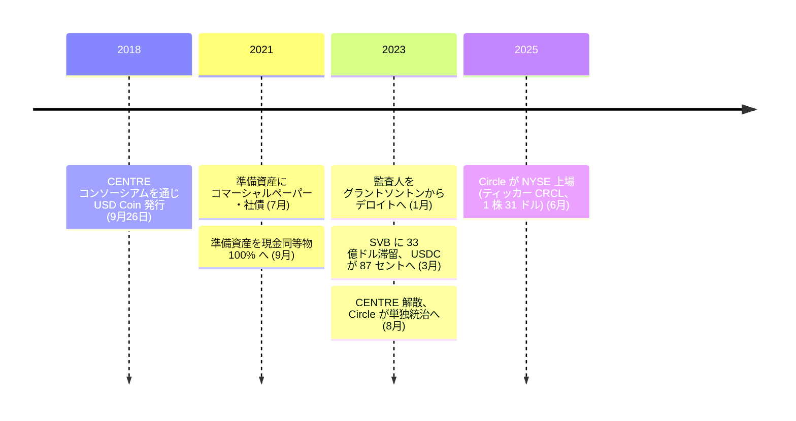

CENTRE の技術文書は、ドル連動通貨に取りうる設計を四つ挙げたうえで、自分たちがどれを選んだかを隠さずに書いている。

<!-- audit:quote-skip -->
> CENTRE が提供しようとするのは第一の方式、すなわち法定通貨担保型である。トークン化された法定通貨 1 単位は、準備された法定通貨 1 単位に裏付けられる。他の方式に比べ、法定通貨担保型は伝統的な規制要件を確実に満たすことを要し、発行会員に伝統的な裏付け資産 (法定通貨の銀行取引関係など) についての強固で監査可能な準備能力を要し、分散の度合いは小さくなる。そして価格の安定という点では、現在もっとも堅牢な方式でもある。

Circle が Coinbase とともに設立した CENTRE コンソーシアムのもとで、この設計を採った USD Coin (USDC) が世に出たのは 2018 年 9 月 26 日のことだ。「分散の度合いは小さくなる」という一文を書いた当の設計者たちが、その代償を実際に払う場面に立たされるまでには 5 年もかからなかった。2023 年 3 月 11 日未明、USDC は 87 セントまで値を割っている。

## 白書が語る自己像

技術文書が列挙する残り三つの設計は、資産を暗号資産で裏付ける方式、需給に応じて供給をアルゴリズムで調整するシニョリッジ型、そして双方を組み合わせるハイブリッド型で、当時のドル連動通貨をめぐる議論でよく使われた分類と重なる。CENTRE が選んだのはそのどれでもなく、もっとも単純で、もっとも中央集権的な方式だった。技術文書自身、その代償を取り繕ってはいない。

<!-- audit:quote-skip -->
> CENTRE は中央集権という代償に対し、トークンを発行する会員を複数持つネットワークを構想することで応える。単一の担保の窓口という単一障害点を示す代わりに、利用者に複数の準備資産と流動性の供給源を与えるのである。この手法は分かれてはいるが、完全に分散していると称するものでも、それを目指すものでもない。

「分かれてはいるが完全に分散していると称するものではない」。ドル連動通貨をめぐる文書群の中でも、率直な部類に入る一文だ。ビットコインは発行主体も準備資産も償還の約束も持たないことで検閲耐性を買っているのに対し、USDC はその三つすべてを持つことで価格の安定を買っている。[デジタルゴールドを支える六つの構造的特徴](/BitcoinArchive/ja/entries/analysis/2008-10-31-bitcoin-digital-gold-structural-features/)が名指す軸のうち、USDC が最初から手放しているのはまさにこの部分である。

| 項目 | ビットコイン | USDC |
|---|---|---|
| 供給 | 2,100 万枚上限、半減で逓減 | 発行者の準備資産次第、上限なし |
| 台帳 | 独自のブロックチェーン | 15 を超えるチェーン上で発行されるトークン |
| 合意形成 | プルーフ・オブ・ワーク | 該当なし — 乗せる台帳の合意形成に依存 |
| 供給の増減 | マイニング報酬のみ、誰にも止められない | Circle Mint 口座への米ドルの入出金でミント・バーン |
| 統治 | 特定の主体なし | Circle (2023 年 8 月までは Coinbase と共同の CENTRE) |

## 発行の仕組み：ミント、償還、そしてチェーンを越える移動

USDC の供給は、マイニングでもステーキングでもなく、銀行送金で増減する。企業や機関が Circle の口座 (Circle Mint) に米ドルを送金すると、Circle は同額の USDC を新規に発行し、その口座に記録する。これがミントである。逆に USDC を米ドルへ戻したい利用者は、Circle Mint の償還アドレスへ USDC を送る。Circle のスマートコントラクトがその USDC を焼却し (バーンし)、流通量から永久に差し引いたうえで、対応する米ドルを利用者の銀行口座へ送金する。ミントと償還をこの窓口で無条件かつ無償に行えること自体が、USDC を 1 ドルへ引き戻す裁定の仕組みそのものである。市場価格が 1 ドルからわずかでもずれれば、この窓口で利ざやを抜こうとする者が現れ、価格を押し戻す。

準備資産が申告どおりの額だけ存在するかどうかは、外部監査に委ねられている。Circle は 2018 年の公開以来、毎月の準備資産証明報告を公表しており、当初はグラントソントン、2023 年 1 月からはデロイトが監査人を務めている。報告は銀行残高・資産管理報告書・チェーン上のデータを突き合わせ、流通する USDC の総量以上のドル建て資産を Circle が保有していることを確認する。だがこの監査は月次のスナップショットにすぎず、リアルタイムの保証ではない。銀行が破綻した当日に、その隙間がそのまま価格の隙間になった。

USDC は単一のチェーン上のトークンでもない。2023 年 8 月時点で 15 を超えるブロックチェーン上に発行されており、その多くは Circle 自身が開発した Cross-Chain Transfer Protocol (CCTP) で結ばれている。仕組みは単純だ。送り手が送出元チェーンのスマートコントラクトに USDC を預けると、そのコントラクトは USDC を焼却し、宛先チェーンと受取人を記したメッセージを発行する。Circle の署名サービスがその焼却を確認し、送出元チェーンの確定を待ったうえで、宛先チェーン向けの承認署名を発行する。誰でもその署名を宛先チェーンのコントラクトへ提出でき、提出されると同額の USDC がそのチェーン上に新規で鋳造される。ラップドトークンも、資産を凍結するブリッジの金庫も存在しない。焼却と鋳造をつなぐのは Circle の署名だけだ。ビットコインのブロックチェーンには、そもそも複数チェーンをまたぐ仕組みが要らない。USDC のクロスチェーン転送を支えているのは、ビットコインが要らないと証明したまさにその一点、信頼できる第三者である。

## 統治：CENTRE から Circle 単独へ

USDC の発行主体は、公開時から単独企業ではなかった。Circle は Coinbase とともに CENTRE コンソーシアムを設立し、USDC の発行資格を複数の会員企業に開くという体裁を取った。会員になるには、電子マネー業務の免許を持ち、資金洗浄防止・顧客確認・テロ資金供与対策の規則を満たし、法定通貨の準備資産を自ら管理できることが条件とされた。技術文書が「単一障害点ではない」と書いた分散は、この会員制度の上に成り立っていた。

その会員制度は、5 年で終わった。2023 年 8 月 21 日、Circle と Coinbase は CENTRE を解体すると発表した。Circle が USDC の発行・統治・スマートコントラクトの鍵をすべて単独で握り、新しいチェーンへの対応も単独で決める体制に切り替わった。表明された理由は、米国内外で規制の明確化が進み、独立した統治体をもう必要としなくなったというものだった。同じ合意のもとで Coinbase は Circle の株式を取得し、両社は USDC 準備資産が生む利息収入を、それぞれが保有する USDC の量に応じて分け合う関係になっている。技術文書が「単一障害点を避ける」ために設けた複数会員の構図は、こうして 1 社に戻った。

## 設計が試された場面：準備資産の変化と 87 セント

USDC の準備資産の中身は、公開当初の説明とその後の実態のあいだにずれがあった。2018 年の公開発表は USDC を「現金の準備に裏付けられる」と説明していたが、2021 年 7 月時点の証明報告が明らかにした内訳は、現金および現金同等物 61%、外国銀行の米ドル建て譲渡性預金 13%、米国債 12%、コマーシャルペーパー 9%、社債 5% だった。Circle は同年 9 月、準備資産を現金および現金同等物 100% へ切り替えている。ビットコインには、そもそも準備資産の内訳という論点が存在しない。裏付ける資産がないからだ。この違いは、裏付けそのものが疑われる場面が来るまでは弱点にしか見えない。

その場面は 2023 年 3 月にやってきた。Circle は、準備資産のうち全体の約 8% にあたる 33 億ドルが、破綻したばかりのシリコンバレー銀行に置かれていたと公表した。発表から数時間後の 3 月 11 日未明、USDC は 87 セントまで値を割った。連邦の銀行・金融当局が預金の全額保護を表明した週末を経て、USDC が 1 ドルの連動を取り戻したのは 3 月 13 日である。当時の声明で、アレール自身がこの局面で試された原則をこう述べている。

<!-- audit:quote-skip -->
> 流通するすべての USDC について、信頼・安全・1 対 1 の償還可能性が Circle にとって最重要である。

連動は約束としては保たれ、価格としては 2 日ほど壊れた。この 2 日間の隙間こそが、取引相手の危険というものの中身のすべてであり、持参人払いの資産にはそれがない。

## アレールが語ったビットコイン

USDC の発行主体を率いるアレールは、この設計と正反対の性質を、繰り返しビットコインの側に認めてきた。2019 年 6 月、CNBC の取材でこう語っている。

<!-- audit:quote-skip -->
> ビットコインの命題はまさに、主権の外にある貨幣が伸び続け、その重要性は下がるどころか上がっていくというものだ。

<!-- audit:quote-skip -->
> より多くの人が、ビットコインのような検閲耐性のある、極めて安全なデジタル資産の価値を理解するようになる。

二か月後、同じく CNBC の取材で、その価値の所在を市場論ではなく特定の人々の側に置き直している。

<!-- audit:quote-skip -->
> 明らかに、ビットコインのような主権の外にあるデジタル資産は、自分で管理できる場所に資本を移したい人々にとって魅力的だ。

<!-- audit:quote-skip -->
> それがデジタルゴールドの命題だ。ビットコインを積み上げる機関も個人も、とりわけ資本規制への強い懸念がある地域や環境にいる個人が、そう考えていると思う。

2024 年には、こう言い切っている。

<!-- audit:quote-skip -->
> ビットコインそのものが、地球上でもっとも大きく重要な代替投資資産の一つになった。

USDC が売っているのは銀行送金の代わりであり、ビットコインの用途とは競合しない。アレールが矛盾なく両方を語れるのは、USDC とビットコインがそもそも異なる需要に応えているからだ。

## ビットコインにとっての意味

USDC は、ビットコインが手放した性質を一つ残らず買い戻した設計である。[デジタルゴールドを支える六つの構造的特徴](/BitcoinArchive/ja/entries/analysis/2008-10-31-bitcoin-digital-gold-structural-features/)は、発行主体・準備資産・償還の約束・スマートコントラクトの鍵を特定の主体が握らないことを、ビットコインの「人・組織の脱中央集権」として数える。USDC はこれを最初から持たない設計として選び、CENTRE の解体でその選択をさらに一歩押し進めた。[固定供給と自動調整の比較](/BitcoinArchive/ja/entries/analysis/2008-10-31-fixed-supply-vs-adjustable-money/)が法定通貨連動型を別の群に置くのは、供給の増減が発行者の裁量そのものだからであり、USDC の 87 セントという数字は、その裁量が破綻した銀行という外部要因ひとつでどこまで揺れうるかを示した実例である。[アルトコインの数と設計の比較](/BitcoinArchive/ja/entries/analysis/2026-07-26-altcoin-count-and-design-comparison/)も USDC を USDT と並べ、価格がまったく動かない列に置く。そこに届いた資金は価格を動かす代わりに、新規発行になるだけだからだ。

2025 年 6 月、Circle は自らニューヨーク証券取引所に上場し、USDC という商品を運営する会社そのものが公開企業になった。[電子現金とデジタルゴールド](/BitcoinArchive/ja/entries/analysis/2008-10-31-bitcoin-electronic-cash-vs-digital-gold/)が追う「決済に使われる通貨と、価値の保存に使われる通貨は同じものでありうるか」という問いに、USDC は「ありえない」という答えを出した設計だ。決済の役割を担うために、USDC は保存の役割が要求する性質のすべてを手放した。ビットコインが両方の役割を一つの設計に詰め込もうとして緊張を抱え続けているのだとすれば、USDC はその緊張を最初から解こうとせず、決済の側だけを取り、残りを規制された発行主体に預けた。どちらが正しい設計かではなく、両方が同時に存在し続けていることが、ビットコインが最初に立てた問いにまだ単一の答えがないことを示している。
