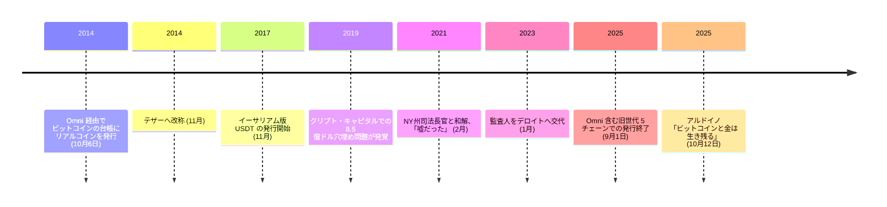

2016 年 6 月、テザー社は自社の設計を説明する文書を公開した。表題を訳せば「ビットコインの台帳上の法定通貨」。文書の要旨はこう宣言している。

<!-- audit:quote-skip -->
> 我々は、USDT と呼ばれる暗号通貨トークンと、それに対応する現実世界の資産である法定通貨との間で、一対一の準備金比率を維持する方式を提案する。この方式は、発行されたトークンが常に全額担保され準備されていることを証明するために、ビットコインの台帳、準備金証明、その他の監査手法を用いる。

USDT は文書のとおりに生まれた。2014 年 10 月 6 日、ブロック・ピアース、リーヴ・コリンズ、クレイグ・セラーズ（Omni Foundation の一員でもあった）の 3 人が「リアルコイン」の名で発行した最初のトークンは、ビットコインのブロックチェーン上にメタデータとして書き込まれていた。同年 11 月、名は「テザー」に改められる。それから 11 年後の 2025 年 9 月 1 日、テザー社は、ビットコインの台帳上でトランザクションのメタデータとして USDT を発行する仕組みである Omni Layer における新規発行と償還を終えた。生まれた場所と、離れた場所は同じだった。

## 白書が名乗った設計 — 発行体だけが作り、発行体だけが壊す

2016 年の白書は、自らの構造を三層に分けて説明している。

<!-- audit:quote-skip -->
> 第一の層はビットコインのブロックチェーンである。テザーの取引台帳は、埋め込み型の合意システムである Omni を通じて、メタデータとしてビットコインのブロックチェーンに埋め込まれる。

第二層が Omni Layer で、ビットコインの台帳の上でトークンの発行・破棄・追跡を担う。第三層がテザー社そのもので、法定通貨の預かり入れと引き出し、対応する USDT の発行と失効、準備資産の保管を担当する。白書はこの三層構造の要点を一文にまとめている。

<!-- audit:quote-skip -->
> フロー図が伝える中心的な考え方は、テザー社だけが USDT を流通に加え（発行し）、流通から除く（破棄する）権限を持つという一点であり、これがシステムの支払能力を維持する主要な手段である。

供給に上限はない。1 USDT を発行するたびに 1 米ドルが準備資産に加わり、1 USDT を焼却するたびに 1 米ドルが引き出される。発行と償還はどちらも、この一社の判断だけで動く。白書自身、この設計が完全な非中央集権ではないことを隠していない。

<!-- audit:quote-skip -->
> 我々の実装が完全には非中央集権的でないことは承知している。準備資産の中央集権的な保管者としてテザー社が機能せざるを得ないからだ（もっとも、流通する USDT 自体は非中央集権的なデジタル通貨として存在する）。

その上で、白書は自らが抱える弱点を、隠さず四つ列挙してもいる。

<!-- audit:quote-skip -->
> 我々は破産するかもしれない。我々の銀行が支払不能に陥るかもしれない。我々の銀行が資金を凍結または没収するかもしれない。我々は準備資金を持ち逃げするかもしれない。

2016 年の時点でこの四つを自ら書いた企業は、業界の中でもむしろ率直な部類に入る。三年後、この四つのうちの一つが、現実の記録として残ることになる。

## 供給の仕組み — 直接取引できるのは 10 万ドルから

USDT の発行と償還は、白書の設計どおり一社の窓口を通る。だがその窓口に立てる利用者は限られている。テザー社と直接取引するには、まず本人確認（KYC/AML）の審査を通過し、150 ドルの非返金の確認手数料を払わなければならない。審査を通っても、直接の発行・償還には 10 万ドル（または 10 万 USDT）という最低額が課され、償還には 0.1% の手数料と、米ドルについては週 1 回という頻度の上限が付く。米国市民が償還するには、適格契約参加者（Eligible Contract Participant）の要件も満たす必要がある。

大多数の利用者は、この窓口を使わない。取引所で USDT を売買するだけであり、そこで動くのは発行済みの供給の中の話であって、供給そのものを増減させる操作ではない。供給を増減できるのは、10 万ドルを用意し審査を通過した一部の主体と、テザー社自身だけである。

USDT はもはやビットコインの台帳の上にはほとんど存在しない。2017 年 11 月、テザー社はイーサリアムの ERC-20 トークンとして USDT を発行し始めた。2020 年には主要な発行先がすでに Omni Layer からイーサリアムへ移っていたと報じられている。2026 年 7 月時点、USDT は流通供給量およそ 1,840 億ドル、暗号資産の時価総額ランキングで全体の 3 位を占め、15 を超えるチェーンで発行されている。供給のおよそ半分に迫る割合を Tron が占め、次いでイーサリアムが続く。生まれた場所である Omni Layer に残っていたのは、供給のごく一部だった。

## 凍結という機能 — 白書にはなかった権限

白書が 2016 年に列挙した四つの弱点のうち、「銀行が資金を凍結する」は、テザー社が受け身で被る側の危険として書かれていた。だが今日の USDT には、テザー社が自ら他者の残高を凍結する権限が存在する。白書にこの権限への言及はない。

各チェーンの USDT を発行するスマートコントラクトには、`addBlackList`（凍結対象に加える）、`removeBlackList`（凍結を解く）、`destroyBlackFunds`（凍結した残高を破棄する）という管理者専用の関数が組み込まれている。凍結対象に加えられたアドレスは、そこから先の送金も、そこへの受け取りも、コントラクトの水準で拒否される。この関数を呼び出せる権限は、テザー社内部の複数承認を経るマルチシグ・ウォレットが握っている。呼び出し自体はブロックチェーン上に記録として残り、外部からも検証できる。

この権限は、法執行機関との協力の形で行使されることもある。2025 年 6 月 18 日、テザー社は米司法省と協力し、恋愛詐欺（いわゆる「ピッグ・ブッチャリング」）に関わる USDT 約 2 億 2,500 万ドル分の押収を支援したと公表した。同社はこれを含め、55 か国超・255 を超える法執行機関との協力により累計 27 億ドル超を凍結・押収してきたと説明している。2025 年の 1 年間だけで見ても、イーサリアムと Tron の両チェーンを合わせて凍結された USDT は 12 億 6,000 万ドルを超える。

## 準備金と透明性 — 監査ではなく証明

白書は「専門家が定期的に検証し、署名し、公表する」準備資産の監査を約束していた。実際に定着したのは、監査ではなく証明（アテステーション）である。証明はある特定時点の主張を確認する手続きにとどまり、期間を通じた内部統制まで検証する監査とは別物だ。テザー社は四半期ごとに BDO イタリアの証明意見書を公表しているが、四大会計事務所（デロイト・EY・KPMG・PwC）による監査は、これまで一度も受けていない。

その理由を、最高経営責任者パオロ・アルドイノは 2024 年 4 月、率直に語っている。

<!-- audit:quote-skip -->
> あなたが四大会計事務所だとして、銀行業界全体を顧客に抱えているとする。ステーブルコイン数社のために、その 10 万社の顧客を危険にさらす理由がどこにあるだろうか。

準備資産の中身が実際に問われた場面は、証明という制度が定着する前にすでに記録されている。2018 年から 2019 年にかけて、テザー社とビットフィネックス（同じ持株会社の傘下にある取引所）は、パナマの決済業者クリプト・キャピタルに預けた 8 億 5,000 万ドルへのアクセスを失っていた。この穴を埋めるためにテザーの準備資産が流用されていたことが、2019 年、ニューヨーク州司法長官の調査で明らかになる。2021 年 2 月 23 日、テザー社とビットフィネックスは不正の認定なしに和解し、1,850 万ドルを支払い、以後 2 年間は準備資産の構成を四半期ごとに報告する義務を負った。当時の司法長官レティシア・ジェームズは、この和解についてこう述べている。

<!-- audit:quote-skip -->
> テザーが自社の仮想通貨を常に米ドルで全額担保していると主張していたのは、嘘だった。

## アルドイノが語るビットコイン

テザー社自身は、ビットコインを競合ではなく準備資産として扱っている。2023 年 5 月 17 日、同社は純利益のうち最大 15% を継続的にビットコインの購入へ充てると発表した。この分は USDT の裏付けに数えられる準備資産とは別枠の、余剰資産としての保有である。アルドイノは 2024 年 10 月、この積み増しによってテザー社の保有量が 8 万 2,000 BTC、時価にしておよそ 58 億ドルに達したと明らかにした。

2025 年 10 月 12 日、アルドイノは X にこう投稿している。

<!-- audit:quote-skip -->
> ビットコインと金は、他のどの通貨よりも長く生き残るだろう。

同じ年の少し前、テザー社は USDT の発行を五つの旧世代チェーンで打ち切ると発表していた。その一つが、USDT が最初に生まれた場所である Omni Layer だった。アルドイノはその理由をこう説明している。

<!-- audit:quote-skip -->
> これら旧世代チェーンへの対応を終えることで、より高い拡張性・開発者活動・コミュニティの関与を提供するプラットフォームに集中できるようになる。

発表文はこれらのチェーンが「テザーの初期の成長において基盤的な役割を果たした」ことを認めたうえで、力点を Lightning Network をはじめとする、ビットコイン自身のレイヤー 2 へ移すと述べている。ビットコインの台帳そのものからは去りながら、その上に築かれた決済層へは戻る。同じ年に語られたこの動きと、ビットコインを準備資産として買い増す判断は、同じ発行体から出ている。

## ビットコインにとっての意味

USDT が問うているのは、供給を増やす主体を一社に集めたとき、何が起き何が起きないかである。[ビットコインの「デジタルゴールド」としての地位を支える六つの構造的特徴](/BitcoinArchive/ja/entries/analysis/2008-10-31-bitcoin-digital-gold-structural-features/)は、発行体が存在しないこと、供給が誰の裁量にも服さないことを前提に組まれている。USDT はその前提のほとんどを裏返している。発行体は名指しできる一社であり、供給は日々その一社の判断で増減し、残高はその一社の判断で凍結できる。同じ構造は USDC にも当てはまる。発行体の裁量で供給が決まる点は変わらない。[十二チェーンを横断した比較](/BitcoinArchive/ja/entries/analysis/2026-07-26-altcoin-count-and-design-comparison/)では、この二つを含む全チェーンの設計を並べて確認できる。

USDT と USDC の違いは、この構造の有無にはない。両者とも発行体を持ち、両者とも残高を凍結できる。違うのは、その発行体が自らの準備資産をどこまで見せるかという一点だ。[USDC の発行体](/BitcoinArchive/ja/participants/jeremy-allaire/)は準備資産の構成を自ら開示し、2023 年にはシリコンバレー銀行への預金が原因で一時的にペッグを外れたことも自ら公表している。テザー社が公にしてきたのは、四半期ごとの証明という、監査より狭い窓だけだ。証明と監査の違いを、テザー社の最高経営責任者自身が「四大事務所が引き受けない理由」として説明した記録は、この窓の狭さが偶然ではないことを示している。

ビットコインの台帳は、USDT を生んだ場所であり、USDT が公式に去った場所でもある。テザー社はその同じ年に、ビットコインを準備資産として買い増す方針を続け、決済の力点をビットコインのレイヤー 2 へ移すと発表した。一つの企業が、ビットコインの基盤層から意図的に距離を置きながら、ビットコインそのものを資産として抱え込み続けている。USDT の 11 年間の記録が示しているのは、この二つが少しも矛盾しないという事実である。
