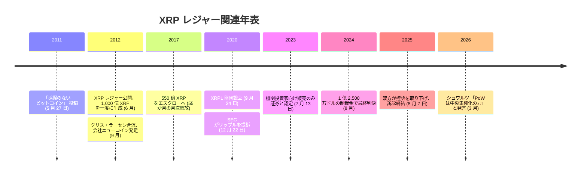

2011 年 5 月 27 日、ジェド・マケーレブは BitcoinTalk にこう投稿した。

<!-- audit:quote-skip -->
> ビットコインの採掘は、この仕組みのひどく不運な副作用に思える。あまりにも無駄が多いからだ。

投稿の題は「採掘のないビットコイン」。マケーレブはその年のうちにデビッド・シュワルツ、アーサー・ブリットと合流し、採掘そのものを設計から抜いた台帳に着手する。1 年後の 2012 年 6 月、XRP レジャーが動き出した。ジェネシスの台帳には、1,000 億 XRP がすでに全量刻まれていた。以後、この数を 1 XRP たりとも新たに生成する仕組みは存在しない。

## 「無駄」を抜いた先にあった選択

採掘の代わりに 3 人が選んだのは、各サーバーが自分で選ぶ「信頼する検証者の一覧」に基づいて合意する仕組みだった。同じ年の 9 月、クリス・ラーセンが合流して最高経営責任者に就き、会社は「ニューコイン」として発足する。まもなく「オープンコイン」、さらに「リップル・ラボ」へと名を変えるこの会社に、創設者たちは 1,000 億枚のうち 800 億枚を贈与した。残る 200 億枚は創設者たち個人の手元に残った。ビットコインの供給がマイナーへ 16 年かけて配られていくのに対し、XRP の供給は公開の瞬間にすでに宛先が決まっていたことになる。

## 検証者の八割が合意するまで

XRP レジャーにマイナーはいない。存在するのは、各サーバーが自分で選ぶ「信頼する検証者の一覧」（UNL）だけだ。サーバーは数秒ごとに、自分が正当だと考える取引の候補集合を互いに提案し合い、その一覧に含まれる検証者の八割以上が同じ台帳版に合意した時点で、その版を確定させる。合意に届くまで数ラウンドの往復を挟むこともあるが、ビットコインの採掘のように次のブロックを待つ必要はない。

一覧のうち二割未満が不正であっても合意は止まらない。裏を返せば、不正な取引を通すには一覧の八割超が結託しなければならない計算になる。検証者が規定数を割ってオフラインになれば、サーバーは定足数に届かず新しい版の確定を止める――ここに、検証者を誰が選ぶかという問いが残る。既定の一覧を編んできたのは長らくリップル自身であり、2020 年 9 月 24 日に独立した非営利団体として XRPL 財団が 650 万ドルの寄付を受けて発足した後も、その役割の中心はリップルとこの財団に残ったままだ。

| 項目 | ビットコイン | XRP レジャー |
|---|---|---|
| 合意の単位 | 最多累積作業量のチェーン | 検証者一覧の 80% が一致した台帳版 |
| 参加条件 | 電気代を払える者なら誰でも採掘に参加できる | 各サーバーが選んだ検証者一覧に限られる |
| 新版の確定間隔 | 平均 10 分に 1 ブロック | 数秒ごとに 1 台帳版 |
| 手数料の行き先 | マイナーへの報酬になる | 誰にも渡らず消却される |
| 供給の生まれ方 | 半減期を経て 2,100 万枚まで逓減発行される | 2012 年に 1,000 億枚を一度に生成、以後の新規発行はない |

## 1,000 億枚は、最初から存在した

XRP レジャーの供給曲線は平坦だ。ビットコインの 2,100 万枚が 33 回の半減を重ねながら 2140 年ごろまでかけて段階的に掘り出されるのに対し、XRP の 1,000 億枚はジェネシスの台帳の時点でもう全量が存在していた。2017 年、リップルは自社が保有する 550 億 XRP を、レジャーそのものが強制するエスクロー契約の連鎖に封じ込めた。契約は 55 か月にわたり、毎月 1 日に 10 億 XRP ずつを解放するよう組まれている。その月に使わなかった分は、行列の最後尾に新しいエスクローとして積み直される。結果として、毎月市場に新たに出回る量は額面の 10 億 XRP よりずっと少なく、おおむね 2 億から 3 億 XRP にとどまってきた。

XRP レジャーにも、新規発行に代わる小さな消却はある。取引ごとに手数料としてごくわずかな XRP が破棄される仕組みで、2012 年の公開以来、破棄された総量は 1,000 億枚のうちおよそ 1,400 万枚、全体のおよそ 0.014% にすぎない。ここにビットコインとの違いがある。ビットコインの手数料はマイナーへの報酬として渡り、その報酬こそが採掘という労力を支える対価になる。XRP レジャーの手数料は、誰の懐にも入らずに消える。受け取り手のいない罰金であり、支払う相手のいない対価だ。

## 創業者たちが語ったビットコイン

XRP レジャーを作った側は、ビットコインを技術として退けたことがない。退けたのは採掘という一つの装置だけだ。共同創設者[ジェド・マケーレブ](/BitcoinArchive/ja/participants/jed-mccaleb/)は、ビットコインの分散性を「本当に見事な形」と認めながらも「複製するのはとても難しい」と結論づけている。

同じ構図は、後にリップルへ加わった面々の発言にも繰り返し現れる。共同創設者クリス・ラーセンは 2021 年 4 月、プルーフ・オブ・ワークを「見事に設計された技術だが、今日の世界では時代遅れになりつつある」と書き、その変更こそ「ビットコインが世界の支配的な暗号通貨であり続けるために決定的に重要だ」と助言の形で論じた。最高経営責任者ブラッド・ガーリングハウスは 2020 年、「価値の保存手段としての BTC には強気だが、決済用としてはそうではない」と語っている。

もっとも踏み込んだ発言は、直近になって出た。大手マイニングプールが 7 ブロック連続で採掘した出来事を受け、リップルの元最高技術責任者で現在は名誉職にあるデビッド・シュワルツはこう述べた。

<!-- audit:quote-skip -->
> これは私が何度も指摘してきたことを、まさに裏づけている。ビットコインの分散性はプルーフ・オブ・ワークの使用から生まれているのではない。むしろプルーフ・オブ・ワークこそ、ビットコインが絶えず抗い続けなければならない中央集権化の力なのだ。

シュワルツが名指ししたのは、まさに XRP レジャーが設計で切り離した当のものだ。採掘という装置は参加を誰にでも開く代わりに、安い電気と専用機材を持つ者へ力を集中させていく。XRP レジャーはその装置を丸ごと外し、代わりに検証者一覧という、もっと小さいが誰の目にも見える一点に信頼を集めた。どちらの側も、集中する力をゼロにはできないと認めている。違うのは、その力がどこに現れるかだけだ。

## 証券だったのかという問い

2020 年 12 月 22 日、SEC はリップル・ラボと共同創設者クリス・ラーセン、最高経営責任者ブラッド・ガーリングハウスを相手取り、13 億ドル超の無登録証券発行を行ったとして提訴した。訴状が対象にしたのは、2013 年以降に売却された 146 億 XRP 超である。

裁判所自身は、設計の意図それ自体を争いのない事実として次のように要約している。

<!-- audit:quote-skip -->
> 彼らは、2009 年に登場した最初のブロックチェーン台帳であるビットコインのブロックチェーンに対し、より速く、より安く、よりエネルギー効率の高い代替物を作ることを目指していた。……2012 年に XRP レジャーが立ち上がったとき、そのソースコードは 1,000 億 XRP の固定供給を生成した。

2023 年 7 月 13 日、トーレス判事は買い手の立場によって判断を分けた。機関投資家への直接販売は無登録の投資契約にあたるとした一方、取引所を通じた一般向けの販売は同じ基準を満たさないと退けた。買った側がリップルの働きに期待して買ったかどうかが分かれ目だった。2024 年 8 月の最終判決は、1 億 2,500 万ドルの制裁金と将来の違反を禁じる恒久的差止命令を科した。SEC が求めていたおよそ 8 億 7,600 万ドルにはるかに届かない額であり、判事は不当利得の返還請求も退けている。双方が控訴を取り下げ、この訴訟が閉じたのは 2025 年 8 月 7 日、提訴から 4 年 7 か月後のことだった。

XRP の平坦な供給曲線を、ビットコインおよび他 10 通貨と同じ指数チャートで並べる。

<!-- chart: supply-curve-comparison -->

## ビットコインにとっての意義

XRP レジャーが証明したのは、ビットコインが解いた二重支払いの問題は、採掘がなくても解けるということだ。マケーレブが 2011 年に書いた答えは、各サーバーに「信頼する検証者の一覧」を持たせ、その八割の合意で台帳を確定させることだった。ここまでは、一つの技術的選択にすぎない。

[デジタルゴールドを支える六つの構造的特徴](/BitcoinArchive/ja/entries/analysis/2008-10-31-bitcoin-digital-gold-structural-features/)がビットコインについて数える条件は、マイナー不在の分散だけではなく、創設者の不在、公正な立ち上がり、そして誰にも運命を握られていない供給だ。XRP レジャーが選び直さなかったのは、そのうち最初の一つだけではない。検証者一覧を編むのはリップルと XRPL 財団であり、供給の 8 割は公開直後に一つの会社へ贈与され、創設者たちは今も名前を明かして語り続けている。[十二のチェーンを並べた比較](/BitcoinArchive/ja/entries/analysis/2026-07-26-altcoin-count-and-design-comparison/)が並べる他のチェーンの多くも、程度の差はあれ同じ選択をしている。ビットコインが手放した先――誰が決めるのか、誰が語るのか、誰が持つのか――を、XRP レジャーは会社という一点に残した。SEC が 13 億ドル超の訴状で問い、トーレス判事が買い手の立場によって答えを分けたのは、まさにその一点だ。
