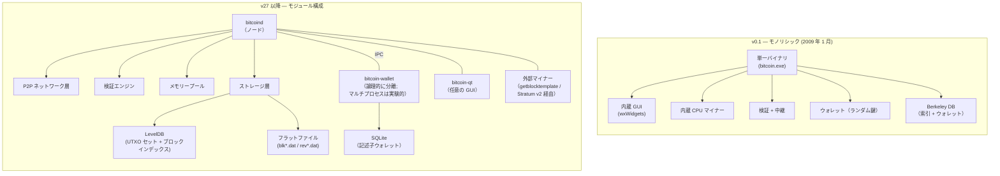
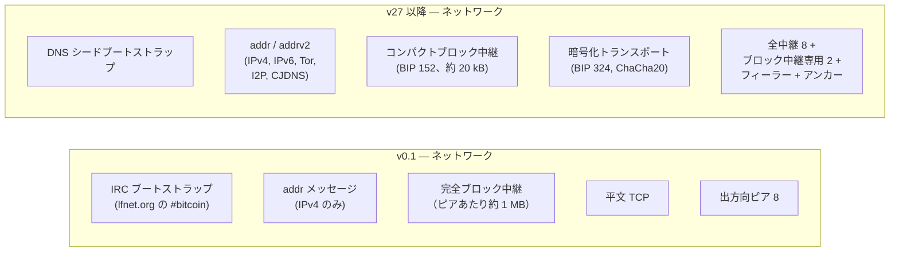
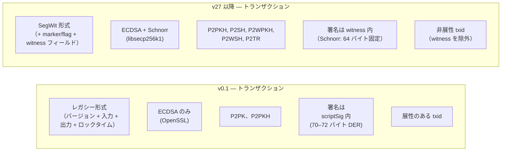
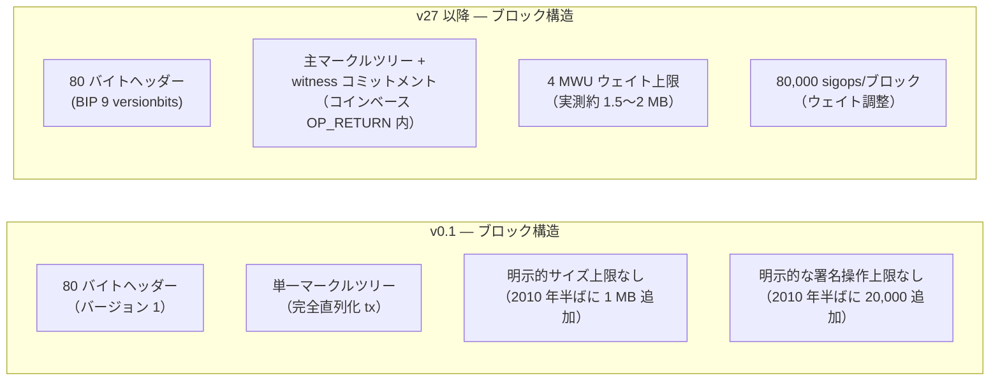
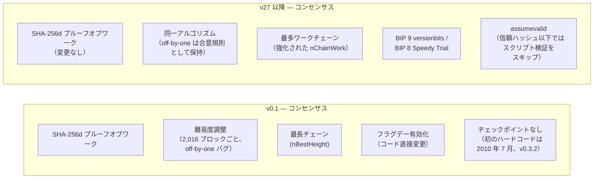
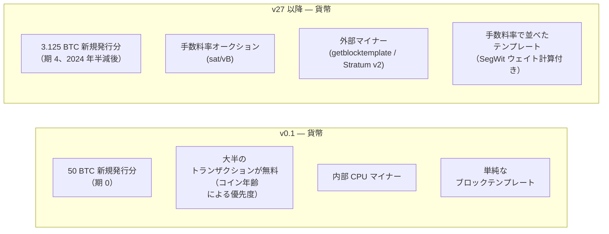
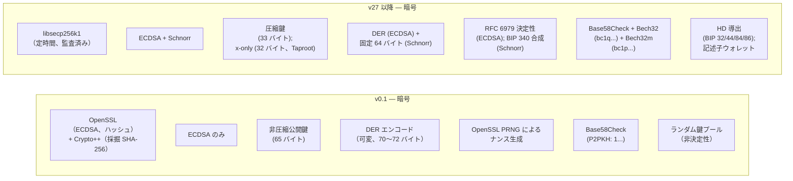
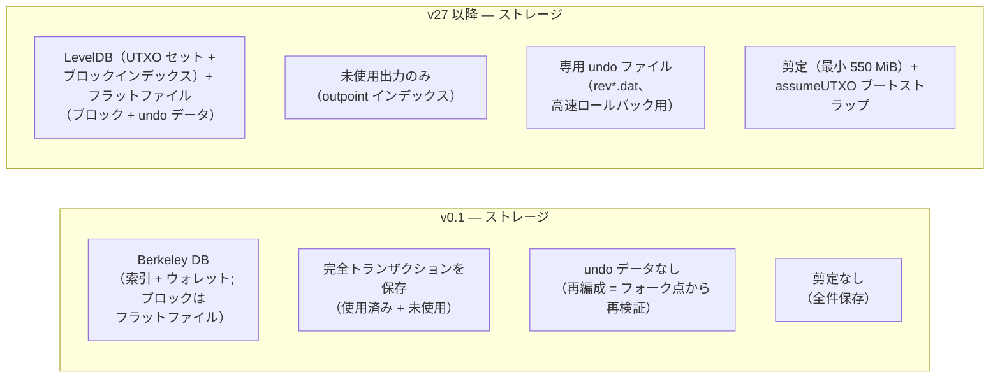
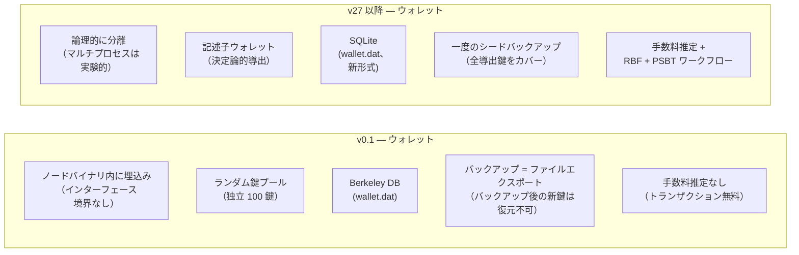
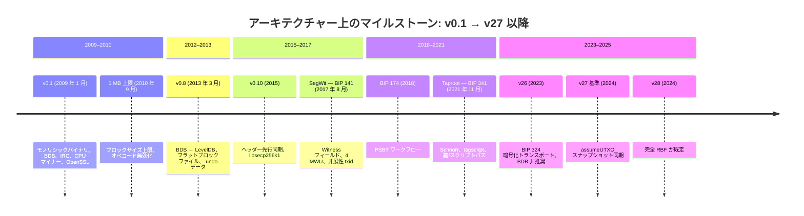

## 本ページの位置付け

本ページは[設計文書シリーズ](/BitcoinArchive/ja/entries/design/2009-01-03-bitcoin-system-design-overview/)の **L2 #9「アーキテクチャー進化（サトシ時代 vs v27+）」** である。3 つの横断的深掘りの最初。各 L1 ページが 1 つのサブシステムを末尾に簡潔な「二時代比較」節を添えて端から端まで検証するのに対して、本ページはそれらの比較を 8 つのドメインすべてにわたって並置し、単一のドメインページでは提供できない分割アーキテクチャー図を追加する。

**範囲。** すべての比較は 2 つの固定参照点を使用する: サトシの v0.1 リリース（2009 年 1 月 3 日）と現行の Bitcoin Core v27 以降基準。中間バージョンは構造的変更を導入した場合にのみ言及する。

本ページは社会的・経済的層での設計のずれは扱わない。それらは[設計意図と現実の分析](/BitcoinArchive/ja/entries/analysis/2026-05-24-satoshi-design-vs-current-reality/)で分析される。以下の各節には分割図（左が v0.1、右が v27 以降）と比較表があり、L1 の番号付けに対応する。

## 1. システム全体のアーキテクチャー

v0.1 と v27 以降の間で最も目に見える変化はアーキテクチャーの分解である。サトシはウォレット、マイナー、GUI、検証エンジン、ネットワーク層を 1 つのプロセスに融合した単一バイナリーをリリースした。その足元を支えていたのは Berkeley DB の索引とフラットブロックファイルである。現行の Bitcoin Core はこれらの関心事を異なるモジュール、プロセス、ストレージバックエンドに分離している。

| 側面 | v0.1（2009 年 1 月） | v27 以降基準 |
|---|---|---|
| **バイナリー** | 単一実行ファイル: ウォレット + マイナー + GUI + ノード | `bitcoind`（ノード）、`bitcoin-wallet`（ウォレット）、`bitcoin-qt`（GUI）— 別々のバイナリー |
| **プロセスモデル** | 1 プロセス、1 アドレス空間 | 論理的に分離; マルチプロセスは実験的で既定ではない（IPC は Cap'n Proto 経由） |
| **データベース** | Berkeley DB が索引とウォレットを管理; ブロックデータはフラットファイル | LevelDB（UTXO セット、ブロックインデックス）+ フラットファイル（ブロック）+ SQLite（ウォレット） |
| **マイニング** | 内部 CPU マイナー、同一プロセス | `getblocktemplate`（BIP 22/23）経由の外部化; エコシステムでは Stratum v2 |
| **インターフェース** | リリース時はなし; 直後に基本的な JSON-RPC を追加 | JSON-RPC（完全な読み書き）、REST（読み取り専用）、ZMQ（プッシュ通知） |
| **暗号ライブラリー** | OpenSSL（ECDSA/secp256k1）; Crypto++（SHA-256） | libsecp256k1（ECDSA/シュノア署名）、ハードウェアアクセラレーション付き内部 SHA-256 |

## 2. ネットワーク層

| 機能 | v0.1 | v27 以降基準 | 主要な BIP / バージョン |
|---|---|---|---|
| **ピア発見** | IRC チャネル + `addr` | DNS シード + `addrv2` + `peers.dat` キャッシュ | BIP 155（addrv2、v22） |
| **アドレス種別** | IPv4 のみ | IPv4、IPv6、Tor v3、I2P、CJDNS | BIP 155 |
| **アウトバウンドピア** | 8 フルリレー | 8 フルリレー + 2 ブロックリレー専用 + フィーラー + アンカー | v19 以降（ブロックリレー専用） |
| **ブロック中継** | 全ブロックを各ピアに送信（約 1–2 MB） | コンパクトブロック: ヘッダー + 短縮 ID（約 20 kB） | BIP 152（v0.13） |
| **トランスポート** | 平文 TCP | 日和見暗号化トランスポート（ChaCha20-Poly1305） | BIP 324（v26、v27 でデフォルト） |
| **初期同期** | 逐次: ブロックを 1 つずつ | ヘッダー優先: 並列ブロックダウンロード | v0.10 |
| **日食攻撃耐性** | 最小限 | アウトバウンドローテーション、多様な追い出し、アンカーピア、ブロックリレー専用ピア | v19 以降 |

*詳細: [L1 #1「P2P ネットワーク設計」](/BitcoinArchive/ja/entries/design/2009-01-03-bitcoin-p2p-network-design/)*

## 3. トランザクション層

| 機能 | v0.1 | v27 以降基準 | 主要な BIP / バージョン |
|---|---|---|---|
| **形式** | レガシー: バージョン + 入力 + 出力 + ロックタイム | SegWit: + マーカー/フラグ + Witness | BIP 141（2017） |
| **トランザクション ID** | 完全なシリアライズ済みトランザクションの SHA-256d | `txid` は Witness を除外; `wtxid` は含む | BIP 141 |
| **展性** | あり — 第三者が scriptSig を変更可能 | 修正済み — Witness が txid から除外 | BIP 141 |
| **スクリプト種別** | P2PK、P2PKH | P2PKH、P2SH、P2WPKH、P2WSH、P2TR | BIP 16、141、341 |
| **署名方式** | ECDSA（OpenSSL 経由） | ECDSA + シュノア署名（libsecp256k1 経由） | BIP 340（2021） |
| **オペコード** | 完全セット（後に無効化されたものを含む） | 縮小セット; Tapscript が選択されたオペコードを再有効化 | BIP 342 |
| **タイムロック** | 絶対ロックタイムのみ | 絶対 + 相対（BIP 68）+ スクリプトレベル（`OP_CLTV`、`OP_CSV`） | BIP 65、68、112、113 |
| **手数料置換** | 未実装; 先着順 | 完全 RBF がデフォルト | BIP 125（v0.12 任意選択; v24 オプション追加; v28 デフォルト） |
| **コイン選択** | 単純な最大額優先 | BnB + ナップサック + 単一ランダム抽選; 無駄指標 | v27 以降 |

*詳細: [L1 #2「トランザクション設計」](/BitcoinArchive/ja/entries/design/2009-01-03-bitcoin-transaction-design/)*

## 4. ブロックとチェーン層

| 機能 | v0.1 | v27 以降基準 | 主要な BIP / バージョン |
|---|---|---|---|
| **ヘッダー形式** | 80 バイト、バージョン 1 | 80 バイト、同一構造; BIP 9 シグナリングビット | BIP 9 |
| **ブロックバージョン** | 常に 1 | バージョンビット（`0x20000000` ベース + シグナルビット） | BIP 9（2016） |
| **マークルツリー** | 完全なシリアライズ済みトランザクション上の単一ツリー | プライマリーツリー（ストリップ済みトランザクション）+ コインベース内の Witness コミットメント | BIP 141 |
| **サイズ制限** | v0.1 では制限なし; 2010 年に 1 MB 追加 | 4 MWU ウェイト制限 | BIP 141（2017） |
| **Witness ディスカウント** | 存在しない | Witness バイトは 1/4 ウェイト（1 WU 対 4 WU） | BIP 141 |
| **コインベースデータ** | 最大 100 バイトの任意データ | BIP 34: ブロック高の接頭辞が必須 | BIP 34（2013） |
| **署名操作制限** | v0.1 では制限なし; 2010 年に 20,000 追加 | ブロックあたり 80,000（ウェイト調整済み）; Tapscript のカウント方法は異なる | BIP 141、342 |

*詳細: [L1 #3「ブロック・チェーン設計」](/BitcoinArchive/ja/entries/design/2009-01-03-bitcoin-block-chain-design/)*

## 5. コンセンサス層

| 機能 | v0.1 | v27 以降基準 | 主要な BIP / バージョン |
|---|---|---|---|
| **ハッシュ関数** | SHA-256d（二重 SHA-256） | 同一 | — |
| **チェーン選択** | 最長チェーン（ブロック高の比較、`nBestHeight`） | 最多ワークチェーン（`nChainWork`、v0.3.3 以降） | — |
| **難易度調整** | 2,016 ブロックごと; オフバイワンバグ | 同一アルゴリズム; バグは保存（修正 = ハードフォーク） | — |
| **ソフトフォーク有効化** | 直接コード変更（フラグデイ） | BIP 9 バージョンビット / BIP 8 高速試行 | BIP 9、BIP 8 |
| **スクリプト検証** | scriptSig + scriptPubKey の結合実行 | 分離評価; SegWit Witness プログラム; Tapscript | BIP 141、342 |
| **タイムスタンプルール** | 直前 11 ブロックの中央値（median-time-past）より大きい（v0.1 から存在） | 同一の受理ルール; BIP 113 が MTP をロックタイム評価にも拡張 | BIP 113 |
| **チェックポイント** | v0.1 にはなし; 2010 年 7 月（v0.3.2）にハードコードされたチェックポイントを追加 | `assumevalid` がチェックポイント機能の大部分を置換 | v0.14 以降 |

*詳細: [L1 #4「コンセンサス設計」](/BitcoinArchive/ja/entries/design/2009-01-03-bitcoin-consensus-design/)*

## 6. 貨幣・インセンティブ層

| 機能 | v0.1 | v27 以降基準 | 主要な BIP / バージョン |
|---|---|---|---|
| **総供給量上限** | 20,999,999.9769 BTC | 同一 — コンセンサスで凍結された定数 | — |
| **新規発行分の計算** | `nSubsidy >>= (nHeight / 210000)` | 同一の演算; シフト 64 以上のゼロガード | — |
| **手数料の挙動** | 大半のトランザクションは無料; コイン年齢による優先度 | 手数料率オークション（sat/vB）; コイン年齢優先度は廃止 | — |
| **CPFP** | 未実装 | 祖先認識メモリープール; パッケージ評価 | v0.13 以降 |
| **ブロックテンプレート** | 内部マイナー; 素朴な順序 | `getblocktemplate`（BIP 22/23）; 手数料率順ソート | BIP 22、23 |
| **Witness ディスカウント** | 存在しない | Witness バイトは 1/4 ウェイト | BIP 141 |

*詳細: [L1 #5「貨幣設計」](/BitcoinArchive/ja/entries/design/2009-01-03-bitcoin-monetary-design/)*

## 7. 暗号層

| 機能 | v0.1 | v27 以降基準 | 主要な BIP / バージョン |
|---|---|---|---|
| **暗号ライブラリー** | OpenSSL | libsecp256k1（定時間演算、公式レビュー済み） | v0.10（2015） |
| **署名方式** | ECDSA のみ | ECDSA（レガシー/SegWit v0）+ シュノア署名（Taproot） | BIP 340（2021） |
| **鍵形式** | 非圧縮公開鍵（65 バイト） | 圧縮（33 バイト）; x-only（32 バイト、Taproot） | BIP 340 |
| **署名展性** | あり — `s` 値を変更可能 | Low-S ルール（BIP 146）で ECDSA を制限; シュノア署名は展性なし | BIP 146 |
| **ナンス生成** | OpenSSL 擬似乱数生成器 | RFC 6979 決定性（ECDSA）; BIP 340 合成（シュノア署名） | RFC 6979 |
| **ハッシュ関数** | SHA-256d、RIPEMD-160 は OpenSSL 経由; 採掘 SHA-256 は同梱 Crypto++ | 同一アルゴリズム; ハードウェアアクセラレーション付き内部実装（SHA-NI、ARMv8-A） | — |
| **署名ハッシュアルゴリズム** | レガシー署名ハッシュ（入力数に対して二次的） | BIP 143（SegWit v0、線形）+ BIP 341（Taproot、エポックタグ付き） | BIP 143、341 |

*詳細: [L1 #6「暗号設計」](/BitcoinArchive/ja/entries/design/2009-01-03-bitcoin-cryptography-design/)*

## 8. ストレージ層

| 機能 | v0.1 | v27 以降基準 | 主要バージョン |
|---|---|---|---|
| **主要データベース** | Berkeley DB（索引 + ウォレット） | LevelDB（UTXO セット + ブロックインデックス）; フラットファイル（ブロック） | v0.8（2013） |
| **UTXO ストレージ** | 使用済みフラグベクトル付きの完全なトランザクション | 未使用出力のみ; アウトポイント索引、コンパクトシリアライズ | v0.8 |
| **コインキャッシュ** | 分離キャッシュなし; BDB が読み書きを処理 | 専用メモリー上ライトバックキャッシュ（デフォルト 450 MiB） | v0.15 以降 |
| **ブロック保存** | フラットファイル（`blk*.dat`）、約 2 GB でローテーション | 順次フラットファイル（`blk*.dat`、各約 128 MiB） | v0.8 |
| **アンドゥデータ** | 保存なし; 再編成 = フォークポイントからの再検証 | 専用 `rev*.dat` ファイルで高速ロールバック | v0.8 |
| **剪定** | 不可 | 利用可能; 最低保持量 550 MiB | v0.11（2015） |
| **assumeUTXO** | なし | スナップショットベースのブートストラップ、バックグラウンド検証付き | v27 以降 |
| **ディスクサイズ** | 無視できる程度（チェーンが極めて小さかった） | アーカイブで約 650 GB 以上; 剪定で約 10 GB; コイン DB で約 7 GB | — |

*詳細: [L1 #7「ストレージ設計」](/BitcoinArchive/ja/entries/design/2009-01-03-bitcoin-storage-design/)*

## 9. ウォレットとインターフェース層

| 機能 | v0.1 | v27 以降基準 | 主要な BIP / バージョン |
|---|---|---|---|
| **アーキテクチャー** | 単一バイナリーに組み込み | 論理的に分離; マルチプロセスは実験的で既定ではない | v27 以降 |
| **鍵生成** | ランダム鍵プール（100 個の独立した鍵） | 記述子ウォレット: マスターシードからの決定性導出 | BIP 380 以降（v23 でデフォルト） |
| **鍵ストレージ** | Berkeley DB（`wallet.dat`） | SQLite（新形式の `wallet.dat`） | v26（新規ウォレットで BDB 非推奨） |
| **バックアップモデル** | 新しい鍵の生成後に毎回ファイルをエクスポート | 記述子バックアップがすべての導出鍵をカバー（生の BIP 32 シード、BIP 39 ではない） | BIP 32 + 記述子 |
| **署名** | 内部、同一プロセス | 内部、PSBT（BIP 174/370）、またはハードウェアウォレット（HWI 経由） | BIP 174（2018） |
| **マルチデバイス署名** | サポートなし | PSBT ワークフロー: 作成 → 更新 → 署名 → 結合 → 完成 | BIP 174、370 |
| **手数料引き上げ** | 不可 | 手数料置換（`bumpfee`）、CPFP | BIP 125 |
| **インターフェース** | リリース時はなし; 直後に基本的な JSON-RPC を追加 | JSON-RPC（完全）、REST（読み取り専用）、ZMQ（プッシュ通知） | — |
| **プロセスモデル** | モノリシック（ウォレット + ノード + マイナー + GUI） | モジュラー: `bitcoind`、`bitcoin-wallet`、`bitcoin-qt` | v27 以降 |

*詳細: [L1 #8「ウォレット設計」](/BitcoinArchive/ja/entries/design/2009-01-03-bitcoin-wallet-design/)*

## 10. 構造的移行タイムライン

## 11. 変わったものと変わらなかったもの

15 年にわたる開発が実装を一変させたが、コンセンサスの核心はサトシがリリースした当時のまま正確に残っている。

**v0.1 以来不変のもの:**

- SHA-256d プルーフオブワーク
- 2,016 ブロック難易度調整（オリジナルのオフバイワンバグを含む）
- UTXO モデル
- 2,100 万枚の供給上限
- 210,000 ブロック半減期
- コインベース成熟期間（100 ブロック）
- secp256k1 曲線
- 10 分のターゲットブロック間隔
- 許可不要の参加

**v0.1 以来変革されたもの:**

- ストレージエンジン（BDB 索引 + フラットブロックファイル → LevelDB 索引 + フラットファイル + SQLite ウォレット）
- 暗号ライブラリー（OpenSSL → libsecp256k1）
- 署名方式（ECDSA のみ → ECDSA + シュノア署名）
- ブロック容量（制限なし → 1 MB → 4 MWU）
- トランザクション形式（レガシー → SegWit）
- スクリプトシステム（全オペコード + 結合実行 → 縮小セット + 分離評価 + Tapscript）
- 鍵管理（ランダムプール → HD 導出 + 記述子）
- ピアトランスポート（平文 → 暗号化）
- ピア発見（IRC → DNS シード + addrv2）
- マイニングインターフェース（内部 CPU → getblocktemplate 経由の外部化）
- 初期同期（逐次 → ヘッダー優先 + assumeUTXO）
- 手数料市場（無料 → RBF/CPFP 付き手数料率オークション）
- プロセスアーキテクチャー（モノリシック → モジュラー）
- ソフトフォーク有効化（フラグデイ → BIP 9/8）
- チェーン選択ルール（ブロック高のみの比較、nBestHeight → 最多ワークチェーン、nChainWork）

## 12. 本ページの範囲

本ページはすべてのドメインにわたって 2 つの参照点を比較するが、ドメインページの代替にはならない。各サブシステムの完全な解説は、上記各節の末尾にリンクした L1 ページを参照。

範囲外:

- **社会的・経済的なずれ**（マイニングの集中化、カストディー、ガバナンス、スケーリング。[設計意図と現実の分析](/BitcoinArchive/ja/entries/analysis/2026-05-24-satoshi-design-vs-current-reality/)を参照）
- **セキュリティーモデル**（脅威分析、51% 攻撃の経済学。[L2 #11「セキュリティーモデル」](/BitcoinArchive/ja/entries/design/2009-01-03-bitcoin-security-model/)を参照）
- **エコシステム**（Lightning、サイドチェーン、Ordinals。[L2 #10「エコシステム設計」](/BitcoinArchive/ja/entries/design/2009-01-03-bitcoin-ecosystem-design/)を参照）
- **サトシのコーディングスタイル**（[サトシのコード分析](/BitcoinArchive/ja/entries/analysis/2009-01-09-satoshi-code-analysis/)と [Windows 開発環境](/BitcoinArchive/ja/entries/analysis/2009-01-09-satoshi-windows-development-environment/)エントリーを参照）

[Windows 専一の開発環境の分析](/BitcoinArchive/ja/entries/analysis/2009-01-09-satoshi-windows-development-environment/)は、同じ漂流をツールチェーンの側から読んでいる。