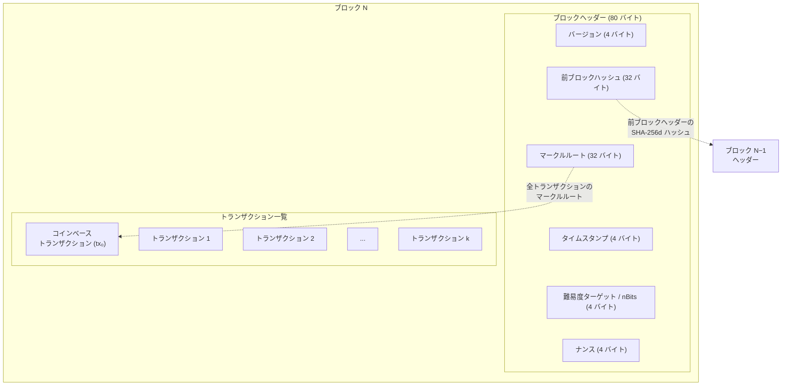
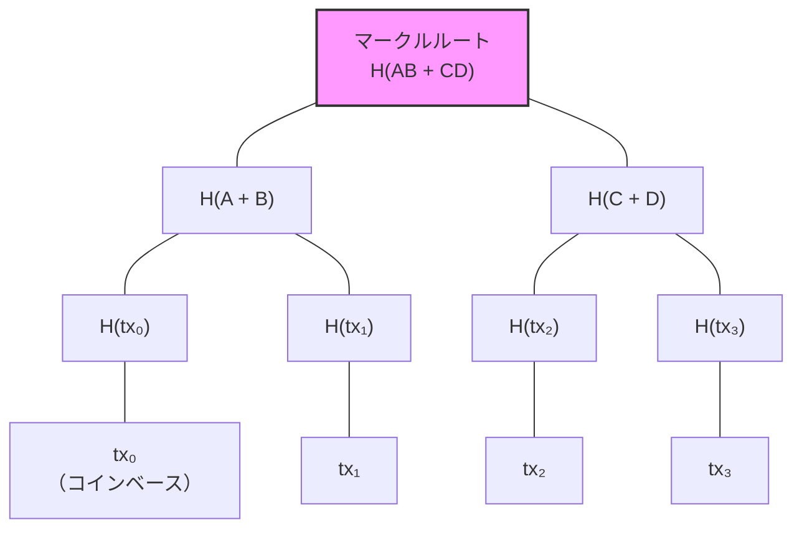
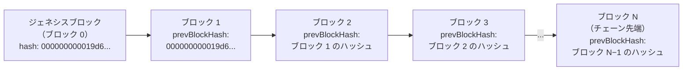
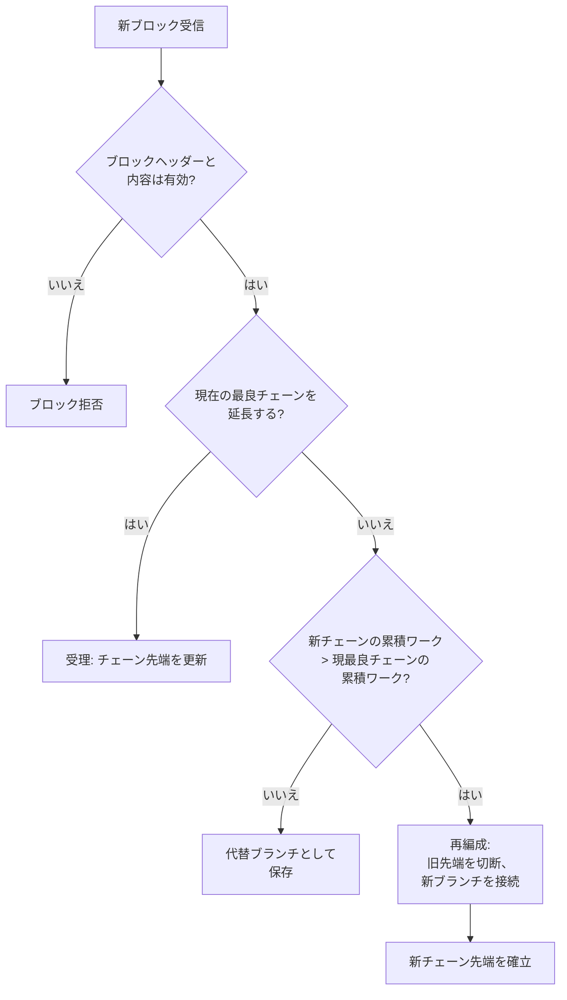

## はじめに

本ページは[設計文書シリーズ](/BitcoinArchive/ja/entries/design/2009-01-03-bitcoin-system-design-overview/)の **L1 #3 — ブロック・チェーン設計** である。ブロック・チェーン層を扱う。トランザクションがブロックにバッチされる方法、ブロックがチェーンにリンクされる方法、ノードが権威あるチェーン先端を選択する方法を解説する。

[トランザクション設計ページ](/BitcoinArchive/ja/entries/design/2009-01-03-bitcoin-transaction-design/)は個々のトランザクション — 入力、出力、スクリプト、署名 — を扱った。本ページはそこから 1 段上がり、それらのトランザクションを永続的かつ全体的に順序付ける構造を扱う。

3 つの問いで素材を整理する:

1. **ブロックとは何か?** タイムスタンプ付きのコンテナであり、一連のトランザクションを単一のプルーフ・オブ・ワークの封印の下にコミットする。
2. **チェーンとは何か?** 各ブロックが前のブロックのハッシュを参照するブロックの連鎖であり、追記専用台帳を形成する。
3. **どのチェーンが勝つか?** 累積プルーフ・オブ・ワークが最大のチェーン — ブロック数が最多のチェーンではない。

サトシ時代の実装（v0.1、2009 年 1 月）と現行の Bitcoin Core（v27 以降基準）で挙動が異なる場合は、両方を記す。

## 1. ブロック構造

ブロックは 2 つの部分で構成される。ブロックを要約するコンパクトな 80 バイトの**ヘッダー**と、ブロックに含まれるすべてのトランザクションを収める**トランザクションリスト**である。チェーンレベルの検証にはヘッダーのみが必要で、内容レベルの検証には完全なトランザクションリストが必要となる。

### ブロックの構造

### ヘッダーフィールドの詳細

| フィールド | サイズ | 説明 |
|---|---|---|
| **バージョン** | 4 バイト | ブロック形式のバージョン。v27 以降基準ではソフトフォークシグナリングビット (BIP 9) を符号化。 |
| **前ブロックハッシュ** | 32 バイト | 前のブロックヘッダーの SHA-256d ハッシュ。このブロックをチェーンにリンクする。ジェネシスブロックはゼロハッシュを使用。 |
| **マークルルート** | 32 バイト | ブロック内の全トランザクションから構築されたマークルツリーのルートハッシュ。トランザクション集合をヘッダーにコミットする。 |
| **タイムスタンプ** | 4 バイト | マイナーが設定する Unix エポック時刻。直前 11 ブロックの中央値より大きく、かつネットワーク調整時刻から 2 時間以上先でなければならない。 |
| **nBits** | 4 バイト | ターゲット閾値のコンパクト符号化。ブロックヘッダーのハッシュはこのターゲット以下でなければならない。2,016 ブロックごとに再計算。 |
| **ナンス** | 4 バイト | マイナーが有効なプルーフ・オブ・ワークを探索するために反復する任意の値。4 バイト空間（2³² 値）は頻繁に枯渇し、探索空間を更新するためにコインベースやタイムスタンプの変更が必要になる。 |

### ブロックバージョンの進化

| 時代 | バージョン | 意義 |
|---|---|---|
| **サトシ v0.1** | 1 | 唯一のバージョン。シグナリング機構なし。 |
| **BIP 34 (2013 年)** | 2 | コインベースにブロック高が必須。バージョンを用いた合意規則強制の初使用。 |
| **BIP 66 (2015 年)** | 3 | 厳密な DER 署名符号化。 |
| **BIP 65 (2015 年)** | 4 | `OP_CHECKLOCKTIMEVERIFY` を有効化。 |
| **BIP 9 (2016 年〜)** | 上位 3 ビット = `001`、残り 29 ビットで個別提案をシグナル | バージョンビット方式: 複数のソフトフォークを同時にシグナル可能。SegWit (ビット 1)、Taproot (ビット 2) 等で使用。 |
| **v27 以降基準** | バージョンビット標準 | 現行のすべてのブロックが BIP 9 バージョンビットシグナリングを使用。基底値は `0x20000000` + 提案固有のビット。 |

## 2. マークルツリー

ブロックヘッダーのマークルルートは、ブロック内の全トランザクションに対する暗号学的コミットメントである。二分ハッシュツリーとして構築される。リーフノードがトランザクションのハッシュであり、各内部ノードは 2 つの子を連結した SHA-256d ハッシュである。

### マークルツリーの構築

**奇数ノード規則。** ツリーの各レベルでノード数が奇数の場合、最後のノードが複製されてペアを形成する。これによりツリーは常に完全二分木となる。

### マークルツリーの意義

| 利点 | 仕組み |
|---|---|
| **SPV 証明** | 軽量クライアントが、全 n 件のトランザクションをダウンロードせず log₂(n) 個のハッシュ（マークルパス）の検査のみでトランザクションのブロック内包含を検証できる。 |
| **効率的な検証** | 単一のトランザクションを変更するとマークルルートが無効になる。ノードは全トランザクションをゼロから再検証せずに、改竄・破損したブロックを検出できる — 変更されたリーフからルートへのパスが一致しない。 |
| **コンパクトなコミットメント** | トランザクション集合全体が単一の 32 バイトハッシュとしてヘッダーにコミットされる。ブロックに 1 件のトランザクションが含まれても 10,000 件が含まれてもヘッダーは 80 バイトのまま。 |

### SegWit 証人コミットメント

現行の Bitcoin Core（v27 以降基準）は第 2 のマークルツリーを追加する。**証人マークルツリー**であり、そのルートはコインベーストランザクションの `OP_RETURN` 出力 (BIP 141) 内にコミットされる。これは主マークルルートが除外する証人データ（署名、スクリプト）をコミットする。サトシの v0.1 には証人の概念がなく、単一のマークルツリーが署名を含む完全に直列化されたトランザクションをコミットしていた。

## 3. チェーン構造

ブロックチェーンはブロックの単方向連結リストであり、各ブロックのヘッダーに前のブロックヘッダーの SHA-256d ハッシュが含まれる。このハッシュの連鎖が台帳を追記専用にする。いかなる過去のブロックを変更してもそのハッシュが変わり、次のブロックからのリンクが切れ、チェーン先端までのすべての後続ブロックに波及する。

### ブロックの連鎖

**ハッシュの連鎖による不変性。** 各ヘッダーハッシュは `prevBlockHash` を含むヘッダー全 80 バイトに対して計算される。ブロック 2 のトランザクションリスト内の 1 バイトを変更すると、ブロック 2 のマークルルートが変わり、ブロック 2 のヘッダーハッシュが変わり、ブロック 3 の `prevBlockHash` が無効になり、以降同様に連鎖する。過去のブロックを改ざんする攻撃者は、そのブロックとすべての後続ブロックのプルーフ・オブ・ワークをやり直さなければならない — 指数関数的に増大するコスト。

### フォークのシナリオ

| シナリオ | 原因 | 解決 |
|---|---|---|
| **自然フォーク（失効ブロック）** | 2 人のマイナーがほぼ同じブロック高で有効なブロックを発見し、ネットワークの異なる部分に送信する。 | ネットワークが一時的に分裂する。ノードは累積プルーフ・オブ・ワークが最大のチェーンに従う。敗れたブロックは失効し、そのトランザクションはメモリープールに戻る。 |
| **孤児ブロック** | 親ブロックより先にブロックが到着する。ハッシュの連鎖が不完全なため検証できない。 | ノードが一時保存する。親が到着し検証されると、孤児ブロックが再接続される。v27 以降基準では「孤児」は親が不明なブロックを特に指し、失効ブロックとは区別される。 |
| **意図的フォーク（ソフト/ハードフォーク）** | プロトコルアップグレードが合意規則を変更し、異なるソフトウェアを実行するノードがブロックの有効性について不一致になる。 | ソフトフォーク: 旧ノードは新規則のブロックをなお受理する。ハードフォーク: 一方の側がフォークを放棄しない限り、チェーンが恒久的に分裂する。 |

チェーン先端争いにブロックが敗れた実例が記録されている。2009 年 1 月、[ダスティン・トランメルは採掘した 4 ブロックが「Generated (not accepted)」と表示されたと報告した](/BitcoinArchive/ja/entries/aftermath/2009-01-12-trammell-to-satoshi-upgrade-issues/) —— v0.1.0 の通信バグにより、勝ち残ったチェーンを争うのに間に合うタイミングで彼のノードがブロックをブロードキャストできなかったためである。

## 4. チェーン選択規則

ビットコインのチェーン選択規則は**最大作業量チェーン規則**である。ノードが認識しているすべての有効なチェーンの中から、累積プルーフ・オブ・ワークが最大のチェーンに従う。これは一般に — 不正確に —「最長チェーン規則」と呼ばれる。チェーンの長さ（ブロック数）とチェーンの作業量は同一ではない。難易度がブロック間で調整される場合、同じ高さの 2 つのチェーンが異なる総作業量を持ちうる。プロトコルは高さではなく作業量で選択する。

### チェーン選択の判定プロセス

### チェーン選択とフォーク解決の比較

| 側面 | チェーン選択 | フォーク解決 |
|---|---|---|
| **契機** | 新規ブロック受信のたびに | 2 つ以上の競合するチェーン先端が同時に存在する場合 |
| **指標** | 累積プルーフ・オブ・ワーク (`nChainWork`) | 同一の指標 — フォークはチェーン選択によって解決 |
| **範囲** | 全体的: 既知のすべての有効なチェーンを常に比較 | フォークポイントに局所的: フォークからどの分岐がより多くの作業量を持つか |
| **結果** | ノードの最良チェーン先端が更新される（またはされない） | 一方の分岐が勝利。もう一方は失効。失効分岐のトランザクションはなお有効であればメモリープールに戻る |
| **速度** | 通常 1〜2 ブロック以内に解決 | 同様 — 大半の自然フォークは次のブロックが一方の分岐を伸長した時点で解決 |

**「最大ブロック数」ではなく「最大作業量」である理由。** 難易度ターゲットは 2,016 ブロックごとに調整される。攻撃者が低い難易度でブロックを生成した場合（例: 難易度調整が反映される前の少数派フォーク上で）、それらのブロックのブロック当たりのプルーフ・オブ・ワーク寄与は少ない。ブロック数は少ないがブロック当たりの難易度が高いチェーンがより多くの総作業量を持つ可能性があり、プロトコルはそれを正しく選択する。Bitcoin Core はこれを `nChainWork`（各ブロックの作業量寄与を累積する 256 ビット整数）として追跡する。

## 5. ブロックサイズと重量

サトシの v0.1 には明示的なブロックサイズ上限がなかった。2010 年に 1 MB の最大ブロックサイズが追加された（当初はスパム対策として）。SegWit (BIP 141、2017 年 8 月有効化) はバイトサイズの上限を証人データにディスカウントを適用する**重量**システムに置き換え、後方互換性を保ちつつ最大ブロック容量を実質的に引き上げた。

### 従来のサイズと SegWit 重量の比較

| 指標 | 従来型 (SegWit 以前) | SegWit (v27 以降基準) |
|---|---|---|
| **上限** | 1,000,000 バイト (1 MB) ハードキャップ | 4,000,000 重量単位 (4 MWU) |
| **計算** | `サイズ = 直列化バイト総数` | `重量 = (非証人バイト × 4) + (証人バイト × 1)` |
| **実効最大** | ブロックあたり 1 MB | 実測約 1.5〜2.0 MB（証人と非証人の比率により変動） |
| **理論最大** | 1 MB | 約 4 MB（ほぼ全体が証人データで構成されるブロック） |
| **コインベースのみのブロック** | 約 250 バイト | 約 1,000 重量単位 |
| **手数料市場への効果** | すべてのバイトがブロック空間内で同一コスト | 証人バイトは 75% 安価であり、SegWit 採用を促進 |

**サトシ時代と v27 以降基準の比較。**

| 側面 | サトシ時代 | v27 以降基準 |
|---|---|---|
| **ブロックサイズ上限** | v0.1 に明示的上限なし。2010 年 9 月に 1 MB 追加 | 4 MWU 重量上限 (BIP 141) に置換 |
| **サイズ強制** | `MAX_BLOCK_SIZE` 定数を生バイト数と照合 | `MAX_BLOCK_WEIGHT` を計算された重量と照合 |
| **証人データ** | 存在しない | 1 バイトあたり 1 WU でディスカウント（非証人は 4 WU） |
| **署名操作上限** | ブロックあたり 20,000 署名操作 | ブロックあたり 80,000 署名操作（重量でスケール）。Tapscript は異なる計算方法 |

## 6. コインベーストランザクション

各ブロックの最初のトランザクションは**コインベーストランザクション**であり、新しいビットコインを作成する唯一のトランザクション型である。以前の UTXO を参照する入力を持たず、代わりにヌルの前トランザクションハッシュと任意のデータフィールドを持つ単一の入力がある。

**構造:**

- **入力:** ヌル prevout（32 バイトのゼロ + インデックス `0xFFFFFFFF`）、加えて `coinbase` データフィールド（2〜100 バイト）。マイナーはここに任意のデータを書き込める。BIP 34 以降、先頭バイトにブロック高を符号化することが必須。
- **出力:** ブロック報酬（新規発行分 + 手数料）をマイナーの選択したアドレスに分配する 1 つ以上の出力。

**ブロック報酬スケジュール:**

| 半減期 | ブロック | 新規発行分 | 期間 |
|---|---|---|---|
| 0 | 0 – 209,999 | 50 BTC | 2009〜2012 年 |
| 1 | 210,000 – 419,999 | 25 BTC | 2012〜2016 年 |
| 2 | 420,000 – 629,999 | 12.5 BTC | 2016〜2020 年 |
| 3 | 630,000 – 839,999 | 6.25 BTC | 2020〜2024 年 |
| 4 | 840,000 – 1,049,999 | 3.125 BTC | 2024〜2028 年 |

新規発行分は 210,000 ブロックごと（約 4 年ごと）に半減し、漸近的にゼロに近づく。総供給量は 20,999,999.9769 BTC（一般に 2,100 万枚に丸められる）を上限とする。

**コインベース成熟。** コインベース出力はその上に 100 ブロックが採掘されるまで支払いに使用できない。この規則はチェーン再編成によりコインベースが無効化され、下流のトランザクションが有効な入力を失う事態から保護する。

**注目すべきコインベースデータ。** サトシはジェネシスブロックのコインベースにテキスト `The Times 03/Jan/2009 Chancellor on brink of second bailout for banks` を埋め込んだ — タイムズ紙の見出しへの参照であり、タイムスタンプの証明と、ビットコインが迂回するように設計された金融システムに対する声明、その両方として機能する。

## 7. 二時代比較

| 機能 | サトシ時代 (v0.1、2009 年 1 月) | 現行 Bitcoin Core、v27 以降基準 |
|---|---|---|
| **ヘッダー形式** | 80 バイト、バージョン 1 | 80 バイト、同一構造。バージョンフィールドに BIP 9 シグナリングビットを搭載 |
| **ブロックバージョン** | 常に 1 | BIP 9 バージョンビット（`0x20000000` 基底 + シグナルビット） |
| **マークルツリー** | 完全に直列化されたトランザクションの単一ツリー | 主ツリー（証人除去トランザクション）+ コインベース内の証人コミットメント |
| **チェーン選択** | 最大累積プルーフ・オブ・ワーク | 同一規則。`nChainWork`（256 ビット整数）で追跡 |
| **ブロックサイズ上限** | v0.1 に上限なし。2010 年に 1 MB 追加 | 4 MWU 重量上限 (BIP 141) |
| **コインベースデータ** | 最大 100 バイトの任意データ | BIP 34: ブロック高プレフィックスが必須。残りバイトは任意 |
| **コインベース成熟** | 100 ブロック | 同一 |
| **証人コミットメント** | 該当なし | コインベースの `OP_RETURN` 出力で証人マークルルートをコミット (BIP 141) |
| **署名操作上限** | ブロックあたり 20,000 | ブロックあたり 80,000（重量調整済み）。Tapscript は異なる計算方法 |
| **ブロック中継** | すべてのピアへの完全ブロック送信 | コンパクトブロック (BIP 152): ヘッダー + 短縮トランザクション ID。受信ノードがメモリープールから再構築 |

## 8. 本ページの範囲

本ページはブロック・チェーン層を独立して扱う。以下のトピックは本ページの範囲外であり、[設計文書シリーズ](/BitcoinArchive/ja/entries/design/2009-01-03-bitcoin-system-design-overview/)内のそれぞれのドメインページで扱う:

- **トランザクション構造と UTXO モデル** — 各ブロック内のトランザクションがどのように構築、検証、連鎖されるか。[トランザクション設計ページ](/BitcoinArchive/ja/entries/design/2009-01-03-bitcoin-transaction-design/)で扱う。
- **マイニングとプルーフ・オブ・ワーク** — 有効なブロックを生成するハッシュパズル、難易度調整アルゴリズム、ブロックテンプレート構築。
- **チェーン選択を超えた合意規則** — ソフトフォーク有効化メカニズム (BIP 9、BIP 8)、合意形成とポリシーの境界、ブロック有効性規則の全体。
- **ネットワーク層のブロック中継** — `inv`、`getdata`、`headers`、`block`、`cmpctblock` メッセージが P2P ネットワーク上でブロックを伝播させる仕組み。
- **ストレージとチェーン状態** — 検証済みブロックのディスクへの永続化方法（ブロックファイル、取消データ）と UTXO 集合の LevelDB での管理方法。
- **SPV クライアントの実装** — 軽量ウォレットによるマークル証明の実用的な使用（本ページはマークルツリー構造を記述する。SPV プロトコル自体はネットワーク層のトピック）。

本ブロック・チェーン設計は、二つの兄弟設計書エントリが依拠する構造的基盤である。 [ストレージ設計](/BitcoinArchive/ja/entries/design/2009-01-03-bitcoin-storage-design/)はブロック形式とチェーン状態の範囲をすべて本エントリへ委ねる。 [コンセンサス設計](/BitcoinArchive/ja/entries/design/2009-01-03-bitcoin-consensus-design/)は本エントリで文書化されたチェーン構造を、最長チェーン規則が動作する基盤として扱う。
