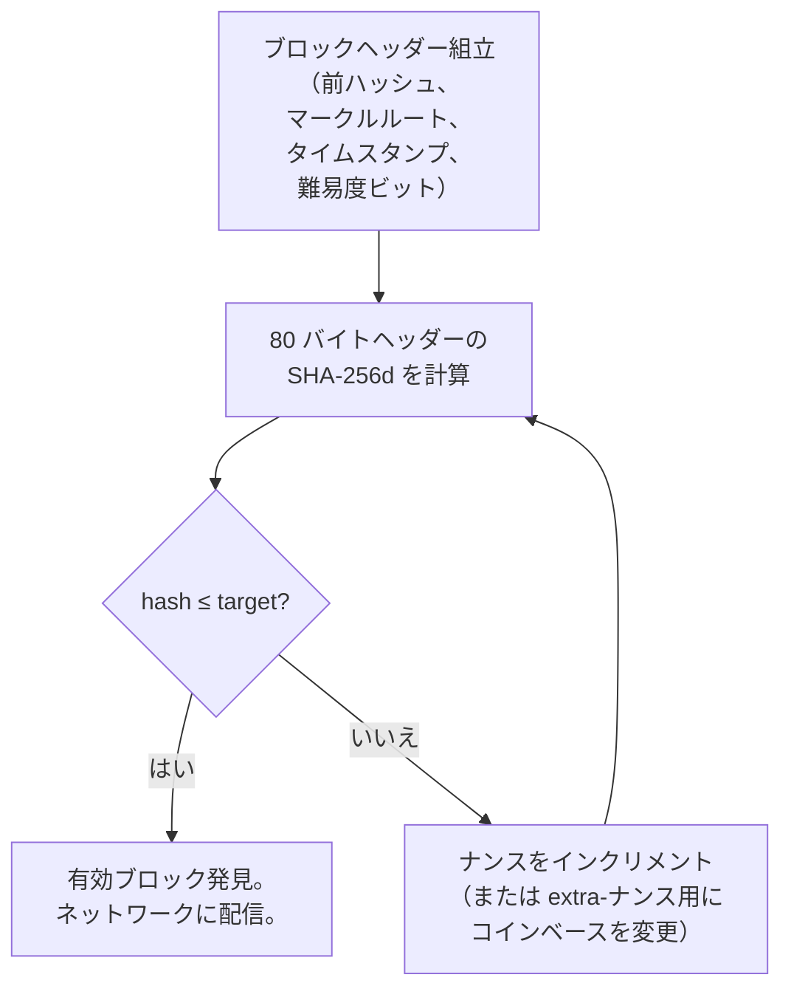
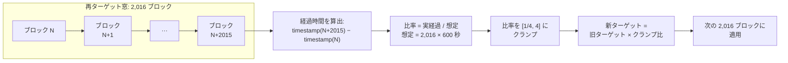
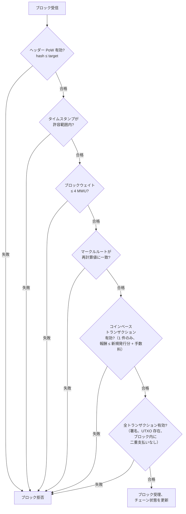
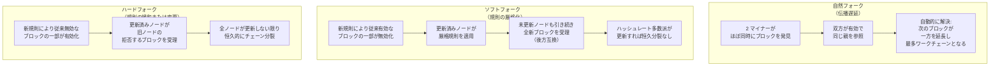
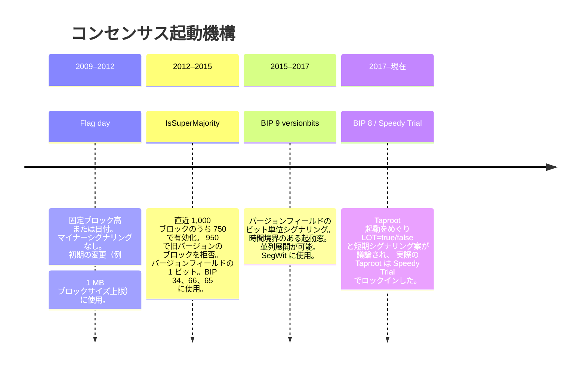

## はじめに

本ページは[設計文書シリーズ](/BitcoinArchive/ja/entries/design/2009-01-03-bitcoin-system-design-overview/)の **L1 #4「コンセンサス設計」** である。[ブロック・チェーン設計](/BitcoinArchive/ja/entries/design/2009-01-03-bitcoin-block-chain-design/)ページの直接の後続である。前ページがヘッダー、マークルツリー、ハッシュの連鎖といったデータ構造を記述したのに対し、本ページはどのチェーンが有効でどのチェーン先端が勝つかを決定する規則を記述する。

合意形成は、ビットコインにおいて中央集権的な権威に代わるものである。すべてのフルノードがすべてのブロックを同一の決定論的規則集に対して独立に評価する。信頼に基づいてブロックを受理することはなく、他のノードの判断に委ねることもない。その結果、数千の機械が調整、投票、リーダー選出なしに単一の取引履歴に収束するシステムが実現する。

本ページは 5 つの領域を扱う。ブロック生成を計算上高コストにするプルーフ・オブ・ワークパズル、ブロック頻度を調節する難易度調整、合法なブロックを定義する検証規則、競合するチェーンを解決するフォーク処理ロジック、承認の安全性を定量化するファイナリティモデル。

サトシ時代の実装（v0.1、2009 年 1 月）と現行の Bitcoin Core（v27 以降基準）で挙動が異なる場合は、両方を記す。

## 1. プルーフ・オブ・ワーク

プルーフ・オブ・ワークはブロック生成を計算上高コストにするメカニズムである。マイナーは 80 バイトのブロックヘッダーの SHA-256d ハッシュがネットワーク全体のターゲット値を下回るようなナンス（およびその他の可変ヘッダーフィールド）を見つけなければならない。SHA-256 は一方向関数であるため、既知の唯一の戦略は総当たり反復である。

### マイニングループ

二重 SHA-256 (SHA-256d) 演算は SHA-256 を 2 回連続で適用する: `SHA-256(SHA-256(header))`。サトシは単一パスの SHA-256 に固有の長さ拡張攻撃を緩和するためにこの構成を選んだ。

### プルーフ・オブ・ワークのパラメーター

| パラメーター | 値 | 備考 |
|---|---|---|
| **ハッシュ関数** | SHA-256d (二重 SHA-256) | v0.1 から不変 |
| **入力** | 80 バイトのブロックヘッダー | バージョン、前ハッシュ、マークルルート、タイムスタンプ、ビット、ナンス |
| **ナンスフィールド** | 32 ビット (4 バイト) | ヘッダー構成ごとに約 43 億の候補を提供 |
| **追加ナンス** | コインベーストランザクションデータ | コインベースを変更するとマークルルートが変わり、ナンス探索空間が更新される |
| **ターゲット表現** | `nBits` コンパクト形式 (4 バイト) | 256 ビットターゲットを 3 バイトの仮数と 1 バイトの指数で符号化 |
| **難易度 1 ターゲット** | `0x00000000FFFF...`（切り詰め） | すべての難易度値がこれとの比率で表される基準ターゲット |
| **有効ハッシュ基準** | `ハッシュ ≤ ターゲット` | ターゲットが低い = 難易度が高い = 有効なハッシュを見つけるのが困難 |

## 2. 難易度調整

ビットコインはブロック間の平均間隔を 10 分に目標設定する。ネットワーク全体のハッシュレートは、新しいマイナーの参入、旧ハードウェアの退役、エネルギーコストの変化などにより変動するため、プロトコルは 2,016 ブロックごと（約 2 週間ごと）にターゲット値を調整する。

### 再ターゲットサイクル

### 調整パラメーター

| パラメーター | 値 | 備考 |
|---|---|---|
| **目標ブロック時間** | 600 秒 (10 分) | サトシが承認速度と孤児ブロック率のトレードオフとして選択 |
| **再ターゲット期間** | 2,016 ブロック | 目標レートでは正確に 14 日間 |
| **期待ウィンドウ時間** | 1,209,600 秒 (14 日間) | 2,016 × 600 |
| **最大上方調整** | 4 倍（ターゲットが 4 倍容易に） | ハッシュレートの急激な低下がチェーンを無期限に停滞させることを防止 |
| **最大下方調整** | 1/4 倍（ターゲットが 4 倍困難に） | ハッシュレートの急増がブロックを危険なほど高速にすることを防止 |
| **調整粒度** | 256 ビットターゲットに対する整数算術 | 浮動小数点なし。すべての実装で決定論的 |

難易度はジェネシスブロックの 1 から、2024 年には 10¹³ を超える水準まで上昇した。15 年間でネットワークハッシュレートが指数関数的に増大した結果である。

### サトシ時代のバグ

元の難易度調整コードには 2 つの既知の問題があり、ネットワークの全歴史を通じて合意規則として残存している:

- **一つ違い誤差。** 再ターゲット計算はブロック N（ウィンドウの最初のブロック）とブロック N+2,015（最後のブロック）のタイムスタンプを使用し、2,016 ではなく 2,015 の間隔を測定する。したがって実際の再ターゲットウィンドウは意図より 1 ブロック短い。10 分の目標では、これは約 0.05% の系統的偏りを生む。

- **時間歪曲脆弱性。** 調整アルゴリズムは 2 つのブロック（ウィンドウの最初と最後）のタイムスタンプのみを検査するため、過半数のハッシュレートを持つマイナーは各ウィンドウの最後のブロックのタイムスタンプを操作してチェーンを実際より遅く見せかけ、目標レートより速くブロックを生成しながら徐々に難易度を下げることができる。この攻撃は正直な多数派に対しては理論的だが、持続的に 50% 超を占める攻撃者には実行可能になる。ソフトフォークによる修正（「時間歪曲攻撃緩和」）が Great Consensus Cleanup の一部として提案されているが、有効化に必要な運用者の合意はまだ得られていない。詳しい仕組みは[時間歪曲攻撃の分析](/BitcoinArchive/ja/entries/analysis/2009-01-09-bitcoin-time-warp-attack/)を参照。

## 3. ブロック検証規則

ノードが新規ブロックを受信すると、ローカルチェーン状態に受理する前に決定論的な一連の検査を適用する。すべての検査に合格しなければならず、1 つでも失敗するとブロック全体が拒否される。

### 検証判定ツリー

### 検証項目

| 検査 | 規則 | 導入時期 |
|---|---|---|
| **ヘッダーのプルーフ・オブ・ワーク** | ヘッダーの SHA-256d ハッシュ ≤ `nBits` に符号化されたターゲット | v0.1 |
| **タイムスタンプ範囲** | 直前 11 ブロックの中央値 (MTP) より大きく、かつノードのローカル時刻 + 2 時間未満 | v0.1（`GetMedianTimePast()`） |
| **ブロック重量** | ≤ 4,000,000 重量単位 (4 MWU) | BIP 141 (2017 年)。v0.1 時代の 1 MB バイトサイズ上限に置換 |
| **マークルルート** | ヘッダーのマークルルートがブロックのトランザクションリストから再計算したルートと一致 | v0.1 |
| **コインベースの有効性** | コインベースは正確に 1 つ。出力値 ≤ 新規発行分 + トランザクション手数料合計。scriptSig にブロック高を含む (BIP 34) | v0.1。BIP 34 は 2013 年追加 |
| **トランザクションの有効性** | すべての入力が既存の未使用出力を参照。すべてのスクリプトが真に評価。ブロック内で入力が二重に使用されていない | v0.1 |
| **署名操作回数** | 全トランザクション横断の署名操作合計 ≤ 上限（従来型: 20,000、SegWit: 重量加重） | v0.1 に上限なし。2010 年半ばに 20,000 追加。SegWit で計算方法を改訂 |
| **トランザクションの確定性** | すべてのトランザクションがロックタイムとシーケンスの制約を満たす | v0.1。BIP 68/113 で相対的タイムロックを追加 |

## 4. フォーク種別と処理

フォークは、2 つ以上のブロックが同じ親を共有するたびに発生し、チェーンが競合する分岐に分裂する。フォークは 3 つの異なる原因から生じ、それぞれ異なる特性と解決メカニズムを持つ。

### フォーク比較

### 注目すべきフォーク

| 出来事 | 年 | 種別 | メカニズム | 結果 |
|---|---|---|---|---|
| **バリュー・オーバーフロー事件** | 2010 | 緊急ソフトフォーク | `CheckTransaction` を修正し 2,100 万 BTC 超の出力を拒否 | チェーン再編成。無効なブロックは数時間以内に孤立化 |
| **BIP 66 (厳密な DER)** | 2015 | ソフトフォーク | `IsSuperMajority` (1,000 ブロック中 750 で有効化、950 で旧バージョンブロックを拒否) | 正規の署名符号化を強制 |
| **SegWit (BIP 141)** | 2017 | ソフトフォーク | BIP 9 バージョンビット | 証人ディスカウント導入、改ざん性修正、スクリプトバージョニング有効化 |
| **ブロックサイズ → [ビットコインキャッシュ](/BitcoinArchive/ja/entries/currency/2026-07-27-bitcoin-cash-currency-overview/)** | 2017 | ハードフォーク | スケーリング方針の対立 | ビットコインキャッシュが分裂。非互換の 8 MB ブロックサイズ規則が恒久的チェーン分岐を生む |
| **Taproot (BIP 341)** | 2021 | ソフトフォーク | Speedy Trial（修正 BIP 9） | シュノア署名、Tapscript、MAST を追加 |

上表のバリュー・オーバーフロー事件は、この緊急ソフトフォークという仕組みが実際に機能した最も明確な事例である。パッチが配信され無効なブロックが数時間で孤立化するに至った経緯は[事件の詳細記事](/BitcoinArchive/ja/entries/aftermath/2010-08-15-value-overflow-incident/)に譲る。

上表に挙げた 2017 年 8 月のビットコインキャッシュ分裂は、本節で述べたハードフォークのパターンを体現する具体例であり、そのブロック高やローンチ仕様、その後の経緯は[ビットコインキャッシュのフォーク](/BitcoinArchive/ja/entries/aftermath/2017-08-01-bitcoin-cash-fork/)のエントリーで詳しく扱っている。

### チェーン選択規則

ノードが競合するチェーン先端に遭遇した場合、累積プルーフ・オブ・ワークが最大のチェーン（内部的に `nChainWork` として追跡）、すなわち**最大作業量チェーン**を選択する。これは一般に不正確にも「最長チェーン」と称される。実際には、難易度の高いブロックを持つ短いチェーンが難易度の低いブロックを持つ長いチェーンよりも多くの総作業量を持ちうる。最大作業量規則は、最大の計算エネルギー支出に裏付けられたチェーンが勝利することを保証する。

## 5. 合意規則の進化

ビットコインの合意規則は静的ではない。すべての参加者の同時的な調整を必要とせずにネットワークが新規則を採用できるよう、慎重に段階的な有効化メカニズムを通じて進化する。

### 有効化メカニズムの沿革

### 有効化パラメーターの比較

| メカニズム | シグナル方法 | 閾値 | タイムアウト時の挙動 | 使用例 |
|---|---|---|---|---|
| **フラグデー** | なし（ハードコードされた高さ/時刻） | 該当なし | 指定時点で無条件に有効化 | 1 MB 上限、初期パッチ |
| **IsSuperMajority** | ブロック `nVersion` ≥ N | 1,000 ブロック中 750 で有効化、950 で旧バージョンブロックを拒否 | 明示的タイムアウトなし。閾値到達まで保留 | BIP 34、BIP 66、BIP 65 |
| **BIP 9 バージョンビット** | `nVersion` の個別ビット | 再ターゲット期間の 95% (2,016 中 1,916) | 終了日までにロックインされなければ失敗。ビットは再利用可能に | CSV (BIP 68/112/113)、SegWit (BIP 141) |
| **BIP 8 (LOT=true)** | `nVersion` の個別ビット | 再ターゲット期間の 95% | タイムアウト時に強制ロックイン（マイナーは有効化を阻止できない） | Taproot 起動の議論で提案されたが、最終的に採用された機構ではない |
| **BIP 8 (LOT=false)** | `nVersion` の個別ビット | 再ターゲット期間の 95% | タイムアウト時に失敗（BIP 9 と同様） | 提案されたが単独ではデプロイされず |
| **Speedy Trial** | `nVersion` の個別ビット | 再ターゲット期間の 90% | 短いシグナリング期間。タイムアウト時の強制ロックインなし | Taproot (BIP 341) |

## 6. ファイナリティモデル

ビットコインは**確率的ファイナリティ**を提供し、絶対的ファイナリティは提供しない。承認済みトランザクションは後続のブロックごとに覆すのが指数関数的に困難になるが、有限の承認数では数学的に覆しを不可能にすることはない。

### 承認深度と攻撃成功確率

以下の表は[ホワイトペーパー第 11 節](/BitcoinArchive/ja/entries/emails/cryptography/2008-10-31-bitcoin-whitepaper-final/)の分析を再現し、ネットワークハッシュレートの一定割合を持つ攻撃者が、トランザクションが一定の承認深度に達した後に正直なチェーンに追いつき追い越す確率を示す。

| 承認数 | q = 10% | q = 15% | q = 20% | q = 25% | q = 30% |
|---|---|---|---|---|---|
| 1 | 0.2045 | 0.2891 | 0.3669 | 0.4375 | 0.5000 |
| 2 | 0.0509 | 0.0965 | 0.1552 | 0.2309 | 0.3190 |
| 3 | 0.0131 | 0.0334 | 0.0682 | 0.1267 | 0.2138 |
| 4 | 0.0034 | 0.0117 | 0.0304 | 0.0706 | 0.1448 |
| 5 | 0.0009 | 0.0042 | 0.0137 | 0.0397 | 0.0989 |
| 6 | 0.0002 | 0.0015 | 0.0062 | 0.0225 | 0.0680 |

6 承認（約 1 時間）の時点で、ネットワークハッシュレートの 10% を制御する攻撃者がトランザクションを覆す確率は 0.02% である。30% の攻撃者に対しては、同じ深度でも覆し確率は依然 6.8% であり、高額トランザクションがより多くの承認を待つ理由である。

### ビットコインに絶対的ファイナリティがない理由

Tendermint や HotStuff のようなビザンチン障害耐性 (BFT) 合意システムでは、検証者の過半数（通常 2/3）がブロックに署名すると確定とみなされる。その時点以降、プロトコルの安全性保証に違反しなければブロックを覆すことはできない。

ビットコインの設計は根本的に異なるトレードオフを行う:

| 特性 | ビットコイン（ナカモト合意） | BFT システム |
|---|---|---|
| **ファイナリティの種別** | 確率的 — 覆し確率が深度とともに指数関数的に減少 | 決定論的 — 過半数投票後に確定 |
| **参加者集合** | 開放的 — 許可なくどの機械でもマイニング可能 | 閉鎖的 — 検証者集合が既知で有界 |
| **耐障害性** | 敵対的ハッシュレート 50% 未満を許容 | 敵対的検証者 1/3 未満を許容 |
| **分断下の活性** | ブロック生成を継続（一時的にフォークする可能性あり） | 過半数が再接続するまで停止 |
| **覆しコスト** | トランザクションの上に埋まった累積プルーフ・オブ・ワークに比例 | 検証者集合の 1/3 以上の買収が必要 |

ビットコインが確率的ファイナリティを選んだのは、開放的で許可不要の参加者集合を可能にするためであり、これがシステムを検閲耐性にする決定的な特性である。閉鎖的メンバーシップの BFT システムは即時ファイナリティを提供できるが、参加者が誰かを知ることが前提となり、ビットコインが排除するように設計された信頼の前提を、再び持ち込むことになる。

## 7. 二時代比較

| 機能 | サトシ時代 (v0.1、2009 年 1 月) | 現行 Bitcoin Core、v27 以降基準 |
|---|---|---|
| **ハッシュ関数** | SHA-256d (二重 SHA-256) | 同一 |
| **チェーン選択** | ブロック高の単純比較 (`nBestHeight`)。累積作業量の追跡なし | 最大作業量チェーン (`nChainWork`、v0.3.3 で導入、2010 年 7 月) が高さ比較を置換 |
| **難易度調整** | 2,016 ブロックごと。一つ違い誤差あり | 同一アルゴリズム。一つ違い誤差は合意として保存（修正にはハードフォークが必要） |
| **ブロックサイズ上限** | v0.1 になし。2010 年半ばに 1 MB 追加 | 4 MWU 重量上限 (BIP 141)。実測約 1.5〜2 MB |
| **コインベース成熟** | 100 ブロックの成熟規則 | 同一 |
| **ソフトフォーク有効化** | コード直接変更（フラグデー） | BIP 9 バージョンビット / BIP 8 Speedy Trial |
| **スクリプト検証** | scriptSig + scriptPubKey を結合して実行 | 分離された評価。SegWit 証人プログラム。Taproot スクリプトパス支払い |
| **タイムスタンプ検証** | 中央値時刻経過 (MTP) 規則: 直前 11 ブロックの中央値より大きいこと (`GetMedianTimePast()`、`nMedianTimeSpan = 11`) | 同一規則。v0.1 から不変 |
| **チェックポイント** | v0.1 になし。2010 年 7 月（v0.3.2）に DoS 対策としてハードコードされたチェックポイントを追加 | `assumevalid`（信頼されたブロックハッシュ以下のスクリプト検証を省略）が大半のチェックポイント機能に置換 |
| **ヘッダー先行同期** | 利用不可。ブロックを逐次ダウンロード・検証 | ヘッダー先行同期（全ヘッダーをダウンロードし、ブロックを並列要求） |
| **暗号ライブラリー** | SHA-256 採掘パスは同梱の Crypto++。ECDSA とその他のハッシュは OpenSSL | 内部 SHA-256（ハードウェアアクセラレーション対応）。ECDSA/シュノアに libsecp256k1 |

## 8. 本ページの範囲

本ページは合意形成層を独立して扱う。以下のトピックは本ページの範囲外であり、[設計文書シリーズ](/BitcoinArchive/ja/entries/design/2009-01-03-bitcoin-system-design-overview/)内のそれぞれのドメインページで扱う:

- **ブロックデータ構造**: ヘッダー形式、マークルツリー構築、コインベース配置。[ブロック・チェーン設計](/BitcoinArchive/ja/entries/design/2009-01-03-bitcoin-block-chain-design/)ページで扱う。
- **マイニング経済学**: ブロックテンプレート構築、手数料市場の動態、プールプロトコル、発行計画。[マイニング報酬枯渇分析](/BitcoinArchive/ja/entries/analysis/2026-05-18-mining-reward-exhaustion-fee-only-future/)が手数料のみのセキュリティ予算への長期的移行を検討する。
- **トランザクション検証の詳細**: UTXO 照合、スクリプト評価、署名検証。[トランザクション設計](/BitcoinArchive/ja/entries/design/2009-01-03-bitcoin-transaction-design/)ページで扱う。
- **ネットワーク層のブロック伝播**: ブロックが P2P ネットワーク上を伝播する仕組み、コンパクトブロック中継 (BIP 152)、日食/シビル耐性。
- **セキュリティモデル**: 51% 攻撃の経済学、利己的マイニング、完全な脅威モデル。L2 セキュリティモデル深掘りに委ねる。

隣接する三つのページが、合意形成の規則を別々の側から扱う。[P2P ネットワーク設計](/BitcoinArchive/ja/entries/design/2009-01-03-bitcoin-p2p-network-design/)はその規則を運ぶ伝送路を、[貨幣設計](/BitcoinArchive/ja/entries/design/2009-01-03-bitcoin-monetary-design/)は発行と難易度を検証ではなく通貨政策として、[セキュリティモデルの深掘り](/BitcoinArchive/ja/entries/design/2009-01-03-bitcoin-security-model/)は規則が攻撃されたときに何が起きるか、すなわち二重支払いの抑止、51% 攻撃の経済、利己的マイニングを扱う。
