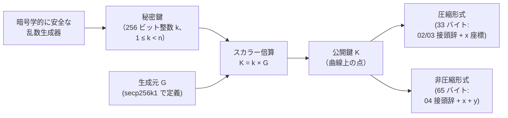
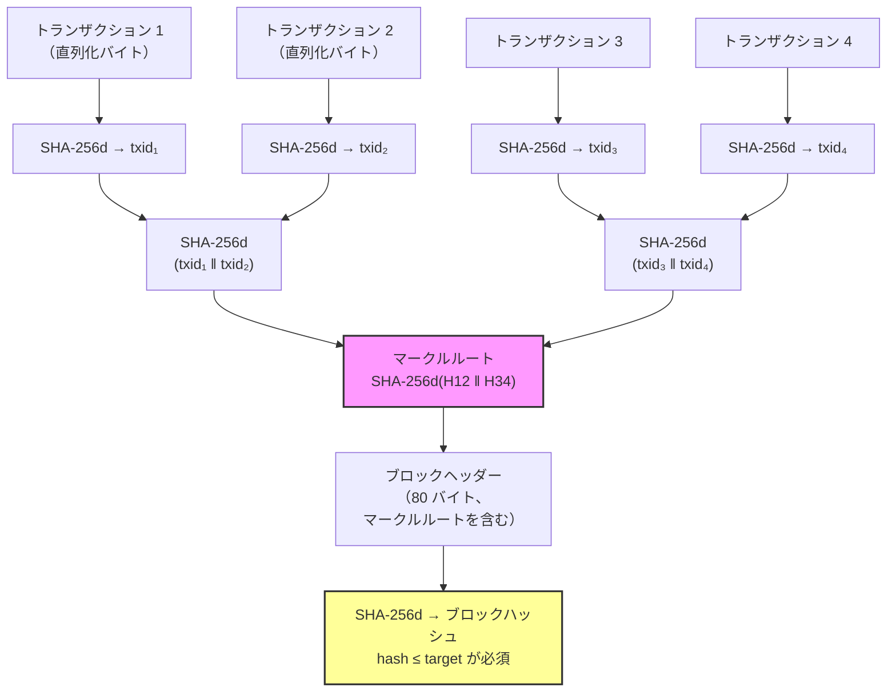
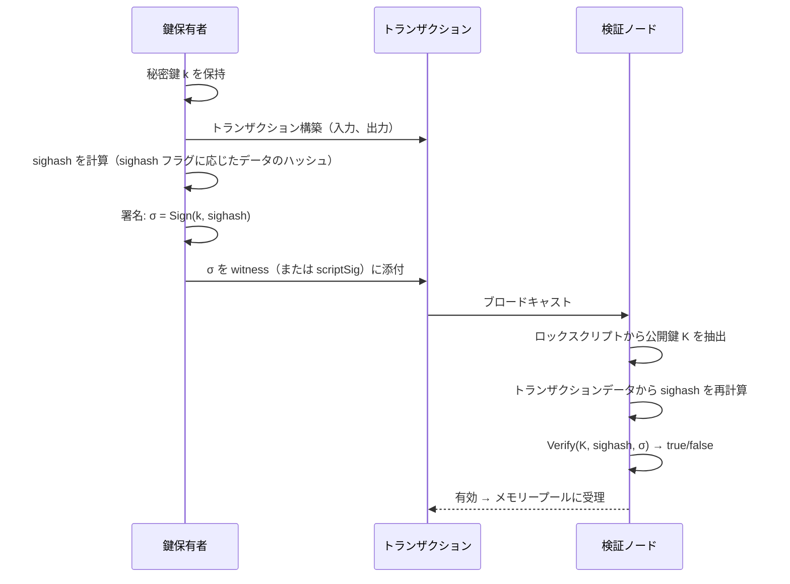
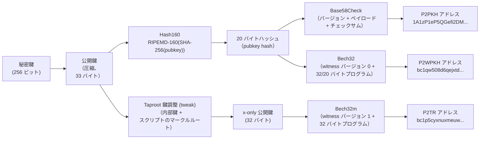
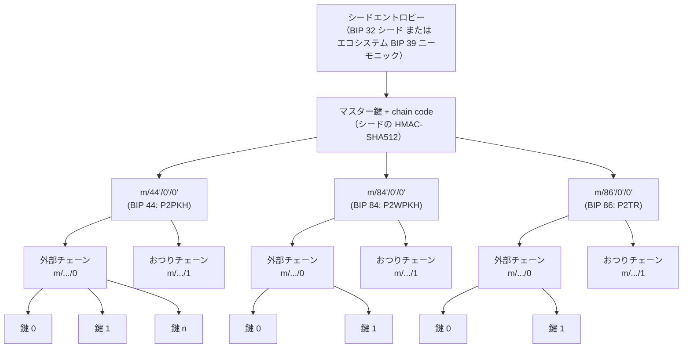

## はじめに

本ページは[設計文書シリーズ](/BitcoinArchive/ja/entries/design/2009-01-03-bitcoin-system-design-overview/)の **L1 #6 — 暗号設計** である。ビットコインのあらゆる層を支える暗号学的基本要素を扱う: 所有権を表す鍵、支出を認可する署名、ブロックとトランザクションを結合するハッシュ関数、そして単一の秘密からアドレスの木を生成する導出スキーム。

重要な区別がある: ビットコインは**暗号学**の上に構築されたシステムであり、**暗号化**のシステムではない。ブロックチェーンは公開されている。トランザクションは平文でブロードキャストされる。プロトコルレベルで暗号化されるメッセージはない。暗号学が代わりに提供するのは**認証** — トランザクションが特定の秘密鍵の保持者によって認可されたことの証明 — と**完全性** — データが改竄されていないことの証明 — である。唯一の例外は BIP 324（v2 トランスポートプロトコル）で、受動的な監視に対抗するためにピアツーピアの通信を暗号化する。これはネットワーク層の問題であり、P2P 設計ページで扱う。トランザクション層の基本要素ではない。

本ページは[トランザクション設計ページ](/BitcoinArchive/ja/entries/design/2009-01-03-bitcoin-transaction-design/)に依存する。同ページでは、入力・出力・スクリプトがここで記述する暗号学的基本要素をどのように消費するかを説明している。サトシ時代の実装（v0.1、2009 年 1 月）と現代の Bitcoin Core（v27 以降を基準）で挙動が異なる箇所は、双方を記載する。

## 1. 楕円曲線暗号

ビットコインの所有権モデルは楕円曲線暗号（ECC）に基づく。秘密鍵はランダムな 256 ビット整数である。対応する公開鍵は secp256k1 曲線上の点で、秘密鍵と曲線の生成点のスカラー乗算で導出される。乗算は計算上容易だが、逆演算 — 公開鍵から秘密鍵を復元すること — は楕円曲線離散対数問題（ECDLP）であり、この鍵サイズでは古典的コンピューターにとって解読不能と考えられている。

### 鍵生成フロー

### secp256k1 曲線パラメーター

| パラメーター | 値 | 備考 |
|---|---|---|
| **曲線方程式** | y² = x³ + 7 (mod p) | ワイエルシュトラス短縮形; a = 0, b = 7 |
| **体の素数 (p)** | 2²⁵⁶ − 2³² − 977 | 効率的な剰余演算のために選ばれた素数 |
| **群の位数 (n)** | FFFFFFFF FFFFFFFF FFFFFFFF FFFFFFFE BAAEDCE6 AF48A03B BFD25E8C D0364141 | 曲線上の点の個数; 秘密鍵は [1, n−1] の範囲 |
| **生成点 (G)** | SEC 2 規格で定義 | すべての鍵導出の固定基点 |
| **補因子 (h)** | 1 | 群は素数位数 — 単位元以外のすべての点が生成元 |
| **鍵サイズ** | 256 ビット（秘密鍵）、256 または 512 ビット（公開鍵） | 圧縮公開鍵: 33 バイト; 非圧縮: 65 バイト |
| **安全性水準** | 約 128 ビット（古典的） | ECDLP の解読には最善の既知古典アルゴリズムで約 2¹²⁸ 演算が必要 |

**なぜ secp256k1 か。** サトシはより広く展開されていた NIST P-256（secp256r1）ではなく secp256k1 を選んだ。secp256k1 のパラメーターは単純な非ランダム値から構成されており、曲線定数にバックドアが埋め込まれていないことを検証できる — Dual_EC_DRBG 事件により NIST 承認の暗号学的パラメーターに意図的に仕込まれた弱点が含まれうることが実証された後、この懸念は重要性を増した。曲線の構造はまた自己準同型最適化による署名検証の約 30% の高速化を可能にし、libsecp256k1 がこれを活用している。

## 2. ハッシュ関数

ビットコインはプロトコル全体で 3 つのハッシュ構成を使用する。いずれも暗号化には使われず、すべてコミットメントまたは完全性のメカニズムとして機能する。

### 各ハッシュの使用箇所

| ハッシュ関数 | 出力サイズ | ビットコインでの使用箇所 |
|---|---|---|
| **SHA-256**（単一） | 256 ビット | マークルツリー内部ノード（ルートでは SHA-256d と組み合わせ）; BIP 340 シュノア署名のチャレンジ; BIP 32 HMAC-SHA512 子鍵導出は内部で SHA-512 を使用 |
| **SHA-256d**（二重 SHA-256） | 256 ビット | ブロックヘッダーのハッシュ化（プルーフ・オブ・ワーク）、トランザクション ID (txid)、マークルルート計算、`OP_HASH256` |
| **RIPEMD-160** | 160 ビット | Hash160 構成で SHA-256 の後に使用: `RIPEMD-160(SHA-256(data))`。P2PKH および P2WPKH アドレスの 20 バイトペイロードを生成、`OP_HASH160` |
| **SHA-512** | 512 ビット | BIP 32 HD 鍵導出における HMAC-SHA512（単一操作から子鍵とチェーンコードの両方を生成） |
| **タグ付きハッシュ** | 256 ビット | BIP 340/341 は各 SHA-256 入力にドメイン固有のタグを接頭辞として付加し、プロトコル間のハッシュ衝突を防止する（例: `SHA-256(SHA-256("BIP0340/challenge") ‖ SHA-256("BIP0340/challenge") ‖ data)`） |

### ハッシュ連鎖: トランザクションからプルーフ・オブ・ワークまで

**なぜ二重ハッシュか。** SHA-256d は SHA-256 を順に 2 回適用する: `SHA-256(SHA-256(data))`。サトシはこの構成を長さ拡張攻撃の無効化のために選んだ。単一パスの SHA-256 は、すべてのマークル・ダムゴール型ハッシュと同様に、`H(m)` を知る攻撃者が `m` を知らずに `H(m ‖ padding ‖ m')` を計算できる。2 回目のハッシュパスがこの性質を破壊する — 1 回目の出力が 2 回目への固定長入力となるためである。

## 3. 電子署名

署名は、支出者が UTXO のロックスクリプトにコミットされた公開鍵に対応する秘密鍵の管理権を証明するメカニズムである。ビットコインは 2 つの署名方式を使用してきた。

### 署名と検証のフロー

### ECDSA 対シュノア

| 特性 | ECDSA（v0.1、2009 年） | シュノア（BIP 340、Taproot 2021 年） |
|---|---|---|
| **署名サイズ** | 70〜72 バイト（DER エンコード、可変長） | 64 バイト（固定長） |
| **エンコード** | DER（可変長 ASN.1） | 固定 64 バイト `(R‖s)` |
| **検証方程式** | 署名ごとに 1 つ | 署名ごとに 1 つ; ネイティブにバッチ検証可能 |
| **鍵集約** | ネイティブ非対応; 複雑な多段プロトコルが必要 | MuSig2: n-of-n 参加者が単独支出と区別不能な 1 つの 64 バイト署名を生成 |
| **線形性** | 非線形 — 署名要素が単純には加算できない | 線形 — `s₁ + s₂` が合成公開鍵に対する有効な署名を生成 |
| **証明可能な安全性** | 汎用群モデルまたは追加の仮定が必要 | ランダムオラクルモデルにおける離散対数仮定の下で証明可能な安全性 |
| **改竄可能性** | 署名の改竄が可能（第三者が同じメッセージに対して異なる有効な署名を生成可能） | 構成上改竄不能 |
| **sighash 方式** | レガシー sighash（大規模トランザクションでは二乗的ハッシュ計算） | BIP 341 sighash（線形、エポックタグ付き） |
| **暗号ライブラリー** | OpenSSL（v0.1〜v0.9）; libsecp256k1（v0.10 以降） | libsecp256k1 シュノアモジュール |
| **スクリプトコンテキスト** | `OP_CHECKSIG`、`OP_CHECKMULTISIG` | `OP_CHECKSIG`（tapscript 版）、`OP_CHECKSIGADD` |

**OpenSSL からの離脱。** サトシの v0.1 はすべての暗号演算 — ECDSA 署名、ECDSA 検証、SHA-256、乱数生成 — を OpenSSL に依存していた。v0.10（2015 年）までに Bitcoin Core は ECDSA を libsecp256k1 に移行した。これは定時間演算（サイドチャネル耐性）、決定性ナンス生成（RFC 6979）、大幅に高速なバッチ検証を提供する専用ライブラリーである。この移行はまた、OpenSSL バージョン間の DER 署名解析の差異に起因する合意形成バグのクラスを排除した — BIP 66 の厳密 DER ソフトフォークの動機となったものである。

## 4. アドレス導出

ビットコインアドレスは、ロックスクリプトのペイロードを人間が読める形式にエンコードしたものである。ブロックチェーンには保存されず、ネットワークは生の scriptPubKey バイトで動作する。アドレスはエラー検出の追加とスクリプトタイプの識別を行うユーザーインターフェース上の利便機能である。

### アドレス導出パイプライン

### アドレス形式の比較

| 形式 | 接頭辞 | 導入時期 | エンコード | エラー検出 | ロックスクリプト | 典型的なサイズ |
|---|---|---|---|---|---|---|
| **P2PKH** | `1` | v0.1（2009 年） | Base58Check | 4 バイト SHA-256d チェックサム | `OP_DUP OP_HASH160 <20-byte hash> OP_EQUALVERIFY OP_CHECKSIG` | 25〜34 文字 |
| **P2SH** | `3` | BIP 16（2012 年） | Base58Check | 4 バイト SHA-256d チェックサム | `OP_HASH160 <20-byte hash> OP_EQUAL` | 34 文字 |
| **P2WPKH** | `bc1q` | BIP 141/173（2017 年） | Bech32 | 6 文字 BCH コード | Witness v0 + 20 バイト鍵ハッシュ | 42 文字 |
| **P2WSH** | `bc1q` | BIP 141/173（2017 年） | Bech32 | 6 文字 BCH コード | Witness v0 + 32 バイトスクリプトハッシュ | 62 文字 |
| **P2TR** | `bc1p` | BIP 341/350（2021 年） | Bech32m | 6 文字 BCH コード（修正定数） | Witness v1 + 32 バイト x のみの鍵 | 62 文字 |

**Base58Check → Bech32 → Bech32m。** Base58Check は視覚的に紛らわしい文字（`0`、`O`、`I`、`l`）を除外した文字セットを使用し、4 バイトのチェックサムを含む。Bech32（BIP 173）は QR コード向けに最適化された小文字のみの英数字セットに切り替え、チェックサムを最大 4 つのエラーを検出し、より長いエラーバーストも確実に検出できる BCH 誤り訂正符号に置き換えた。Bech32m（BIP 350）は Bech32 で発見された長さ変異の脆弱性をチェックサム定数の変更で修正し、witness バージョン 1 以上（Taproot の v1 から開始）のすべてに使用される。

## 5. HD ウォレット

初期のビットコインウォレットは鍵を独立に生成していた — 各鍵は他のどの鍵とも構造的関係のない新規乱数だった。新しい鍵が生成される前に取得されたバックアップを紛失すると、その鍵の資金が永久に失われることを意味した。BIP 32（2012 年）は**階層的決定性**（HD）導出を導入した: 単一のマスター秘密から鍵の木全体を生成し、1 つのバックアップからすべてを復元できる。

### HD 導出ツリー

### BIP 32 / 39 / 44 の役割

| BIP | 年 | 役割 | メカニズム |
|---|---|---|---|
| **BIP 32** | 2012 年 | 階層的決定性鍵導出 | 数学を定義: HMAC-SHA512 で親鍵 + チェーンコードから子鍵を導出。強化導出（子から親を復元不能）と通常導出（拡張公開鍵からの監視専用ウォレットが可能）をサポート。 |
| **BIP 39** | 2013 年 | ニーモニックシードフレーズ | 初期エントロピーを 12〜24 の英単語としてエンコード。サードパーティーウォレットで広く採用。**Bitcoin Core はネイティブに BIP 39 を使用しない** — BIP 32 を介して生のエントロピーから鍵を導出する。エコシステムの慣行が広く浸透しているためここに記載。 |
| **BIP 44** | 2014 年 | マルチアカウント構造 | 導出パスを標準化: `m / purpose' / coin_type' / account' / change / address_index`。purpose 44 = P2PKH。 |
| **BIP 49** | 2017 年 | P2SH ラップ SegWit パス | purpose 49 = P2SH-P2WPKH（`3` で始まる後方互換 SegWit アドレス）。 |
| **BIP 84** | 2017 年 | ネイティブ SegWit パス | purpose 84 = P2WPKH（`bc1q` で始まる Bech32 アドレス）。 |
| **BIP 86** | 2021 年 | Taproot パス | purpose 86 = P2TR（`bc1p` で始まる Bech32m アドレス）。 |

**記述子ウォレット（v27 以降基準）。** 現代の Bitcoin Core は暗黙的な BIP 44/49/84/86 導出規約を**出力記述子**（BIP 380 以降）で置き換える: ウォレットがアドレスをどう導出し、ロックスクリプトをどう構築するかを完全に指定する明示的で合成可能な式である。`wpkh([fingerprint/84'/0'/0']xpub.../0/*)` のような記述子は曖昧さがない — スクリプトタイプ、鍵の起源、導出範囲を単一の文字列で宣言する。これにより、BIP 39/44 時代を悩ませた「このウォレットはどの BIP パスを使っているのか?」という曖昧さが解消される。

## 6. 量子脅威への考慮

ビットコインの署名セキュリティ — ECDSA もシュノアも — はすべて楕円曲線離散対数問題の困難性に依拠している。ショアのアルゴリズムを実行する十分に大規模な量子コンピューターはこの仮定を破り、攻撃者が公開鍵から秘密鍵を導出することを可能にする。脅威、タイムライン、提案されている移行パスは[量子脅威分析](/BitcoinArchive/ja/entries/analysis/2026-05-18-bitcoin-quantum-threat/)で詳述されている。

**リスクのある領域とない領域:**

| 基本要素 | 量子攻撃 | ビットコインへの影響 |
|---|---|---|
| **ECDSA / シュノア (secp256k1)** | ショアのアルゴリズムが ECDLP を多項式時間で解く | 暗号学的に有意な量子コンピューターを持つ攻撃者は、露出した公開鍵から秘密鍵を導出し、関連する資金を支出できる |
| **SHA-256（プルーフ・オブ・ワーク）** | グローバーのアルゴリズムが二次的高速化を提供（2²⁵⁶ → 2¹²⁸ の実効原像耐性） | 128 ビットの原像耐性はセキュリティ閾値を十分に上回る; プルーフ・オブ・ワークは破られない |
| **RIPEMD-160 / Hash160（アドレス）** | グローバーが原像耐性を 2¹⁶⁰ から 2⁸⁰ に低下させる | 公開鍵ハッシュが未露出の資金（未使用の P2PKH/P2WPKH）はハッシュで保護されており、ECDLP ではない。ハッシュが第二の障壁を提供するが、2⁸⁰ 演算は長期的な安全マージンを下回る |
| **HD 導出（BIP 32）** | HMAC-SHA512 は共通鍵構成を使用 | グローバーが実効安全性を半減させるが、256 ビットの鍵空間は 2¹²⁸ のまま — 実用的な脅威はない |

## 7. 二つの時代の比較

| 機能 | サトシ時代（v0.1、2009 年 1 月） | 現代の Bitcoin Core、v27 以降基準 |
|---|---|---|
| **曲線** | secp256k1 | 同一 |
| **鍵形式** | 非圧縮公開鍵（65 バイト）が標準 | 圧縮（33 バイト）が標準; Taproot は x のみ（32 バイト）を使用 |
| **署名方式** | ECDSA のみ | ECDSA（レガシー / SegWit v0）+ シュノア（Taproot、BIP 340） |
| **署名エンコード** | DER（可変、70〜72 バイト） | ECDSA に DER; シュノアに固定 64 バイト |
| **署名改竄可能性** | 可能 — 第三者が `s` 値を変更可能 | Low-S 規則（BIP 146）で ECDSA を制限; シュノアは設計上改竄不能 |
| **鍵集約** | 利用不可 | MuSig2（n-of-n シュノア集約で 1 鍵 + 1 署名に統合） |
| **暗号ライブラリー** | OpenSSL | libsecp256k1（定時間、決定性ナンス、正式レビュー済み） |
| **ナンス生成** | OpenSSL の擬似乱数生成器 | RFC 6979 決定性ナンス（ECDSA）; BIP 340 合成ナンス（シュノア） |
| **ハッシュ関数** | OpenSSL 経由の SHA-256、SHA-256d、RIPEMD-160 | 同一のアルゴリズム; ハードウェアアクセラレーション（SHA-NI、ARMv8-A）付き内部実装 |
| **アドレス形式** | Base58Check（P2PKH: `1...`） | Base58Check（レガシー）、Bech32（P2WPKH/P2WSH: `bc1q...`）、Bech32m（P2TR: `bc1p...`） |
| **鍵管理** | ランダム鍵プール（非決定性） | HD 導出（BIP 32/44/84/86）; 記述子ウォレット（BIP 380 以降）。Core は BIP 39 ではなく生の BIP 32 シードを使用 |
| **バックアップモデル** | `wallet.dat` のエクスポート; 新しい鍵には新しいバックアップが必要 | 記述子バックアップがすべての導出鍵をカバー（Bitcoin Core は BIP 39 ニーモニックではなく生の BIP 32 シードを使用） |
| **sighash アルゴリズム** | レガシー sighash（入力数に対して二乗的） | BIP 143 sighash（SegWit v0、線形）+ BIP 341 sighash（Taproot、エポックタグ付き） |

## 8. 本ページの範囲

本ページはビットコインの暗号学的基本要素を単独で扱う。以下のトピックは範囲外であり、[設計文書シリーズ](/BitcoinArchive/ja/entries/design/2009-01-03-bitcoin-system-design-overview/)内のそれぞれの専門ページで扱う:

- **スクリプト評価** — ロックスクリプトとアンロックスクリプトが実行時に署名とハッシュをどう消費するか。[トランザクション設計ページ](/BitcoinArchive/ja/entries/design/2009-01-03-bitcoin-transaction-design/)で扱う。
- **プルーフ・オブ・ワークマイニング** — SHA-256d がブロックヘッダーのハッシュパズルでどう使われ、難易度がどう調整されるか。[合意形成設計ページ](/BitcoinArchive/ja/entries/design/2009-01-03-bitcoin-consensus-design/)で扱う。
- **マークルツリー構築** — トランザクションハッシュがブロックヘッダーのコミットメントにどう組み立てられるか。[ブロックとチェーン設計ページ](/BitcoinArchive/ja/entries/design/2009-01-03-bitcoin-block-chain-design/)で扱う。
- **BIP 324 暗号化トランスポート** — ノード間通信を暗号化する v2 P2P プロトコル。トランザクション層の基本要素ではなく、ネットワーク層の問題。
- **量子移行提案** — BIP 360（P2MR / QuBit）および耐量子署名候補。[量子脅威分析](/BitcoinArchive/ja/entries/analysis/2026-05-18-bitcoin-quantum-threat/)で扱う。
- **閾値署名とマルチシグ方式** — FROST、MuSig2 プロトコルの詳細、この基本要素概説の範囲を超える k-of-n 構成。
