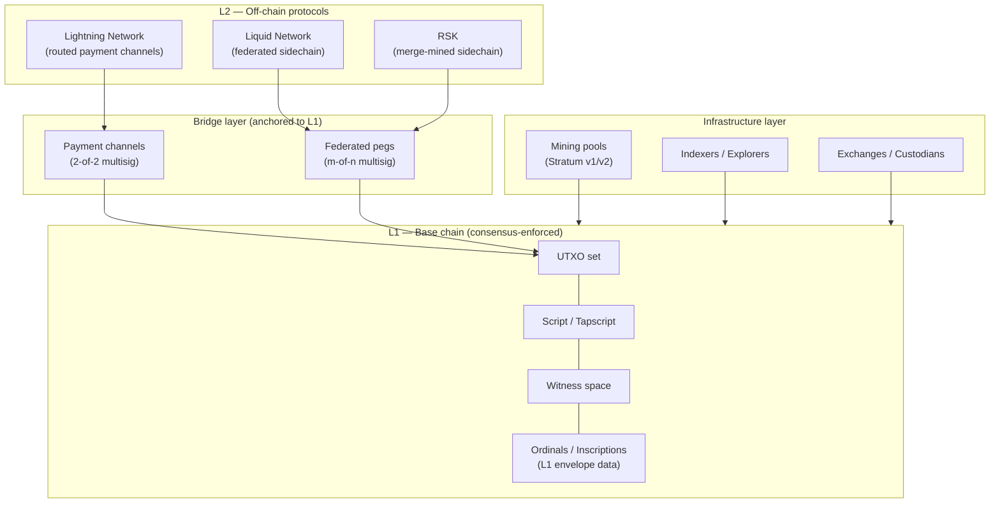
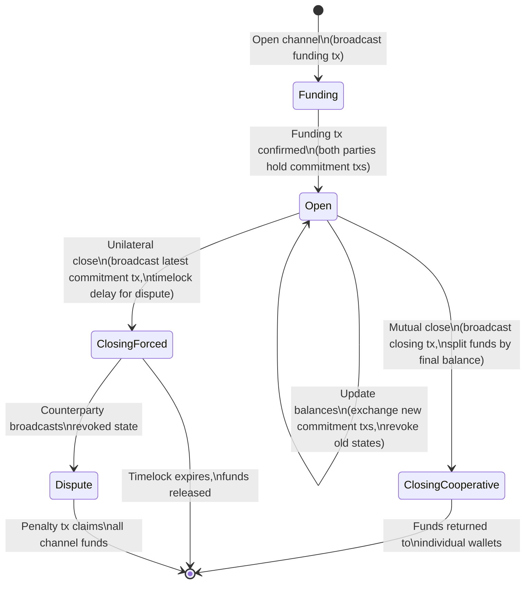
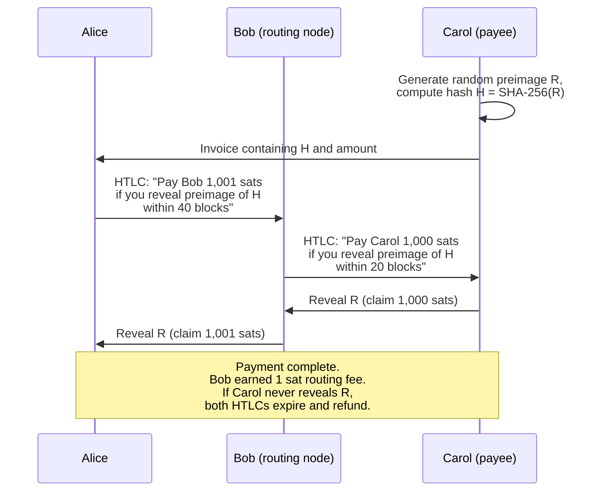
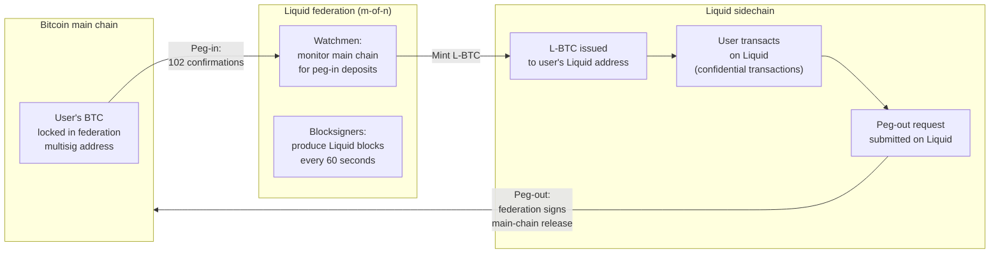
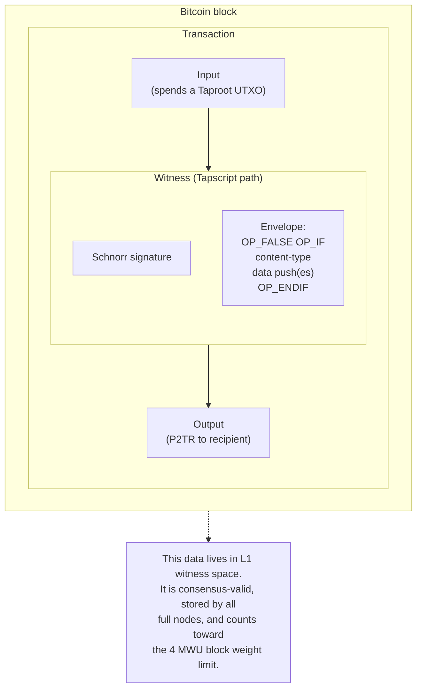
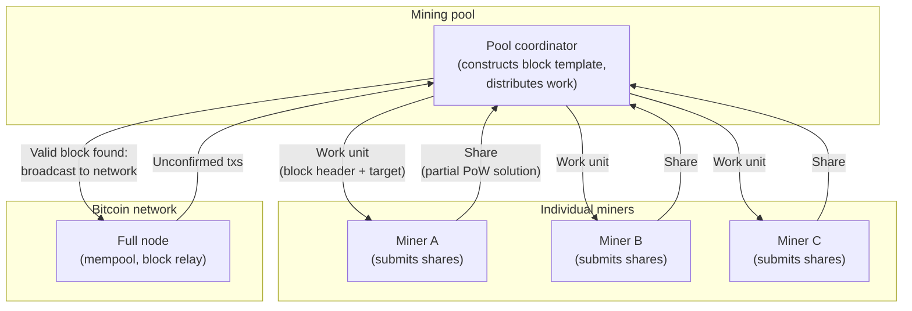

## はじめに

本ページは[設計文書シリーズ](/BitcoinArchive/ja/entries/design/2009-01-03-bitcoin-system-design-overview/)の **L2 #10 — エコシステム設計（Layer 2・サイドチェーン）** である。ビットコインの基盤チェーンの周囲に成長したエコシステムを扱う。決済チャネルネットワーク、連合型サイドチェーン、オンチェーンエンベロープ構造、協調的マイニングアーキテクチャー。これらのシステムは単一の依存関係 — ビットコインの[コンセンサスルール](/BitcoinArchive/ja/entries/design/2009-01-03-bitcoin-consensus-design/)が維持する最多ワークチェーン — を共有するが、実行場所、前提とする信頼モデル、L1 への決済方法は根本的に異なる。

**重要な分類上の注意。** Ordinals と Inscriptions は一般的な議論で「レイヤー 2」に分類されることがある。しかしそうではない。これらは L1 エンベロープ構造 — オンチェーンの Witness 空間に直接埋め込まれ、すべてのフルノードによって検証・保存され、L1 コンセンサスルールに従うデータである。本ページではこの区別を全体を通して維持する。Inscription は決済出力と同じ方法でブロックウェイトを占有する。Lightning の支払いはそうではない。

サトシ時代の実装（v0.1、2009 年 1 月）と現行の Bitcoin Core（v27 以降基準）で挙動が異なる場合は、両方を記す。

## 1. エコシステム層マップ

以下の図は、主要なエコシステムコンポーネントをビットコインの基盤チェーンとの関係によって分類する。縦軸は信頼と決済距離を表す。スタックの上位にあるシステムほど L1 への決済頻度が低く、追加の信頼前提を導入する可能性がある。

| 層 | 決済 | 信頼モデル | 例 |
|---|---|---|---|
| **L1 基盤チェーン** | 毎ブロック（コンセンサスで強制） | トラストレス — すべてのフルノードが検証 | トランザクション、Ordinals/Inscriptions、OP_RETURN データ |
| **ブリッジ** | オンチェーンの開設/閉鎖トランザクション | トラストレス（チャネル）または連合型（ペグ） | 2-of-2 ファンディング出力、Liquid 連合マルチシグ |
| **L2 オフチェーン** | L1 への定期的な決済 | さまざま — チャネル相手方、連合、マージマイニング | Lightning Network、Liquid、RSK |
| **インフラストラクチャー** | 運用上のもの — コンセンサスとは無関係 | オペレーターとのサービスレベルの信頼 | マイニングプール、ブロックエクスプローラー、取引所 |

## 2. Lightning Network の設計

Lightning Network はルーティング型決済チャネルネットワークである。2 者が共有のオンチェーン出力に資金をロックし、ブロックチェーンに触れることなく残高を更新するために署名済みだが未ブロードキャストのトランザクションを交換する。支払いはハッシュタイムロックコントラクト (HTLC) を使用して複数のチャネルを経由してルーティングされ、直接のチャネルがなくても任意の Lightning ユーザーが他の任意の Lightning ユーザーに支払いを行える。

### チャネルライフサイクル

### マルチホップ決済ルーティング (HTLC)

アリスがボブを中継者としてキャロルに支払う場合、支払いは原子的にロックする HTLC の連鎖を使用する。すべてのホップが決済されるか、どれも決済されないかのいずれかである。

### Lightning Network の特性

| 特性 | 設計上の選択 |
|---|---|
| **ファンディング** | L1 上の 2-of-2 マルチシグ出力; 開設に 1 つのオンチェーントランザクションが必要 |
| **容量** | ファンディング出力の額に制限される; オンチェーン預入額を超えられない |
| **更新** | オフチェーン: 当事者が署名済みコミットメントトランザクションを交換; ブロック確認不要 |
| **失効** | 古い状態は失効鍵を共有して失効させる; 失効済み状態をブロードキャストするとペナルティーが発動 |
| **ルーティング** | オニオン暗号化 HTLC パスによるソースルーティング（BOLT 4）; 送信者がルートを選択 |
| **プライバシー** | 中継ノードは自身のホップのみを見る; 送信者と受信者はルーティングノードから秘匿される |
| **ファイナリティー** | 成功した支払いではサブ秒; 紛争解決にはタイムロック付きのオンチェーン決済が必要 |
| **L1 依存性** | `OP_CHECKLOCKTIMEVERIFY`、`OP_CHECKSEQUENCEVERIFY`、および SegWit 展性修正（BIP 141）に依存 |

### L1 前提条件

Lightning Network はサトシの v0.1 実装上では動作できなかった。ビットコインの基盤チェーンへの 3 つのリリース後の追加に依存している:

| 前提条件 | BIP | 有効化 | Lightning が必要とする理由 |
|---|---|---|---|
| **SegWit** | BIP 141 | 2017 | トランザクション展性を修正 — 子トランザクション（コミットメントトランザクション）がファンディング txid を確認前に参照でき、txid が変更されるリスクがない |
| **CLTV** | BIP 65 | 2015 | `OP_CHECKLOCKTIMEVERIFY` が HTLC 返金パスで絶対タイムロックを強制 |
| **CSV** | BIP 68/112 | 2016 | `OP_CHECKSEQUENCEVERIFY` が失効遅延ウィンドウの相対タイムロックを強制 |

## 3. サイドチェーン: Liquid と連合型ペグ

サイドチェーンはビットコインにペグされた別のブロックチェーンである。コインがメインチェーンからサイドチェーンへ（ペグイン）、そして逆方向へ（ペグアウト）ブリッジ機構を通じて移動する。サイドチェーンは BTC 建ての価値を使用しながら、独自のブロック時間、トランザクション形式、機能セットを定義できる。

### ペグイン / ペグアウトフロー（Liquid）

### サイドチェーン比較

| 特性 | Liquid Network | RSK (Rootstock) |
|---|---|---|
| **コンセンサス** | 連合型（ファンクショナリーコンソーシアムがブロックに署名） | ビットコインとマージマイニング（同じ PoW が両チェーンを保護） |
| **ブロック時間** | 約 60 秒 | 約 30 秒 |
| **ペグ機構** | m-of-n 連合マルチシグ（Liquid ファンクショナリー） | m-of-n 連合（PowPeg ハードウェアセキュリティーモジュール） |
| **ペグイン確認数** | 102 ビットコインブロック（約 17 時間） | 100 ビットコインブロック（約 17 時間） |
| **信頼前提** | 連合メンバーの正直な多数派 | 連合の正直な多数派 + マージマイニングのハッシュレート |
| **追加機能** | 秘匿トランザクション、発行資産 | EVM 互換スマートコントラクト |
| **ネイティブ資産** | L-BTC（BTC と 1:1 のペグ） | RBTC（BTC と 1:1 のペグ） |
| **トレードオフ** | 連合の信頼と引き換えにファイナリティーの速さとプライバシー | 連合の信頼と引き換えにスマートコントラクト機能 |

**トラストレスな双方向ペグがない理由。** ビットコインのスクリプトシステムは、他のチェーンのプルーフオブワークや状態遷移を検証できない。完全にトラストレスな双方向ペグにはサイドチェーンのコンセンサスルールの検証ロジックを追加するソフトフォークが必要であり、提案はされている（Drivechain / BIP 300）が有効化されていない。既存のサイドチェーンはしたがって連合マルチシグをブリッジとして使用し、L1 には存在しない信頼前提を導入している。

## 4. L1 拡張: Ordinals と Inscriptions

Ordinals と Inscriptions は**レイヤー 2 ではない**。ビットコインの L1 コンセンサスルール内で完全に動作し、既存の Witness 空間を使用して任意データを個々のサトシに埋め込む。すべてのフルノードがこのデータを正規ブロックの一部として処理・検証・保存する。

### Inscriptions が Witness 空間を使用する仕組み

### Ordinal 理論: サトシレベルの識別

Ordinal プロトコルは、マイニングされた順序に基づいてすべてのサトシに連番を割り当てる。この番号付けは慣習層である — ビットコインプロトコル自体は個々のサトシを区別しない。Ordinal 対応ソフトウェアは、入力サトシを出力サトシに先入れ先出し (FIFO) でマッピングすることでトランザクション間のサトシの動きを追跡する。

| 概念 | 仕組み | コンセンサス上の位置付け |
|---|---|---|
| **Ordinal 番号** | マイニング順に各サトシに割り当てられる連番 | 慣習のみ — ビットコインのコンセンサスはすべてのサトシを同一に扱う |
| **Inscription** | Tapscript Witness 内の `OP_FALSE OP_IF ... OP_ENDIF` エンベロープに埋め込まれた任意データ（画像、テキスト、JSON） | コンセンサス上有効 — データは有効な Witness の一部でブロックウェイトにカウントされる |
| **サトシ追跡** | 入力サトシを出力位置に FIFO で割り当て | 慣習のみ — オフチェーンインデクサーの解釈に依存 |
| **希少性モデル** | 半減期と難易度調整に対する位置に基づく名前付き希少性階層（コモン、アンコモン、レア、エピック、レジェンダリー、ミシック） | 慣習のみ — オンチェーンでの強制なし |

### Ordinals/Inscriptions が L2 でない理由

| 基準 | L2 システム（Lightning、サイドチェーン） | Ordinals/Inscriptions |
|---|---|---|
| **実行場所** | オフチェーン（別の状態マシンまたはチャネル） | オンチェーン（標準的な Tapscript Witness 実行） |
| **ブロックウェイト消費** | なし（開設/閉鎖トランザクションのみが L1 に触れる） | 全量 — すべてのバイトが 4 MWU 制限にカウントされる |
| **フルノードのストレージ** | チャネル更新についてはなし; サイドチェーンブロックは別途保存 | ブロックの一部としてすべてのビットコインフルノードが保存 |
| **コンセンサス検証** | L1 はアンカートランザクションのみを検証 | L1 がスクリプト実行の一部としてエンベロープ全体を検証 |
| **決済モデル** | L1 への定期的な決済 | 決済不要 — すでに L1 上にある |

## 5. マイニングプール

ソロマイニングは 2011 年頃から個人の参加者にとって現実的ではなくなった。マイニングプールによりマイナーはハッシュレートを合算し、共同でブロックを発見し、報酬を比例配分できる。プールはインフラストラクチャー層の参加者であり、コンセンサスルールを変更しないが、ブロックテンプレート構築権限をプールオペレーターに集中させる。

### プールアーキテクチャー

### プールプロトコル: Stratum v1 と Stratum v2

| 特性 | Stratum v1（2012） | Stratum v2（2023 年以降） |
|---|---|---|
| **テンプレート構築** | プールがブロックテンプレートを構築; マイナーはヘッダーをハッシュ | マイナーが独自のテンプレートを構築可能（ジョブ宣言プロトコル） |
| **トランスポート** | 平文 JSON（TCP 経由） | バイナリーフレーミング、オプションでノイズプロトコル暗号化 |
| **トランザクション選択** | プールオペレーターが含めるトランザクションを選択 | ジョブ宣言あり: 個々のマイナーがトランザクションを選択 |
| **検閲耐性** | プールオペレーターがブロック内容の唯一の決定権を持つ | マイナーが独立にブロック内容を構築可能 |
| **効率** | 帯域幅が大きい（JSON 符号化のオーバーヘッド） | 帯域幅が小さい（バイナリー符号化、約 3 倍の削減） |
| **普及状況** | 2025 年時点でほぼ普遍的 | 拡大中; Ocean、Demand Pool 等がサポート |

### 報酬分配方式

| 方式 | 仕組み | マイナーにとっての変動 |
|---|---|---|
| **PPS（シェアごと支払い）** | プールがブロック発見の有無にかかわらず有効なシェアごとに固定額を支払う | 変動ゼロ — プールがすべてのリスクを吸収 |
| **FPPS（完全シェアごと支払い）** | PPS と同様だが推定トランザクション手数料もシェアごとに分配 | 変動ゼロ — 手数料構成要素を含む |
| **PPLNS（直近 N シェアに比例して支払い）** | ブロック発見前のウィンドウ内に提出されたシェアに比例して報酬を分配 | 変動が大きい — 支払いはプールのブロック発見に依存 |
| **ソロ（プール経由）** | マイナーのシェアがブロックを解いた場合にブロック報酬全額を受領; それ以外は何もなし | 最大変動 — プールインフラストラクチャーを使うソロマイニングと同等 |

## 6. エコシステム層の比較

以下の表は、本ページで扱った 4 つのエコシステムカテゴリーを、一貫した設計特性のセットに対して構造的に比較する。

| 特性 | Lightning Network | Liquid（サイドチェーン） | Ordinals/Inscriptions | マイニングプール |
|---|---|---|---|---|
| **層の分類** | L2（オフチェーン） | L2（別チェーン） | L1（オンチェーンエンベロープ） | インフラストラクチャー |
| **信頼モデル** | チャネル相手方（紛争付きのトラストレス） | 連合（m-of-n マルチシグ） | トラストレス（コンセンサス検証済み） | プールオペレーター（報酬サイクル中はカストディアル） |
| **L1 ブロックウェイト** | 最小（開設/閉鎖のみ） | 最小（ペグイン/ペグアウトのみ） | 全量（すべてのバイトがオンチェーン） | 該当なし — プールは L1 ブロックを生成 |
| **トランザクションスループット** | 毎秒数百万（理論値） | 毎秒約 60 | L1 ブロックウェイトに制約 | 該当なし |
| **ファイナリティー** | サブ秒（支払い） | 約 120 秒（2 Liquid ブロック） | 約 60 分（6 ビットコイン確認） | 該当なし |
| **プライバシー** | オニオンルーティング（送信者/受信者が中継者から秘匿） | 秘匿トランザクション（金額が秘匿） | 完全公開（オンチェーンデータ） | プールにより異なる |
| **必要なソフトフォーク** | SegWit（BIP 141）、CLTV（BIP 65）、CSV（BIP 68/112） | なし（連合は標準マルチシグを使用） | Taproot（BIP 341）（Tapscript エンベロープ用） | なし |
| **障害モード** | チャネルをオンチェーンで強制閉鎖; 資金は回復可能 | 連合障害: 定足数が回復するまでペグアウト不可 | 該当なし — データは不変にオンチェーン | プールがオフラインに: マイナーはプールを切り替え; 資金損失なし |

## 7. 本ページの範囲

本ページではエコシステム層のシステムを設計レベルで解説した。以下のトピックは範囲外であり、[設計文書シリーズ](/BitcoinArchive/ja/entries/design/2009-01-03-bitcoin-system-design-overview/)内のそれぞれのドメインページで扱う:

- **トランザクション構造と UTXO モデル** — Lightning チャネルとサイドチェーンペグの基盤となる L1 プリミティブ。[トランザクション設計](/BitcoinArchive/ja/entries/design/2009-01-03-bitcoin-transaction-design/)ページで解説。
- **Taproot と Tapscript の仕組み** — Witness プログラムとスクリプトパス支払いがオペコードレベルでどのように動作するか。[トランザクション設計](/BitcoinArchive/ja/entries/design/2009-01-03-bitcoin-transaction-design/)ページで解説。
- **P2P ゴシップとブロック中継** — トランザクションとブロックがマイナーや Lightning ノードに到達する前にネットワーク上でどのように伝搬するか。[P2P ネットワーク設計](/BitcoinArchive/ja/entries/design/2009-01-03-bitcoin-p2p-network-design/)ページで解説。
- **プルーフオブワークと難易度調整** — すべてのエコシステム層が依存する基盤チェーンを保護するコンセンサス機構。[コンセンサス設計](/BitcoinArchive/ja/entries/design/2009-01-03-bitcoin-consensus-design/)ページで解説。
- **手数料市場とブロックテンプレート構築** — トランザクションの収録優先度を決定する経済的ダイナミクス。
