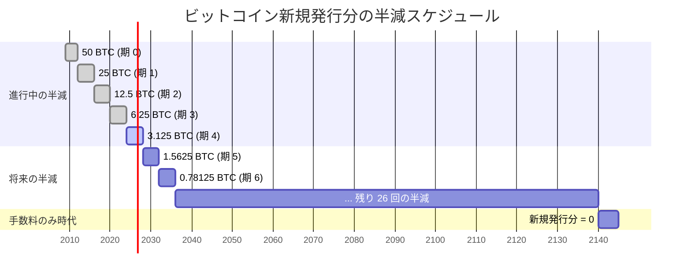
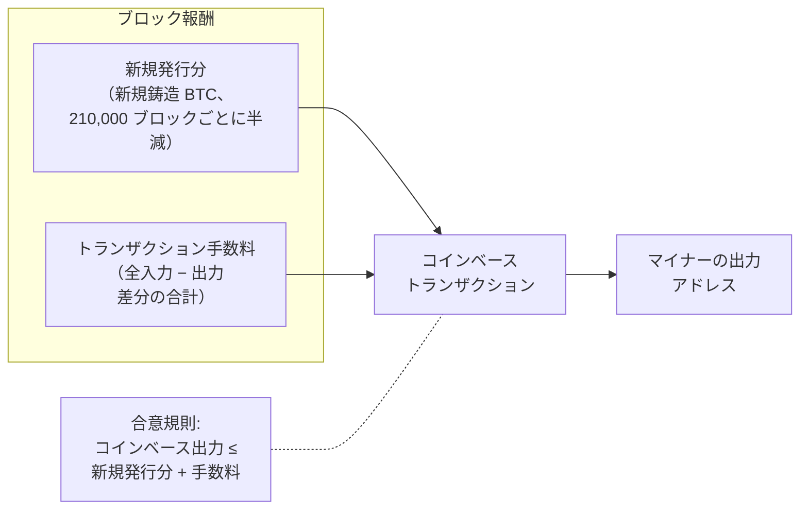
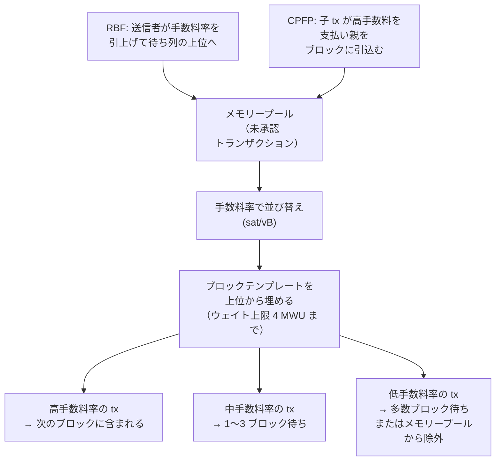
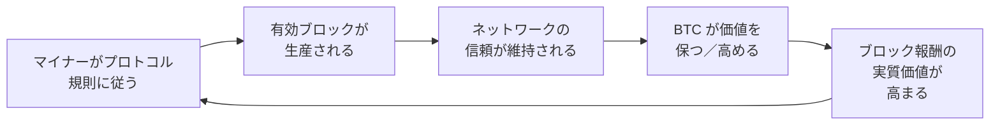
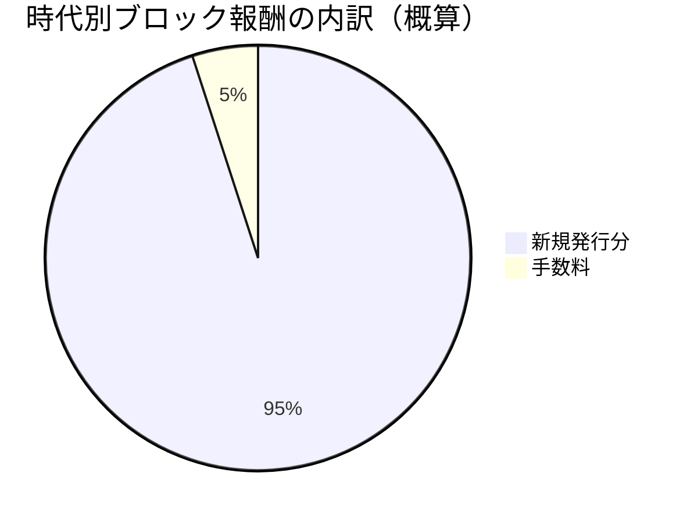

## はじめに

本ページは[設計文書シリーズ](/BitcoinArchive/ja/entries/design/2009-01-03-bitcoin-system-design-overview/)の **L1 #5「貨幣設計」** である。ビットコインの貨幣層を扱う。コイン生成を司る規則、マイナーに報酬を与える経済的メカニズム、正直な参加が攻撃よりも収益性の高い形になるインセンティブ構造を対象とする。

[トランザクション設計](/BitcoinArchive/ja/entries/design/2009-01-03-bitcoin-transaction-design/)ページでは価値の表現と移転を解説した。[合意形成設計](/BitcoinArchive/ja/entries/design/2009-01-03-bitcoin-consensus-design/)ページではノードが単一のチェーンに合意する方法を解説した。本ページはその交差点に位置する。ブロックあたりどれだけの新規価値がシステムに投入されるか、誰がそれを受け取るか、そして合理的なマイナーがなぜ規則に従うのかを扱う。

4 つの問いが内容を構成する:

1. **ビットコインは最終的に何枚存在するか?** 正確には 20,999,999.9769 BTC で、33 回の半減と整数サトシ切り捨てによる幾何級数の結果である。
2. **マイナーはブロックあたり何を得るか?** 新規発行分とトランザクション手数料の合計で構成されるブロック報酬。
3. **手数料はどう機能するか?** 手数料率に基づいて限られたブロック空間をトランザクションが競う分散型オークション。
4. **なぜ正直にマイニングするのか?** ハッシュレートの資本コストを考慮すると、プロトコルに従うことの期待収益が既知のどの攻撃の期待収益をも上回るため。

サトシ時代の実装（v0.1、2009 年 1 月）と現代の Bitcoin Core（v27 以降を基準）で挙動が異なる箇所は、双方を記載する。

## 1. 2,100 万枚上限

ビットコインの総供給量は幾何級数によって制約される。新規発行分は 50 BTC から始まり、210,000 ブロックごとに半減する（10 分間のターゲットレートでおよそ 4 年ごと）。新規発行分はサトシ単位（整数演算、1 BTC = 100,000,000 サトシ）で計算され、整数除算で端数が切り捨てられるため、33 回の半減後に新規発行分はゼロに達する。

総供給量は次の通り:

**210,000 × (50 + 25 + 12.5 + 6.25 + … ) = 210,000 × 99.99999999 ≈ 20,999,999.9769 BTC**

新規発行の最後の 1 サトシはブロック 6,929,999 付近（およそ 2140 年）で流通に入る。そのブロック以降、新規発行分はゼロとなり、マイナーはトランザクション手数料のみを獲得する。

<!-- chart: supply-animated -->

### 半減タイムライン

### 半減エポック

| 期 | ブロック範囲 | おおよその期間 | ブロックあたり新規発行分 | 期中の新規 BTC | 累計供給量 (BTC) | 最終供給量に対する割合 |
|---|---|---|---|---|---|---|
| 0 | 0 – 209,999 | 2009 年 1 月 – 2012 年 11 月 | 50 BTC | 10,500,000 | 10,500,000 | 50.00% |
| 1 | 210,000 – 419,999 | 2012 年 11 月 – 2016 年 7 月 | 25 BTC | 5,250,000 | 15,750,000 | 75.00% |
| 2 | 420,000 – 629,999 | 2016 年 7 月 – 2020 年 5 月 | 12.5 BTC | 2,625,000 | 18,375,000 | 87.50% |
| 3 | 630,000 – 839,999 | 2020 年 5 月 – 2024 年 4 月 | 6.25 BTC | 1,312,500 | 19,687,500 | 93.75% |
| 4 | 840,000 – 1,049,999 | 2024 年 4 月 – 2028 年頃 | 3.125 BTC | 656,250 | 20,343,750 | 96.88% |
| 5 | 1,050,000 – 1,259,999 | 2028 年頃 – 2032 年頃 | 1.5625 BTC | 328,125 | 20,671,875 | 98.44% |
| … | … | … | … 各期半減 | … | … | … |
| 32 | 6,720,000 – 6,929,999 | 2136 年頃 – 2140 年頃 | 1 サトシ (0.00000001) | 0.021 BTC | 約 20,999,999.9769 | 約 100% |
| 33+ | 6,930,000+ | 2140 年頃以降 | 0 | 0 | 20,999,999.9769 | 100% |

発行の前半偏重は極端である。全ビットコインの 75% は 2016 年半ばまでに、つまり最初の 7 年間で発行された。第 4 期（2024 年時点の現行期）では、全供給量の 96% 以上が既にマイニングされている。

### サトシ時代の演算

v0.1 の `GetBlockValue` 関数は右ビットシフトで新規発行分を計算する:

`nSubsidy = 50 * COIN` → `nSubsidy >>= (nHeight / 210000)`

これは 2 の累乗による整数除算である。同じロジックは現代の Bitcoin Core の `GetBlockSubsidy`（`validation.cpp` 内）にも存続しており、シフト回数が 63 を超えた場合に新規発行分を明示的にゼロに設定するガードが 1 つ追加されている。この演算はジェネシスブロック以来、合意形成に凍結された定数である。

## 2. コインベース報酬の構造

すべてのブロックにはちょうど 1 つの**コインベーストランザクション**が含まれる。これはブロック内の最初のトランザクションであり、入力を持たない。その出力がブロック報酬を分配する: 新規発行分（新規鋳造コイン）とブロック内の他のトランザクションから徴収された全トランザクション手数料の合計である。

### 報酬の構成

### コインベースの制約

| 制約 | 規則 | 備考 |
|---|---|---|
| **ブロックあたり 1 件のみ** | 最初のトランザクションはコインベースでなければならず、他のトランザクションはコインベースであってはならない | v0.1 以降 |
| **入力なし** | コインベースには以前の出力参照がない。「入力」は自由形式のデータフィールドである | データフィールドは追加ナンス、プール識別、BIP 34 のブロック高エンコードに使われる |
| **出力上限** | コインベース出力の合計値 ≤ 新規発行分 + トランザクション手数料の合計 | 許可された報酬を超えて請求するマイナーは無効なブロックを生成する |
| **成熟** | コインベース出力は 100 承認が経過するまで使用できない | チェーン再編成が既に使用された新規鋳造コインを無効にすることを防ぐ |
| **コインベース内のブロック高** (BIP 34) | コインベースの scriptSig はシリアライズされたブロック高で始まらなければならない | 2013 年に有効化。すべてのコインベーストランザクションの一意性を保証し、txid の衝突を防ぐ |

マイナーは報酬の全額より**少なく**請求してもよい。未請求の手数料は永久に消滅し、実効供給量が減少する。初期のブロック数件（サトシや初期マイナーがマイニングしたもの）は、偶然かまたは意図的に、コインベース出力が上限を下回っている。この仕組みは初期のユーザーを困惑させるほど不透明だった。[説明のつかない 50.44 BTC の報酬が 2010 年 2 月の BitcoinTalk フォーラム投稿を引き出し](/BitcoinArchive/ja/participants/michael-marquardt/)、これが新規発行分に手数料が加算される仕組みについての最も早い公開説明の一つとなった。

## 3. 手数料市場の設計

ブロック空間の需要が供給を超えると、トランザクションは手数料を提示して掲載を競う。手数料市場はオークショニアのいない分散型の連続オークションである。各マイナーが独立にどのトランザクションを含めるかを選択し、通常は手数料率（仮想バイトあたりのサトシ数）で優先順位を付ける。

### 手数料による優先順位付け

### 手数料メカニズム

| メカニズム | 説明 | 導入時期 | 仕組み |
|---|---|---|---|
| **手数料率** | 仮想バイトあたりのサトシ数 (sat/vB) | v0.1 以降暗黙的 | 手数料率が高いほどブロックテンプレートでの優先度が高い。仮想バイトは SegWit の証人データ割引を反映する。 |
| **手数料置換 (RBF)** | 送信者が未承認トランザクションを手数料率の高い版で置き換える | BIP 125（オプトイン、v0.12）; `-mempoolfullrbf` オプションが v24.0; 完全 RBF が v28.0 以降既定 | 置換版は厳密に高い手数料率を支払い、元版の中継コストを賄わなければならない。 |
| **子が親の手数料を支払う (CPFP)** | 子トランザクションが低手数料の親の出力を十分高い手数料で使用し、パッケージを魅力的にする | メモリープールの祖先追跡（2016 年以降） | マイナーはパッケージを評価する: 子を含めるには親を含める必要があるため、結合手数料率で優先度が決まる。 |
| **手数料推定** | ノード側のアルゴリズムが目標ブロック数以内での承認に必要な手数料率を予測する | `estimatesmartfee`（v0.15 以降） | 手数料率バケットごとの過去の承認時間を追跡。指定された承認目標に対して保守的な推定値を返す。 |
| **パッケージリレー** | 低手数料の親トランザクションとその高手数料の子を 1 つの単位として中継する | 展開中（v28 以降） | CPFP がマイニングノードだけでなく中継ネットワーク全体で機能することを保証する。 |

### サトシ時代の手数料挙動

v0.1 では、大半のトランザクションは手数料を一切支払わなかった。クライアントにはコイン年齢（コインの額面 × 作成以降の承認数）に基づく優先度指標が含まれており、「高優先度」のトランザクションには無料の中継と掲載が与えられた。2012 年まではブロック空間が潤沢であったため、手数料は経済的に無意味だった。手数料市場が実質的に意味を持つようになったのは、ブロックが恒常的に満杯になり始めた 2015〜2017 年以降である。

## 4. マイナーのインセンティブモデル

ビットコインのセキュリティは、正直なマイニング（有効なブロックで最も仕事量の多いチェーンを延伸すること）がどの代替戦略よりも収益性が高いという前提の上に成り立つ。[ホワイトペーパー](/BitcoinArchive/ja/entries/emails/cryptography/2008-10-31-bitcoin-whitepaper-final/)の第 6 節はこれをゲーム理論的議論として提示する: 大きなハッシュパワーを持つ合理的なマイナーは、ネットワークを欺こうとするよりもブロック報酬を集める方が多くを稼げる。

### インセンティブ分析

| 戦略 | 必要ハッシュレート | 期待収益 | リスク / コスト | 結果 |
|---|---|---|---|---|
| **正直なマイニング** | 任意の割合 | ブロック報酬 × (全ハッシュレートに対する自己割合) — 安定的で予測可能な収入 | ハードウェア + 電力コスト | 持続可能。運用コスト < 収益であれば正の期待値 |
| **利己的マイニング** | 約 25–33%（Eyal-Sirer 2014; ネットワーク接続性に依存） | ブロックを隠匿し戦略的なタイミングで公開することで、一時的にブロック獲得比率を高める | 失敗時にオーファンブロックが浪費される。持続的なハッシュレート多数派が必要 | 極端なコストに対してわずかな利得。ネットワーク難易度の調整が時間とともに優位性を低下させる |
| **二重支払い攻撃** | 50% 超で確実に成功 | 承認済み支払いを商品・サービス受領後に取り消す | 莫大な資本コスト。検出と市場崩壊のリスク（BTC 価格下落が攻撃者自身の保有資産を毀損する） | BTC 建ての資産を持つ大規模マイナーにとって経済的に非合理 |
| **トランザクション検閲** | 50% 超の持続 | 特定のトランザクションを将来のすべてのブロックから排除する | 二重支払いと同じ資本コスト。検閲されたトランザクションは正直なブロックを待つだけ | 攻撃者が永続的多数派を保持しない限り無効。正直な少数派が検閲されたトランザクションを掲載する |

### 自己強化ループ

インセンティブモデルは正のフィードバックサイクルを生み出す:

サトシはホワイトペーパーで次のように書いた:「貪欲な攻撃者が全正直ノードよりも多くの CPU パワーを集められたとしても、自らの支払いを盗み返して人々を欺くか、それを使って新しいコインを生成するかを選ばなければならない。ルールに従う方がより収益性が高いと気づくはずだ。」

この議論は、新規発行分が報酬の大部分を占めている間は最も強力である。半減によって新規発行分が減少するにつれ、インセンティブモデルはトランザクション手数料への依存を強める。この移行は [§ 7](#7-二つの時代の比較) および専用の[マイニング報酬枯渇分析](/BitcoinArchive/ja/entries/analysis/2026-05-18-mining-reward-exhaustion-fee-only-future/)で検討する。

## 5. 半減イベントと経済的転換

各半減は離散的な貨幣政策イベントである。新規供給の発行率が一夜にして 50% 下落する。以下の表はこれまでに発生した 4 回の半減を、当時の市場とネットワークの状況とともに記録する。

| 半減 | 日付 | ブロック高 | 半減前後の新規発行分 | 半減後ブロック報酬（円換算） | BTC 価格（概算） | ネットワークハッシュレート（概算） | 注目すべき背景 |
|---|---|---|---|---|---|---|---|
| **第 1 回** | 2012 年 11 月 28 日 | 210,000 | 50 → 25 BTC | 約 2.5 万円 | 約 1,000 円 | 約 25 TH/s | 最初の ASIC マイナー登場; GPU 時代の終焉 |
| **第 2 回** | 2016 年 7 月 9 日 | 420,000 | 25 → 12.5 BTC | 約 82 万円 | 約 6.5 万円 | 約 1.5 EH/s | SegWit 議論が進行中; [イーサリアム](/BitcoinArchive/ja/entries/forum/bitcointalk/topic-428589/2014-01-23-vbuterin-ethereum-welcome-to-the-beginning/)が 1 年前に誕生 |
| **第 3 回** | 2020 年 5 月 11 日 | 630,000 | 12.5 → 6.25 BTC | 約 575 万円 | 約 92 万円 | 約 120 EH/s | 機関投資家の採用が加速 |
| **第 4 回** | 2024 年 4 月 19 日 | 840,000 | 6.25 → 3.125 BTC | 約 3,080 万円 | 約 990 万円 | 約 600 EH/s | 米国でビットコイン現物 ETF が承認（2024 年 1 月）; Ordinals / インスクリプションが手数料急騰を牽引 |

各半減はマイニング業界に構造的な調整を強いる。半減後の新規発行分の水準で運用コストが収益を超えるマイナーは、より安価なエネルギーを見つけるか、より効率的なハードウェアにアップグレードするか、操業を停止しなければならない。歴史的にハッシュレートは各半減後に一時的に低下した後、成長を再開している。生き残ったマイニング設備が前世代よりもコスト効率に優れている証拠である。

### 新規発行分への依存低下

第 0〜3 期では、新規発行分が平均ブロック報酬の 95% 以上を占めた。2017 年以降ブロックが恒常的に満杯になるにつれ手数料の比率は目に見えて成長し、極端な需要期（2017 年末の SegWit 有効化に伴う混雑、2023〜2024 年の Ordinals インスクリプションの波）には 50% を超える急騰を見せた。長期的な趨勢は、新規発行分がゼロに近づくにつれて手数料が支配的になる方向にある。

## 6. 手数料のみの将来

およそ 2140 年に新規発行分はゼロに達する。その時点以降、マイナーの唯一の収益源はトランザクション手数料となる。手数料のみで十分なプルーフ・オブ・ワークのセキュリティを維持できるかどうかは、現在も議論が続いている。これはビットコインの長期的貨幣設計における中心的な未解決の問題である。

### セキュリティ予算の問題

懸念: ブロック報酬が低下しすぎると、ネットワーク攻撃コスト（ハッシュレートの 50% 超の取得）も比例して低下する。手数料のみの体制では、51% 攻撃のコストを実行不可能なほど高く保つのに十分な合計手数料収入をブロックあたりで生み出さなければならない。

サトシの当初の立場は、[ホワイトペーパーの第 6 節](/BitcoinArchive/ja/entries/emails/cryptography/2008-10-31-bitcoin-whitepaper-final/)およびその後のフォーラム投稿で表明されたように、トランザクション手数料が新規発行分を円滑に置き換えるというものだった:

<!-- speaker: Satoshi Nakamoto -->
<!-- audit:quote-skip -->
> 「数十年後に報酬が小さくなりすぎると、トランザクション手数料がノードの主な報酬になる。」

### 両論

| 立場 | 主張 | 主要な参考文献 |
|---|---|---|
| **手数料で十分** | ビットコインの普及が進めばブロック空間の需要も伸びる。少額のトランザクションあたり手数料でも、ブロックあたり数千件分を掛ければ、現行の新規発行時代の収益に匹敵またはそれを上回りうる。レイヤー 2 システム（Lightning）はオンチェーン量を減らすが、高手数料での定期的な決済トランザクションを発生させる。 | サトシのホワイトペーパー §6; 2017 年および 2023〜2024 年の手数料急騰の市場データ |
| **手数料では不十分かもしれない** | 手数料収入は不安定で、予測可能なスケジュールではなく需要サイクルに依存する。保証された最低報酬がなければ、マイナーは不確実な収入に直面し、ネットワークは不確実なセキュリティに直面する。ゲーム理論モデルは、手数料のみのマイニングが新たな不安定性をもたらすことを示唆する（報酬が変動する場合、利己的マイニングがより魅力的になる）。 | Carlsten ら「On the Instability of Bitcoin Without the Block Reward」（ACM CCS 2016） |

この問題は[マイニング報酬枯渇分析](/BitcoinArchive/ja/entries/analysis/2026-05-18-mining-reward-exhaustion-fee-only-future/)で深く検討されている。同分析では文書化された議論とゲーム理論モデルを検証する。別途の[固定供給対調整可能な貨幣の分析](/BitcoinArchive/ja/entries/analysis/2008-10-31-fixed-supply-vs-adjustable-money/)では、2,100 万枚上限を貨幣設計の選択肢（ウェイ・ダイの b-money における弾力的供給の提案や中央銀行の裁量による法定通貨の基準線を含む）のより広い文脈に位置づけている。同じ上限を反対の側から捉えるのが[デジタルゴールド構造分析](/BitcoinArchive/ja/entries/analysis/2008-10-31-bitcoin-digital-gold-structural-features/)である。そこで問われるのは、上限がどう強制されるかではなく、なぜ存続し続けるのかだ。ビットコインを「デジタルゴールド」たらしめているのは上限が政治的に生き延びる点であり、それは半減の算術ではなくネットワークの非中央集権的な構造に支えられている、と論じる。

## 7. 二つの時代の比較

| 機能 | サトシ時代（v0.1、2009 年 1 月） | 現代の Bitcoin Core、v27 以降基準 |
|---|---|---|
| **総供給量上限** | 20,999,999.9769 BTC（幾何級数、整数切り捨て） | 同一 — 合意形成に凍結された定数 |
| **新規発行分の計算** | `nSubsidy = 50 * COIN; nSubsidy >>= (nHeight / 210000)` | 同一の演算; シフト ≥ 64 に対する明示的なゼロガードを追加 |
| **半減間隔** | 210,000 ブロック | 同一 |
| **コインベース成熟** | 100 ブロック成熟規則 | 同一 |
| **コインベース内のブロック高** | 不要 | 必須（BIP 34、2013 年に有効化）— コインベースの scriptSig にブロック高をシリアライズ |
| **手数料の挙動** | 大半のトランザクションは無料; コイン年齢に基づく優先度 | 手数料率オークション (sat/vB); コイン年齢優先度は廃止 |
| **手数料推定** | なし — 手数料は無視できるほど小さかった | `estimatesmartfee` — バケットベースのメモリープール手数料推定 |
| **手数料置換** | v0.1 では nSequence 経由で実装されていたが、DoS 懸念からサトシが 2010 年 8 月に無効化; 以降は先着順ポリシー | オプトイン RBF（[BIP 125](/BitcoinArchive/ja/entries/aftermath/2015-12-04-peter-todd-bip-125-replace-by-fee/)、v0.12）; 完全 RBF は v28.0 以降既定 |
| **CPFP** | 未実装 | 祖先認識型メモリープール; マイニング用パッケージ評価 |
| **パッケージリレー** | 該当なし | 展開中（v28 以降）— 親と子を 1 単位として中継 |
| **ブロックテンプレート** | 内蔵マイナー; 単純な順序付け | `getblocktemplate`（BIP 22/23）; 手数料率順のメモリープール; SegWit ウェイト計算 |
| **証人データ割引** | 存在しない | 証人バイトは 1/4 ウェイト（BIP 141）— ブロック空間の効率的利用を奨励 |

## 8. 本ページの範囲

本ページは貨幣層とインセンティブ層を単独で扱う。以下のトピックは範囲外であり、[設計文書シリーズ](/BitcoinArchive/ja/entries/design/2009-01-03-bitcoin-system-design-overview/)内のそれぞれの専門ページで扱う:

- **プルーフ・オブ・ワークの仕組み** — SHA-256d ハッシュパズル、難易度調整アルゴリズム、ブロック検証規則は[合意形成設計](/BitcoinArchive/ja/entries/design/2009-01-03-bitcoin-consensus-design/)ページで扱う。
- **トランザクション構造** — UTXO モデル、スクリプト評価、署名検証は[トランザクション設計](/BitcoinArchive/ja/entries/design/2009-01-03-bitcoin-transaction-design/)ページで扱う。
- **ブロックテンプレート構築** — マイナーがメモリープールから候補ブロックを組み立てる方法。トランザクションの順序付けとウェイト最適化を含む。
- **マイニングプールプロトコル** — Stratum v1/v2、シェア会計、プール支払いモデル。
- **レイヤー 2 の手数料動態** — Lightning Network のチャネル開閉とサブマリンスワップがオンチェーン手数料市場とどう相互作用するか。
- **セキュリティモデル** — 51% 攻撃の経済学、利己的マイニングのゲーム理論、完全な脅威モデルはレイヤー 2 のセキュリティモデル深掘りに委ねる。

[マイニング報酬枯渇の分析](/BitcoinArchive/ja/entries/analysis/2026-05-18-mining-reward-exhaustion-fee-only-future/)は、同じ枠組みを新規発行が尽きた後まで延ばして考える。