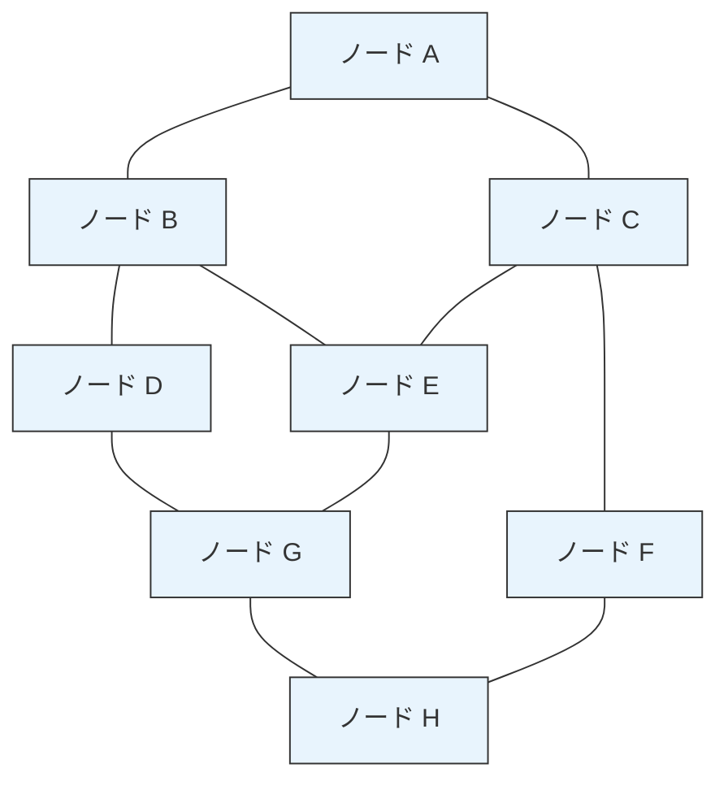
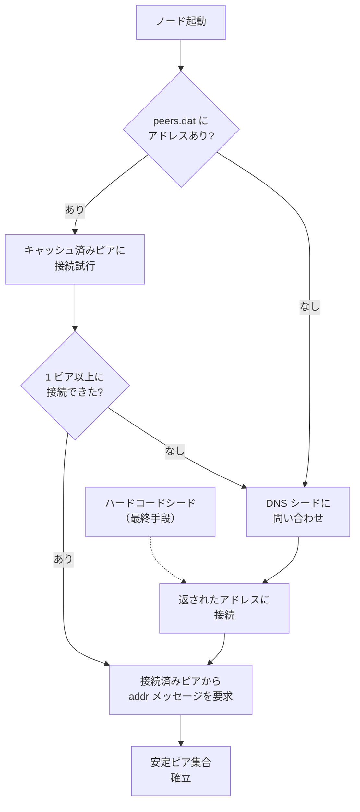
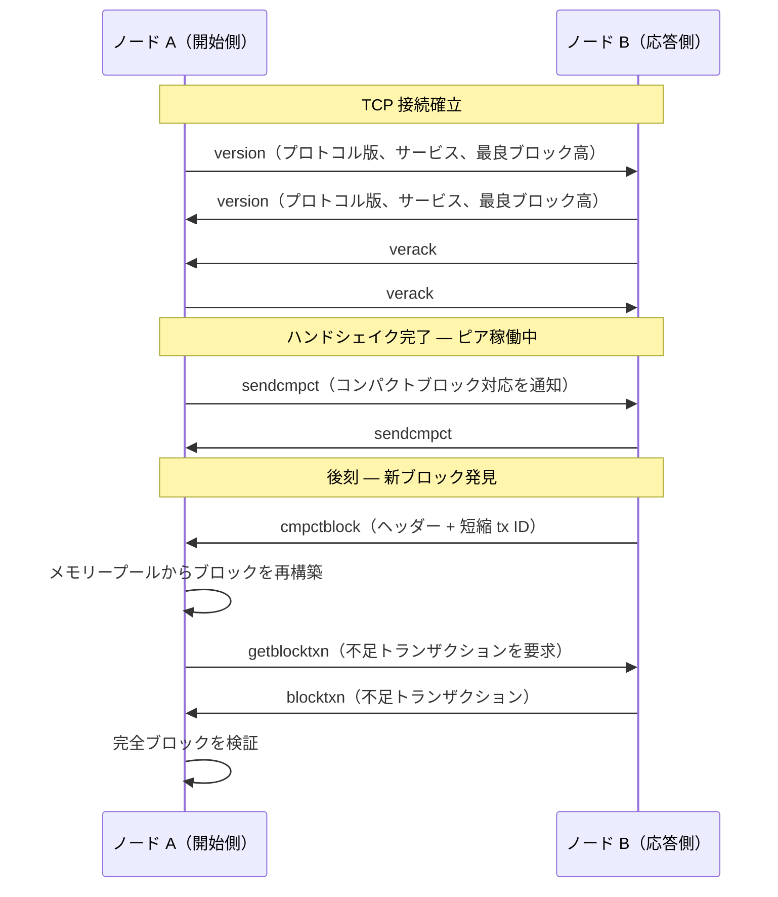
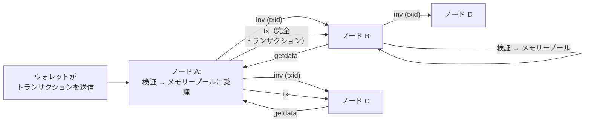
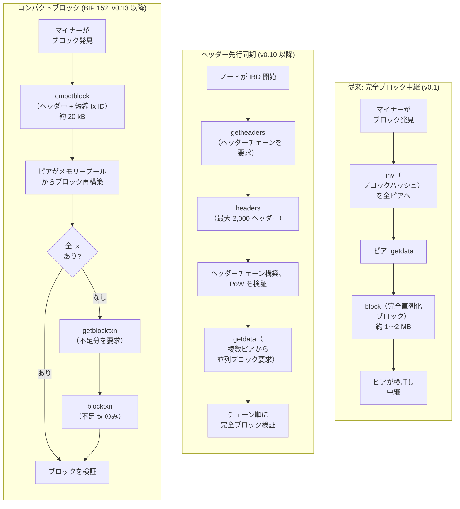

## はじめに

本ページは[設計文書シリーズ](/BitcoinArchive/ja/entries/design/2009-01-03-bitcoin-system-design-overview/)の **L1 #1 — P2P ネットワーク設計** である。ネットワーク層を端から端まで解説する。ノードがどのように互いを発見し、メッセージをどのように交換し、トランザクションとブロックがピアツーピアのゴシップネットワークをどのように伝播するかを扱う。

ネットワーク層は合意形成層、トランザクション層、ブロック層の下に位置する。他のすべてが動作するためのトランスポートを提供する — 信頼できるピアツーピア通信がなければ、[合意形成設計](/BitcoinArchive/ja/entries/design/2009-01-03-bitcoin-consensus-design/)、[トランザクション設計](/BitcoinArchive/ja/entries/design/2009-01-03-bitcoin-transaction-design/)、[ブロック・チェーン設計](/BitcoinArchive/ja/entries/design/2009-01-03-bitcoin-block-chain-design/)の各ページに記述される決定論的検証規則は、処理すべきデータを持たないことになる。

サトシ時代の実装（v0.1、2009 年 1 月）と現行の Bitcoin Core（v27 以降基準）で挙動が異なる場合は、両方を記す。

## 1. ネットワークトポロジー

ビットコインは**非構造的ゴシップネットワーク**を用いる。ノードは TCP 接続のランダムなメッシュを形成し、データをピアに中継し、ピアはさらにそのピアに中継する。中央サーバー、ルーティングテーブル、分散ハッシュテーブル (DHT)、ノード間の階層構造は存在しない。すべてのフルノードは等しく権威を持つ。

| 特性 | 設計上の選択 |
|---|---|
| **構造** | 非構造的ランダムグラフ — DHT なし、スーパーノード階層なし |
| **ノードあたりの接続数** | 各ノードが少数のピアを維持（既定: v27 以降で出方向 11 + 入方向最大 125） |
| **中継モデル** | 蓄積転送型ゴシップ — 各ノードが中継前に独立して検証 |
| **冗長性** | メッセージは複数の経路を伝播する。単一のリンクが不可欠ということはない |
| **分断耐性** | ランダムなピア選択が標的型ネットワーク分割を困難にする |

**ゴシップであり構造化ルーティングでない理由。** DHT や階層的トポロジーはメッセージの冗長性を減らすが、単一障害点も生み出し、ネットワークの分断が容易になる。ビットコインのフラットなゴシップモデルは、攻撃者がノードの見る情報を制御するにはそのピアの大部分を侵害しなければならないことを保証する — 日食攻撃耐性の基盤である。

## 2. ノード発見

ネットワークに新規参加するノードはブートストラップ問題に直面する。最低 1 つの既存ピアを見つける必要があるが、ネットワークの構成員に関する事前知識を持たない。

### 発見メカニズム

| メカニズム | 時代 | 仕組み |
|---|---|---|
| **IRC ブートストラップ** | v0.1 (2009 年) | ノードが特定の IRC チャネル（irc.lfnet.org の `#bitcoin`）に参加し、IP アドレスを告知した。他のノードはチャネルを読んでピアを発見した。v0.8.2 (2013 年) で廃止。 |
| **ハードコードされたシードノード** | v0.1 → 現在 | バイナリにコンパイルされた信頼性の高い既知 IP アドレスの一覧。DNS シードとキャッシュ済みピアが利用不能な場合の最終手段。 |
| **DNS シード** | v0.6 以降 (2012 年) | ホスト名（例: `seed.bitcoin.sipa.be`）が現在アクティブなノードの IP アドレスに解決される。現行 Bitcoin Core の主要なブートストラップ手段。 |
| **`addr` / `addrv2` 中継** | v0.1 → 現在 | 接続済みピアが、既知の他のノードの IP アドレスを含む `addr` メッセージを交換する。`addrv2` (BIP 155、v22.0 以降) は Tor v3、I2P、CJDNS アドレスに対応を拡張。 |
| **ローカルピアデータベース** | v0.1 → 現在 | ノードが既知のピアアドレスを `peers.dat` に永続化し、再起動時に再接続を試みる。正常に動作するノードは時間とともに数千のアドレスを蓄積する。 |

### ブートストラップ手順（v27 以降基準）

**サトシ時代と v27 以降基準の比較。** 元の v0.1 クライアントは主要な発見メカニズムとして IRC に依存していた — 単純だが、IRC サーバーのダウンタイムやチャネル追放に脆弱な中央集権的アプローチであった。現行の Bitcoin Core は独立したコミュニティメンバーが運営する DNS シードで IRC を置き換えている。DNS シード運営者はネットワークを継続的に探索するクローラーソフトウェアを動作させており、DNS レコードには現在到達可能で互換性のあるプロトコルバージョンを実行しているノードのみが反映される。

## 3. 接続管理

各ノードは 2 種類の TCP 接続を維持する。ノードが開始する**出方向**接続と、他のノードがノードに対して開始する**入方向**接続である。

| 接続種別 | 方向 | 既定上限（v27 以降） | 目的 |
|---|---|---|---|
| **全中継出方向** | 出方向 | 8 | トランザクションとブロックを中継するための主要ピア |
| **ブロック中継専用出方向** | 出方向 | 2 | ブロックのみを中継（トランザクション/addr 中継なし）。メモリープール情報を漏洩せずにブロック接続性を向上 |
| **フィーラー** | 出方向（短命） | 同時に 1 | 候補アドレスが到達可能かを検査。ハンドシェイク成功後即座に切断 |
| **入方向** | 入方向 | 最大 125 | 他のノードからの接続。ノードは誰が接続するかを制御しない |
| **アンカー** | 出方向（永続） | 2（ブロック中継専用集合から） | 再起動をまたいで保存され、最低 2 つの信頼できる出方向ピアを維持。再起動時の日食攻撃に抵抗 |

**出方向と入方向: 設計による非対称性。** ノードは自身の出方向接続を入方向接続よりも信頼する。出方向ピアは自分自身が選んだものだからである。ノードを孤立させたい攻撃者（日食攻撃）は、すべての出方向ピアを制御するか — これはノードのアドレス選択を予測または操作する必要がある — あるいはノードを攻撃者制御の入方向接続で溢れさせる必要がある。出方向数の少なさ（合計 10）と独立したアドレス選択アルゴリズムが前者を困難にし、入方向の退去ロジックが後者を維持困難にする。

### 退去

ノードの入方向スロットが満杯の状態で新しい入方向接続が到着すると、ノードは既存ピアの 1 つを切断するかどうかを決定する退去アルゴリズムを実行する。このアルゴリズムは望ましい特性を持つピアを保護する:

- 低レイテンシ（最近有用なデータを送信した）
- 長い接続期間
- ネットワークグループの多様性（異なる /16 サブネット、異なる自律システム）
- 最近有効なブロックまたはトランザクションを中継した

この多様性保持型退去は、攻撃者がノードの入方向スロットを独占するコストを高くする。攻撃者の接続は、保護されるすべての次元で正直なピアに同時に勝つことが難しいためである。

## 4. メッセージプロトコル

ピア間のすべての通信はバイナリメッセージプロトコルを使用する。すべてのメッセージは 24 バイトのヘッダー（4 バイトのネットワークマジック + 12 バイトのコマンド名 + 4 バイトのペイロード長 + 4 バイトのチェックサム）に続くペイロードで構成される。

### バージョンハンドシェイクとブロック中継

### 主要メッセージ型

| メッセージ | ペイロード | 役割 |
|---|---|---|
| `version` | プロトコルバージョン、サービスビットマスク、最良ブロック高、ノードのタイムスタンプ | ハンドシェイクを開始。ピア間で機能を交換 |
| `verack` | 空 | `version` メッセージを確認。ハンドシェイクを完了 |
| `inv` | インベントリベクター（型 + ハッシュ）のリスト | データ送信なしで既知のトランザクションまたはブロックを告知 |
| `getdata` | インベントリベクターのリスト | 告知された項目の完全データを要求 |
| `tx` | 直列化されたトランザクション | `getdata` に応じてトランザクションを配信 |
| `block` | 直列化された完全ブロック | 完全ブロックを配信（従来型中継モード） |
| `headers` | 最大 2,000 件のブロックヘッダー | ヘッダー先行同期用にブロックヘッダーを配信 |
| `getheaders` | ロケーターハッシュ + 停止ハッシュ | ブロックヘッダーの範囲を要求 |
| `cmpctblock` | ヘッダー + 短縮トランザクション ID (BIP 152) | コンパクトブロック告知。受信側がメモリープールから再構築 |
| `getblocktxn` | ブロックハッシュ + 不足トランザクションのインデックス | 受信側のメモリープールに存在しなかったトランザクションを要求 |
| `blocktxn` | ブロックハッシュ + 不足トランザクション | `getblocktxn` で要求されたトランザクションを配信 |
| `addr` / `addrv2` | タイムスタンプ付きピアアドレスのリスト | ネットワーク全体に既知のピアアドレスを伝播 |
| `ping` / `pong` | ナンス | レイテンシ測定と生存確認 |
| `feefilter` | 最低手数料率（サトシ/kB） | この手数料率を下回るトランザクションを中継しないようピアに通知 |
| `sendheaders` | 空 | `inv` ではなく `headers` メッセージで新規ブロックを告知するようピアに要求 |

**サトシ時代と v27 以降基準の比較。** v0.1 プロトコルは 12 種のメッセージ型を定義し、完全ブロックをすべてのピアに中継していた。現行の Bitcoin Core（v27 以降基準）は 27 種以上のメッセージ型に対応し、既定の中継方式としてコンパクトブロック (BIP 152) を使用する。メモリープールが重複する接続良好なノードでは、ブロック中継の帯域幅を約 90% 削減する。

## 5. トランザクション中継

ノードがトランザクションをメモリープールに受理すると、ゴシップネットワークを通じてそのトランザクションをピアに告知する。

中継プロセスは**告知後要求**パターンに従う:

1. **告知。** ノードがトランザクションのハッシュを含む `inv` メッセージを各ピアに送信する。
2. **要求。** このハッシュを見たことがないピアが `getdata` で応答する。
3. **配信。** 告知側のノードが完全な `tx` メッセージを送信する。
4. **検証と伝播。** 受信側のピアがトランザクションを独立して検証する。有効であれば自身のメモリープールに受理し、そのピアに対して告知サイクルを繰り返す。

**プライバシー保護型中継。** ネットワーク観察者がトランザクションを発信元ノードまで追跡するのを防ぐため、Bitcoin Core は各ピアへのトランザクション告知前にランダムな遅延を追加する（ポアソン分布タイマー）。各ピアはわずかに異なる時点で、場合によっては異なる先行中継者集合から告知を受け取るため、発信元の推定が困難になる。

**手数料フィルター。** `feefilter` メッセージ (BIP 133) により、ノードは自身の最低許容手数料率をピアに通知できる。ピアはその閾値を下回るトランザクションの告知を省略し、受信側ノードがどのみち拒否するトランザクションに帯域幅を浪費しなくなる。

**孤児トランザクション。** 親トランザクションが不明な入力を参照するトランザクションは孤児と呼ばれる。ノードは孤児を限定的なキャッシュに保持する。親トランザクションが後から到着すれば、孤児は再評価される。キャッシュが満杯になると、最も古い孤児が退去される。このメカニズムは順序外で到着するトランザクションに対応しつつ、無効な孤児の大量送信によるメモリー枯渇を防止する。

## 6. ブロック伝播

ブロック伝播はネットワーク内で最もレイテンシに敏感な操作である。伝播が遅いと失効ブロック率が上昇し、接続状態の良いマイナーに有利になり、マイニング競争の公平性を損なう。

### 伝播モード

| モード | ブロックあたり帯域幅 | レイテンシ | 使用場面 |
|---|---|---|---|
| **従来の完全ブロック中継** | 約 1〜2 MB（ブロック全体） | 高い — 完全な直列化 + 転送 | サトシ時代 (v0.1)。フォールバックとして引き続き利用可能 |
| **ヘッダー先行同期** | ヘッダー: 各 80 バイト、ブロック: 完全サイズだが並列要求 | 中程度 — 並列性が完全ブロックのサイズを補償 | 初期ブロックダウンロード (IBD) — ジェネシスからチェーン先端までの同期 |
| **コンパクトブロック (BIP 152)** | 標準的に約 20 kB（ヘッダー + 短縮 ID）。不足トランザクションはオンデマンド | 低い — 大半のトランザクションは既にメモリープール内 | 同期済みノード間の定常的ブロック中継（v27 以降の既定） |

**コンパクトブロックが約 90% 節約を達成する仕組み。** 2 つのピアのメモリープールが類似している場合（接続良好なノードでは一般的）、受信側はブロック内のトランザクションの大半を既に持っている。`cmpctblock` メッセージはブロックヘッダーと各トランザクションの 6 バイト短縮 ID のみを送信する。受信側はこれらの ID をメモリープールと照合し、ローカルでブロックを再構築し、不足しているわずかなトランザクションのみを要求する。2,000 件のトランザクションを含むブロックの場合、`cmpctblock` メッセージは 1〜2 MB ではなく約 20 kB となる。

**高帯域幅モードと低帯域幅モード (BIP 152)。** コンパクトブロックは 2 つのモードで動作する。高帯域幅モードでは、送信側ピアは検証完了と同時に `cmpctblock` をプッシュする — 受信側が `inv`/`getdata` で要求するのを待たない。ノードは通常 3 つのピアを高帯域幅モードに指定し、新規ブロックの中継レイテンシを最小化する。低帯域幅モードでは、まず `inv` を送る標準的な告知後要求パターンを使用し、残りのピアとの間でレイテンシを帯域幅節約と引き換えにする。

## 7. トランスポート層: 平文と暗号化

サトシ時代の設計では、すべてのピアツーピア通信が平文で送信されていた。ISP、国家レベルの敵対者、ローカルネットワーク上の中間者など、あらゆるネットワーク観察者がすべてのメッセージを読み取り、ノードが中継しているトランザクションを特定し、ネットワークトポロジーをマッピングし、メッセージを選択的に遮断または遅延させることができた。

**BIP 324 v2 トランスポート**（v26.0 以降で対応、v27 以降で既定有効）は、双方がこれに対応するピア間で日和見的な暗号化トランスポート層を導入する。

| 側面 | サトシ時代 (v0.1) | v27 以降基準 (BIP 324) |
|---|---|---|
| **トランスポート** | 平文 TCP | 日和見的暗号化トランスポート（v2 プロトコル） |
| **機密性** | なし — すべてのメッセージが任意のネットワーク観察者に可読 | メッセージを ChaCha20-Poly1305 で暗号化。観察者には内容が不透明 |
| **認証** | なし | 任意のセッション ID 比較により手動ピア認証が可能。中間者攻撃に対抗 |
| **パケット構造** | 平文のコマンド名を含む固定 24 バイトヘッダー | 可変長暗号化パケット。コマンド ID は 1 バイト（外部から読み取り不能） |
| **検出可能性** | ネットワークマジックバイトによりビットコイン通信として容易に識別可能 | ランダムバイトに見えるよう設計。トラフィック分析分類に抵抗 |
| **後方互換性** | 該当なし | ノードは接続開始時に v2 を交渉。ピアが非対応であれば v1（平文）にフォールバック |

**暗号化トランスポートが重要な理由。** 平文通信は、ビットコインの設計が意図していない 3 つの能力をネットワーク層の敵対者に与える: (1) **監視** — ISP がノードの中継するトランザクションを記録し、IP アドレスと関連付けられる。 (2) **標的型検閲** — 国家がプロトコルの特徴的なヘッダーをパターン照合してビットコイン通信を特定し遮断できる。 (3) **中間者操作** — 中間者がブロックやトランザクションを選択的に遅延させ、特定のマイナーを有利にしたり特定のノードを分断したりできる。暗号化トランスポートはこれらの脅威をすべて排除するわけではない（持続的な敵対者は依然として接続パターンを観察できる）が、そのコストを大幅に引き上げる。

## 8. 二時代比較

| 機能 | サトシ時代 (v0.1、2009 年 1 月) | 現行 Bitcoin Core、v27 以降基準 |
|---|---|---|
| **ピア発見** | IRC チャネルブートストラップ + `addr` メッセージ | DNS シード + `addr`/`addrv2` 中継 + `peers.dat` キャッシュ |
| **対応アドレス型** | IPv4 のみ | IPv4、IPv6、Tor v3 (onion)、I2P、CJDNS (`addrv2`、BIP 155 経由) |
| **出方向接続** | 8 件の全中継 | 8 件の全中継 + 2 件のブロック中継専用 + フィーラー + アンカー接続 |
| **入方向接続** | 最大約 125 | 最大 125、多様性保持型退去アルゴリズム付き |
| **メッセージ型** | 約 7 (version、verack、addr、inv、getdata、block、tx) | 27 種以上 |
| **トランザクション中継** | `inv` 後に直接 `tx` をプッシュ | ポアソンタイマー遅延付き告知後要求、wtxid 中継、`feefilter` |
| **ブロック中継** | 全ピアへの完全ブロック送信 | コンパクトブロック (BIP 152)。高帯域幅モードと低帯域幅モード |
| **初期同期** | 逐次: 1 ブロックずつダウンロードして検証 | ヘッダー先行: 全ヘッダーをダウンロード後、ブロックを並列要求 |
| **トランスポート** | 平文 TCP | 日和見的暗号化トランスポート (BIP 324、ChaCha20-Poly1305) |
| **日食耐性** | 最小限 — 少数のピア集合、退去の多様性なし | 出方向ピアの回転、多様性退去、アンカー接続、ブロック中継専用ピア |
| **プロトコルバージョニング** | バージョン 1 | ハンドシェイク時にインクリメンタルにバージョンを交渉。サービスビットで機能を告知 |

## 9. 本ページの範囲

本ページはネットワーク層を独立して扱う。以下のトピックは本ページの範囲外であり、[設計文書シリーズ](/BitcoinArchive/ja/entries/design/2009-01-03-bitcoin-system-design-overview/)内のそれぞれのドメインページで扱う:

- **トランザクション検証と UTXO モデル** — トランザクションがメモリープールに入る前に何がそれを有効にするか。[トランザクション設計](/BitcoinArchive/ja/entries/design/2009-01-03-bitcoin-transaction-design/)ページで扱う。
- **ブロック検証と合意規則** — ネットワークから受信したすべてのブロックにノードが適用する決定論的検査。[合意形成設計](/BitcoinArchive/ja/entries/design/2009-01-03-bitcoin-consensus-design/)ページで扱う。
- **ブロック構造とマークルツリー** — トランザクションがブロックヘッダー内でどのようにコミットされるか。[ブロック・チェーン設計](/BitcoinArchive/ja/entries/design/2009-01-03-bitcoin-block-chain-design/)ページで扱う。
- **マイニングとプルーフ・オブ・ワーク** — ブロックテンプレート構築、ハッシュパズル、プールプロトコル。
- **日食攻撃とシビル攻撃の経済学** — ネットワーク層攻撃の完全な脅威モデル。L2 セキュリティモデル深掘りに委ねる。
- **メモリープールポリシーの詳細** — パッケージ中継、手数料引上げによる置換の仕組み、手数料率バケット推定。
