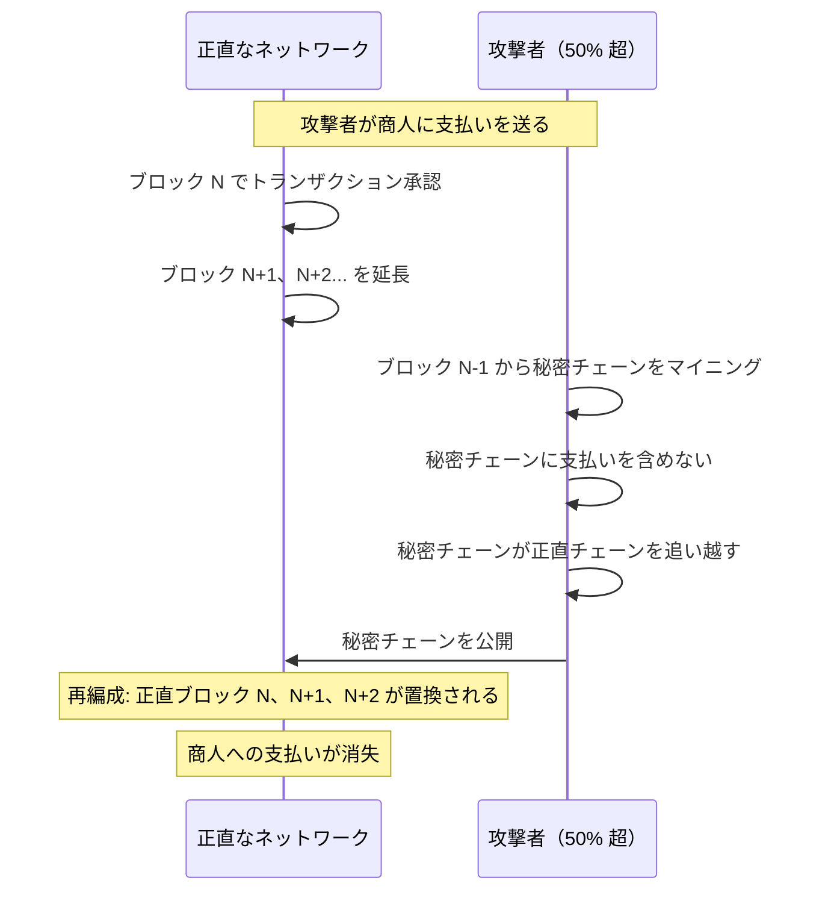
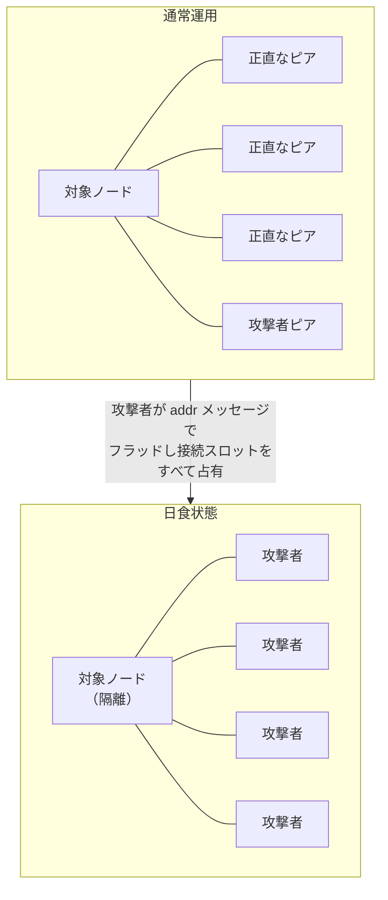
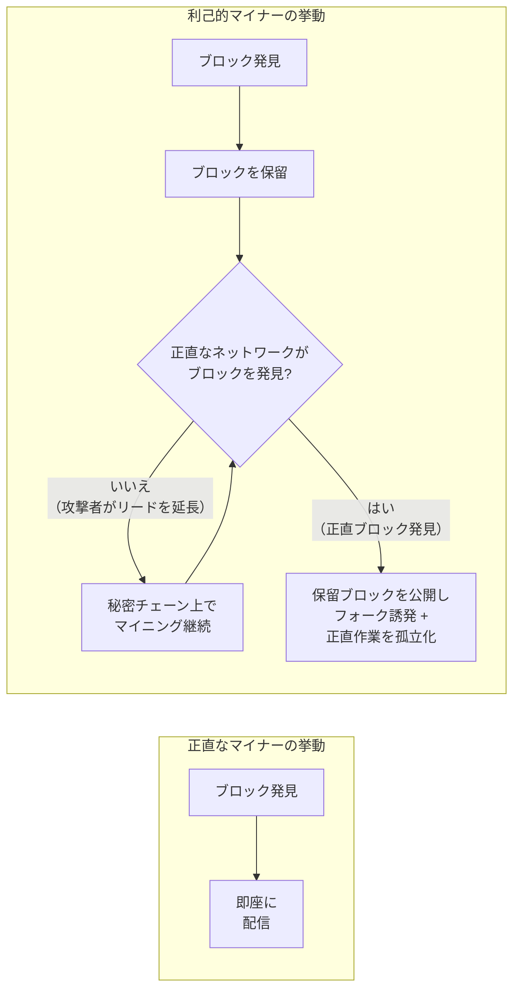
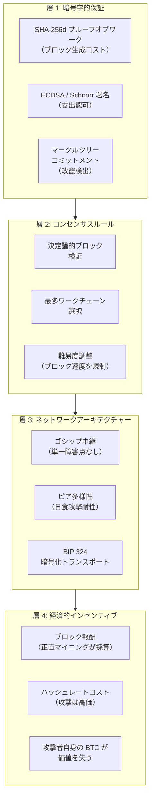
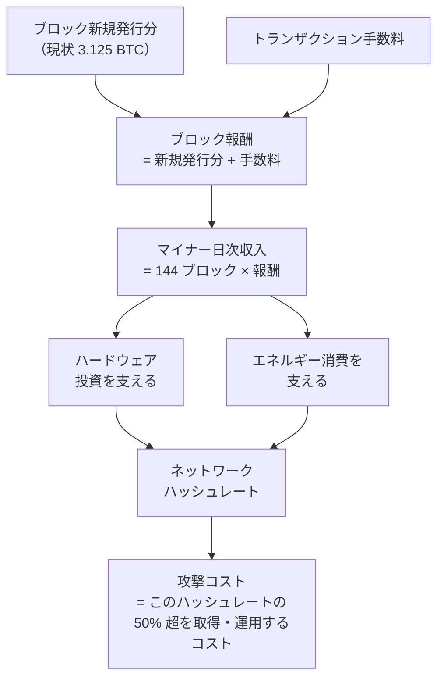
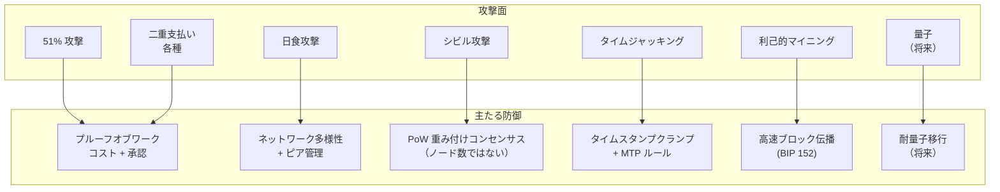

## はじめに

本ページは[設計文書シリーズ](/BitcoinArchive/ja/entries/design/2009-01-03-bitcoin-system-design-overview/)の **L2 #11 — セキュリティーモデル** である。3 つの L2 横断的深掘りの 2 番目。L1 ドメインページが各サブシステムの動作を説明するのに対し、本ページは、何がうまくいかなくなりうるか、そしてそれを何が止めるかを問う。

ビットコインのセキュリティーは単一の機構ではなく、暗号技術、経済的インセンティブ、ネットワークアーキテクチャーの相互作用に基づく。フルノードのオペレーターは機関やアイデンティティーではなく、数学とエネルギー消費を信頼する。本ページでは信頼の境界を図示し、既知の攻撃面を分類し、各攻撃に対処する防御層を追跡し、残存するリスクを特定する。

サトシ時代の実装（v0.1、2009 年 1 月）と現行の Bitcoin Core（v27 以降基準）で挙動が異なる場合は、両方を記す。

## 1. 信頼モデル

ビットコインはいくつかのカテゴリーの信頼を完全に排除し、他のカテゴリーを検証可能な計算に置き換えている。以下の表はプロトコルが信頼するものとしないものを分離する。

### ビットコインが信頼するもの

| 仮定 | なぜ必要か |
|---|---|
| **SHA-256 の原像耐性** | 攻撃者が SHA-256 を反転できれば、プルーフオブワークが偽造可能になる。チェーン選択機構全体がハッシュ反転の計算困難性に依存する。 |
| **ECDLP の困難性（secp256k1）** | 資金の所有権は秘密鍵の保持によって定義される。楕円曲線離散対数問題が解けるようになれば、露出したあらゆる公開鍵から秘密鍵が漏洩する。 |
| **正直な多数派のハッシュレート** | 最多ワークチェーンは正直なマイナーによって生成されていると仮定する。単一主体がハッシュレートの 50% を超えて支配すると、履歴を書き換えることができ、セキュリティーモデルは確率的耐性に低下する。 |
| **ネットワーク接続性** | ノードは少なくとも 1 つの正直なピアに到達できなければならない。完全なネットワーク隔離（成功した日食攻撃）は、攻撃者がノードに偽造チェーンを送り込むことを可能にする。 |
| **正確なソフトウェア** | ノードは自身の検証コードが正しいことを信頼する。ソフトウェアのコンセンサスバグは有効なチェーンと区別がつかない。ノードは、検査できないものを検出できないからだ。 |

### ビットコインが信頼しないもの

| 従来の信頼要件 | ビットコインがそれを排除する方法 |
|---|---|
| **発行のための中央機関** | 発行はすべてのノードが強制する決定論的な半減スケジュールに従う。ルール外でコインを作成できる主体は存在しない |
| **二重支払い防止のための銀行** | すべてのノードが各入力が未使用であることを独立に検証してからトランザクションを受け入れる |
| **参加者のアイデンティティー** | マイナーは匿名。その作業は SHA-256d ハッシュによって検証され、生成者のアイデンティティーによって検証されるのではない |
| **いかなる単一ピアの誠実さ** | ノードは受信するすべてを検証する。嘘をつくピアは信頼されるのではなく、検出されてペナルティーを受ける |
| **いかなる単一サーバーの稼働時間** | ゴシップネットワークに単一障害点はない。ノードの一部が接続を維持する限りプロトコルは動作し続ける |

## 2. 攻撃の分類

以下の攻撃はビットコインプロトコルの既知の脅威面を代表する。各攻撃はコンセンサス、ネットワーク、暗号の異なる層で動作し、異なるコストと影響のプロファイルを持つ。

### 2.1 多数派ハッシュレート攻撃（51% 攻撃）

ネットワーク総ハッシュレートの 50% 超を支配する攻撃者は、正直なネットワークより速く秘密のチェーンをマイニングし、それを公開して再編成を引き起こし、以前に確認されたトランザクションを覆すことができる。

**コストモデル。** 攻撃者は攻撃の期間中、ネットワークの 50% を超えるハッシュレートを維持しなければならない。2024 年時点の難易度レベルでは、ハードウェアだけで数十億ドル規模の資本支出が必要であり、加えて 1 日あたり数千万ドルのエネルギーコストがかかる。攻撃はまた、ネットワークへの信頼を損なうことで攻撃者自身のマイニング投資の価値も毀損する。

**緩和策。** 高い累積プルーフオブワークが再編成の深さを実質的に制限する。商人と取引所は複数の確認（6 回が慣習的; 高額決済ではそれ以上を要求する場合がある）を待つ。大規模マイナーは BTC 建てで大量の資産を保有しており、その経済的自己利益がハッシュレートコストを超える抑止力として機能する。

### 2.2 二重支払い攻撃

二重支払いは、受取人が後に覆される支払いを受け入れてしまうあらゆる攻撃である。51% 攻撃が最も強力な形態だが、より低コストの変種が存在する。

| 変種 | 必要なハッシュレート | 仕組み |
|---|---|---|
| **レース攻撃** | 任意（0 確認） | 攻撃者が 2 つの競合するトランザクションを同時にブロードキャスト; 商人は最初に到着したものを受け入れるが、2 番目がマイニングされる |
| **フィニー攻撃** | マイナー（任意 %） | 攻撃者が競合するトランザクションを含むブロックを事前にマイニングし、商人で支払った直後に事前マイニングしたブロックを公開する |
| **ベクター 76 攻撃** | マイナー（任意 %） | レースとフィニーの手法を組み合わせ: 攻撃者が被害者に直接接続して一方のトランザクションを配信し、もう一方を含む事前マイニング済みブロックをネットワークの残りに公開する |
| **多数派攻撃** | 50% 超 | 対象トランザクションを除外した秘密チェーンをマイニングし、公開して再編成を引き起こす |

**緩和策。** 不可逆な商品に対して未確認（0 確認）トランザクションを受け入れない。追加の確認ごとに二重支払い成功の確率は指数関数的に低下する。[コンセンサス設計ページのファイナリティー分析](/BitcoinArchive/ja/entries/design/2009-01-03-bitcoin-consensus-design/)で示されている通りである。

### 2.3 日食攻撃

日食攻撃は、ターゲットノードのすべてのピア接続を攻撃者が制御するノードで独占することで、正直なネットワークからターゲットノードを隔離する。隔離されたノードは攻撃者が見せるブロックチェーンの姿しか見えなくなる。

**影響。** 日食状態のノードは低ワークチェーンを送り込まれたり、そのノードに対して特定的に二重支払いに使われたり、新しくマイニングされたブロックを見ることを妨げられて正直なチェーン先端から取り残される可能性がある。

**緩和策（v27 以降基準）。** アウトバウンドピアの多様性（IP 範囲をまたぐランダム選択）、再起動間で保持されるアンカー接続、ブロックリレー専用ピア（メモリープール情報を明かさない追加の 2 つのアウトバウンド接続）、ネットワークグループの多様性を保つインバウンド追い出し、そして通信の識別と傍受を困難にする BIP 324 暗号化トランスポート。

### 2.4 シビル攻撃

シビル攻撃は、多数の偽のノードアイデンティティーを作成してネットワークに対する不均衡な影響力を得る。日食攻撃（1 ノードをターゲットにする）とは異なり、シビル攻撃はグローバルにネットワークの認識に影響を与えることを目的とする。

**影響。** シビル攻撃者はピア発見を偏らせたり、トランザクション伝搬を遅延させたり、複数のノードに対する日食攻撃の成功確率を高めたりできる。

**緩和策。** ビットコインのコンセンサスはノード数ではなくプルーフオブワークで重み付けされる。ハッシュレートゼロの 100 万のシビルノードは有効なブロックを 1 つも生成できない。プルーフオブワークはビットコインの根本的なシビル耐性機構であり、サトシが[ホワイトペーパーの第 5 節](/BitcoinArchive/ja/entries/emails/cryptography/2008-10-31-bitcoin-whitepaper-final/)で説明した通り、ノードは IP アドレスではなく CPU パワーで投票する。ネットワーク層では、ピア選択アルゴリズムが IP 範囲と自律システムをまたいで多様化し、攻撃者が接続を集中させる能力を制限する。

### 2.5 タイムジャッキング

タイムジャッキング攻撃は、攻撃者のピアが報告するタイムスタンプを操作してターゲットノードのネットワーク時間の認識を歪める。ビットコインノードは接続されたピアの報告時間の中央値オフセットとして「ネットワーク時間」を計算する。

**影響。** 成功したタイムジャッキングは、ターゲットノードに有効なブロック（タイムスタンプが未来に見えすぎる）を拒否させたり、無効なブロック（歪んだ時計に対してタイムスタンプが有効に見える）を受け入れさせたりする可能性がある。極端な場合、多数派ハッシュレート攻撃と組み合わせて難易度調整のタイムスタンプベースの計算を悪用できる。

**緩和策。** Bitcoin Core はネットワーク時間のオフセットをノードのローカルシステム時計から最大 70 分に制限する。中央値のピアオフセットがこのしきい値を超えると、ノードは自身の時計にフォールバックする。ホストシステムの正確な NTP 同期がさらに露出を制限する。

### 2.6 利己的マイニング

利己的マイナーは発見したブロックを即座にブロードキャストせず保留する。保留ブロックの公開タイミングを戦略的に操ることで、攻撃者は正直なマイナーに陳腐化するブロックに対して作業を浪費させ、ハッシュレートの割合に対して不均衡なブロック報酬シェアを得ることができる。

**しきい値。** アイアルとシーラー（2014）による理論的分析は、利己的マイニングがネットワークハッシュレートの約 25–33% を超えると利益が出ることを示した。しきい値は攻撃者のネットワーク接続性（競合する正直なブロックが伝搬する前に大部分のノードに到達する能力）に依存する。このしきい値以下では、攻撃者は正直なマイニングと比較して収入を失う。

**緩和策。** 高速なブロック伝搬（コンパクトブロック、BIP 152）が、保留ブロックが正直な作業を陳腐化できるウィンドウを狭めることで攻撃者の優位性を低下させる。コンセンサスレベルの修正は展開されていないが、先着ブロックを優遇するタイブレーキングの提案が存在する。

## 3. 防御層

ビットコインのセキュリティーは単一の壁ではなく、一連の同心円状の層である。攻撃者は意味のある成果を得るために複数の独立した防御を突破しなければならない。

| 層 | 何を保護するか | 何に対して保護できないか |
|---|---|---|
| **暗号** | 偽造トランザクション（署名）、偽造ブロック（プルーフオブワーク）、改竄された履歴（マークルコミットメント） | ECDLP を破る量子コンピューター; 暗号ライブラリーの実装バグ |
| **コンセンサス** | 無効なブロック、競合するチェーン、ルール違反 | すべてのルールに従うが履歴を書き換える有効なブロックを生成する 50% 超の攻撃者 |
| **ネットワーク** | 日食攻撃、シビルの影響、通信監視 | 物理的なネットワークインフラストラクチャーを支配する国家レベルの敵対者 |
| **経済** | 合理的攻撃者の抑止（攻撃コストが利得を上回る） | 非経済的な動機を持つ不合理または国家支援の攻撃者 |

## 4. 暗号学的仮定

ビットコインのセキュリティーは 3 つの具体的な計算困難性の仮定に基づいている。いずれも数学的な意味で困難であることは証明されていない。数十年にわたる暗号解析の努力に基づく経験的な仮定である。

| 仮定 | プリミティブ | 仮定が崩れた場合に何が壊れるか |
|---|---|---|
| **SHA-256 の原像耐性** | プルーフオブワーク、トランザクション ID、マークルツリー | 攻撃者がエネルギー消費なしにプルーフオブワークを偽造でき、チェーン選択機構全体が崩壊する |
| **SHA-256 の衝突耐性** | マークルツリーの結合、コミットメント方式 | 攻撃者が同じマークルルートを生成する 2 つの異なるトランザクションセットを構築でき、有効なブロックヘッダー内でトランザクションの隠れた差し替えが可能になる |
| **楕円曲線離散対数の困難性（secp256k1）** | ECDSA、シュノア署名 | 攻撃者が公開鍵から秘密鍵を導出でき、公開鍵がオンチェーンで露出しているあらゆる資金を使用できる |

**防御の深さ。** ビットコインのアドレス方式（Hash160: 公開鍵の SHA-256 の RIPEMD-160）は未使用出力に第二の障壁を提供する。ECDLP が崩壊しても、未公開の公開鍵ハッシュ背後の資金を奪うには、ハッシュ関数の破壊もあわせて必要になる。これは独立した別の計算問題である。この防御は一度も支払いを行っていないアドレスにのみ適用される。トランザクションが Witness または scriptSig で公開鍵を公開すると、ハッシュの障壁は消滅する。

## 5. ネットワーク層の防御

[P2P ネットワーク設計ページ](/BitcoinArchive/ja/entries/design/2009-01-03-bitcoin-p2p-network-design/)がネットワーク層を詳述する。本節ではセキュリティーに関連する機構を要約する。

| 防御 | 導入時期 | 対抗する攻撃 |
|---|---|---|
| **ランダムなアウトバウンドピア選択** | v0.1（反復的に改善） | 予測可能なピア選択による日食攻撃 |
| **アンカー接続** | v0.21 | ノード再起動時の日食攻撃（攻撃者が `peers.dat` を汚染して再起動を待つ） |
| **ブロックリレー専用ピア** | v0.19 | すべてのブロックソースの制御を必要とする日食攻撃; メモリープールタイミングによる匿名化解除も防止 |
| **多様性保持の追い出し** | v0.12 以降（反復的に改善） | シビルベースのインバウンドフラッディング（攻撃者が全インバウンドスロットを埋める） |
| **フィーラー接続** | v0.14 | ピアデータベースに陳腐化または到達不能アドレスが蓄積 |
| **BIP 324 暗号化トランスポート** | v26.0（v27 以降でデフォルト） | 受動的通信監視、標的型検閲、ブロック遅延の中間者攻撃 |
| **addrv2（BIP 155）** | v22.0 | 単一ネットワーク層の検閲（Tor、I2P、CJDNS がルーティングの多様性を提供） |

## 6. 経済的セキュリティー

セキュリティー予算は、攻撃者がネットワークを侵害するために負担しなければならない総経済コストである。ハッシュレート取得の資本コストとその運用にかかる継続的エネルギーコストの 2 つの構成要素を持つ。

### ハッシュレートコストモデル

| パラメーター | おおよその値（2024 年） | 意味 |
|---|---|---|
| **ネットワークハッシュレート** | 約 600 EH/s（エクサハッシュ/秒、2024 年半ば時点） | 攻撃者が超えなければならない総計算能力 |
| **マイナーの日次収入** | 約 3,000–4,000 万ドル（新規発行分 + 手数料、典型的な価格で） | 現在のハッシュレートを維持する経済的フロー |
| **ASIC 単価** | 約 15–30 ドル/TH/s（最新世代） | 攻撃者のハードウェアの資本支出 |
| **エネルギーコスト** | 約 0.05 ドル/kWh（業界平均） | 継続的な運用支出 |
| **推定 51% 攻撃コスト（1 時間）** | 数千万ドル | 約 6 ブロックにわたる持続的な多数派ハッシュレートのためのハードウェア償却 + エネルギー |

**半減問題。** 新規発行分が 210,000 ブロックごとに半減するにつれて、セキュリティー予算はトランザクション手数料への依存を増す。手数料収入が低下する新規発行分を補うだけ成長しなければ、51% 攻撃の経済コストは低下する。プロトコルルールは変わらなくても、購買力ベースではネットワークのセキュリティーが低下する可能性がある。この移行は[マイニング報酬枯渇分析](/BitcoinArchive/ja/entries/analysis/2026-05-18-mining-reward-exhaustion-fee-only-future/)で詳細に分析されている。

**経済的抑止と物理的セキュリティー。** 上記のコストモデルは期待利得と期待コストを比較衡量する合理的攻撃者を仮定している。非経済的な動機（検閲、破壊）を持つ国家レベルの敵対者は、直接的な金銭的リターンを超えるコストを負担する意思がありうる。この種の攻撃者に対するビットコインの防御は経済的ではなく構造的である。ネットワークは地理的に分散し、マイニングハードウェアは物理的に分散しており、プロトコルは正直な参加者の一部が接続を維持する限り動作し続ける。

## 7. 量子脅威

量子コンピューティングはビットコインの暗号層に対する将来の潜在的脅威を表す。完全な分析は[量子脅威分析](/BitcoinArchive/ja/entries/analysis/2026-05-18-bitcoin-quantum-threat/)にある。本節ではセキュリティーモデルへの影響を要約する。

| プリミティブ | 古典的セキュリティー | 量子攻撃 | 耐量子状況 |
|---|---|---|---|
| **ECDSA / シュノア署名（secp256k1）** | 約 128 ビット | ショアのアルゴリズムが ECDLP を多項式時間で解く | 暗号学的に意味のある量子コンピューターが存在するとき破られる |
| **SHA-256（プルーフオブワーク）** | 256 ビットの原像 | グローバーのアルゴリズム: 2²⁵⁶ → 2¹²⁸ の実効耐性 | 128 ビットは実用的な脅威しきい値を大きく上回る |
| **RIPEMD-160（アドレスハッシュ）** | 160 ビットの原像 | グローバーのアルゴリズム: 2¹⁶⁰ → 2⁸⁰ | 境界的な水準にとどまり、2⁸⁰ は快適な長期マージンを下回る |
| **HMAC-SHA512（HD 導出）** | 256 ビットの鍵 | グローバーが約 128 ビットに半減 | 実用上の脅威なし |

**露出ウィンドウ。** 資金が量子 ECDLP 攻撃に対して脆弱になるのは公開鍵がオンチェーンに露出しているときのみである。一度も公開鍵が公開されていない公開鍵ハッシュ背後の未使用出力（受け取ったが送金したことのないアドレス）は、署名方式ではなくハッシュ関数によって保護される。送金済みアドレスと、サトシ時代初期の Pay-to-Public-Key (P2PK) 出力は、公開鍵がオンチェーンに恒久的に可視であり、最初のターゲットとなる。

**移行パス。** BIP 360（P2MR / QuBit）は耐量子アドレスタイプを提案している。いかなる移行もネットワーク全体のソフトフォークと、ユーザーが量子脆弱なアドレスから量子耐性アドレスへ資金を移す移行期間を必要とする。タイムラインは量子ハードウェアの進歩に依存し、暗号学的に意味のある量子コンピューターの実現には 20 年から 40 年かかると推定されている（アダム・バック、2025 年 11 月）。ただし、プロトコルは脅威が顕在化するかなり前に移行機構を設計しておかなければならない。この推定の詳しい文脈は[アダム・バックの量子脅威タイムライン発言](/BitcoinArchive/ja/entries/aftermath/2025-11-15-adam-back-quantum-threat-timeline/)を参照。

## 8. 攻撃と防御の比較

| 攻撃 | 層 | 必要なリソース | 主要な防御 | 緩和状況 |
|---|---|---|---|---|
| **51% 攻撃** | コンセンサス | ネットワークハッシュレートの 50% 超 | 累積プルーフオブワークコスト; 確認の深さ | 現在のハッシュレートでは経済的に禁止的; プロトコルレベルの防止策はない |
| **二重支払い（0 確認）** | トランザクション | 最小限（2 つの競合するトランザクション） | 確認を待つ; 不可逆な商品に 0 確認を受け入れない | ポリシー（1 回以上の確認）で完全に緩和 |
| **二重支払い（確認済み）** | コンセンサス | 確認の深さに比例したハッシュレート | 確認ごとに指数関数的に増大する覆転コスト | 確率的; 深さとともにセキュリティーが向上 |
| **日食攻撃** | ネットワーク | すべてのピア接続の支配 | アンカーピア、ブロックリレー専用ピア、多様な追い出し、BIP 324 | v27 以降で大幅に堅牢化; 接続の乏しいノードに残存リスク |
| **シビル攻撃** | ネットワーク | 大量の偽ノードアイデンティティー | シビル耐性としてのプルーフオブワーク; IP 範囲の多様化 | コンセンサス層は免疫; ネットワーク層は漸進的に堅牢化 |
| **タイムジャッキング** | ネットワーク / コンセンサス | 複数ピア接続の制御 | 70 分のオフセット制限; NTP 同期 | 制限で緩和; 極端な時計のずれでは残余事例あり |
| **利己的マイニング** | コンセンサス | ハッシュレートの約 25–33%（接続性に依存） | コンパクトブロックリレー（BIP 152）が伝搬優位性を低減 | 部分的に緩和; コンセンサスレベルの修正は未展開 |
| **量子（ECDLP）** | 暗号 | 暗号学的に意味のある量子コンピューター | 耐量子署名への移行（BIP 360 / P2MR 提案） | 未緩和; 脅威のタイムラインは 20–40 年と推定（アダム・バック、2025 年 11 月） |

## 9. 本ページの範囲

本ページではセキュリティーモデルを横断的分析として解説した。以下のトピックは[設計文書シリーズ](/BitcoinArchive/ja/entries/design/2009-01-03-bitcoin-system-design-overview/)内のそれぞれのドメインページで扱う:

- **トランザクション展性**: SegWit 以前の展性ベクトルと BIP 141 による解決。[トランザクション設計](/BitcoinArchive/ja/entries/design/2009-01-03-bitcoin-transaction-design/)ページで解説。
- **プルーフオブワークの仕組み**: SHA-256d ハッシュパズル、難易度調整アルゴリズム、オフバイワン / タイムワープのバグ。[コンセンサス設計](/BitcoinArchive/ja/entries/design/2009-01-03-bitcoin-consensus-design/)ページで解説。
- **暗号プリミティブの詳細**: 鍵生成、署名方式、ハッシュ構成、HD 導出。[暗号設計](/BitcoinArchive/ja/entries/design/2009-01-03-bitcoin-cryptography-design/)ページで解説。
- **ネットワークアーキテクチャー**: ピア発見、接続管理、メッセージプロトコル、トランスポート暗号化。[P2P ネットワーク設計](/BitcoinArchive/ja/entries/design/2009-01-03-bitcoin-p2p-network-design/)ページで解説。
- **手数料のみのセキュリティー予算**: 新規発行分主体からの手数料主体のマイナー収入への長期的移行とチェーンセキュリティーへの影響。[マイニング報酬枯渇分析](/BitcoinArchive/ja/entries/analysis/2026-05-18-mining-reward-exhaustion-fee-only-future/)で解説。
- **量子脅威の深掘り**: タイムライン推定、脆弱な UTXO の全数調査、BIP 360 の仕組み、他システムの耐量子移行との比較。[量子脅威分析](/BitcoinArchive/ja/entries/analysis/2026-05-18-bitcoin-quantum-threat/)で解説。

プルーフ・オブ・ワークの仕組みそのものは[コンセンサス設計](/BitcoinArchive/ja/entries/design/2009-01-03-bitcoin-consensus-design/)にある。ここにあるのは同じ機構の攻撃側である。具体的には、51% 攻撃の経済、利己的マイニングのゲーム理論、そして脅威モデル全体を指す。
