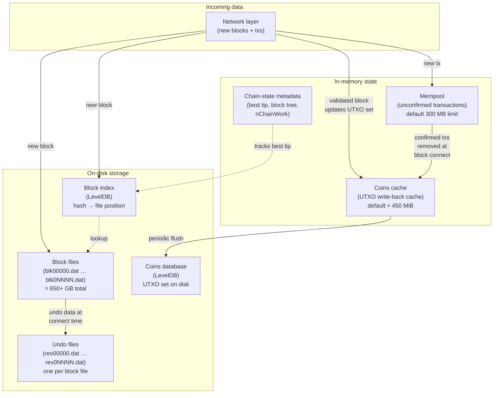
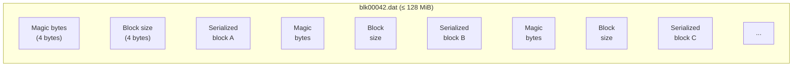
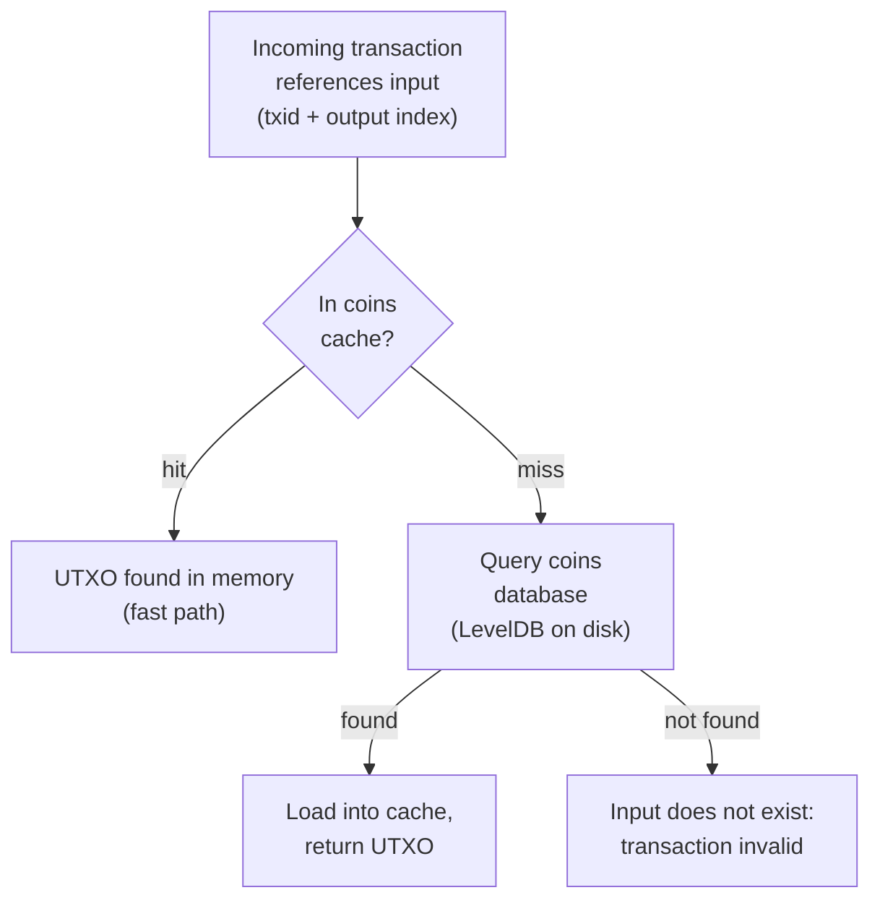
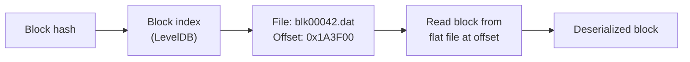
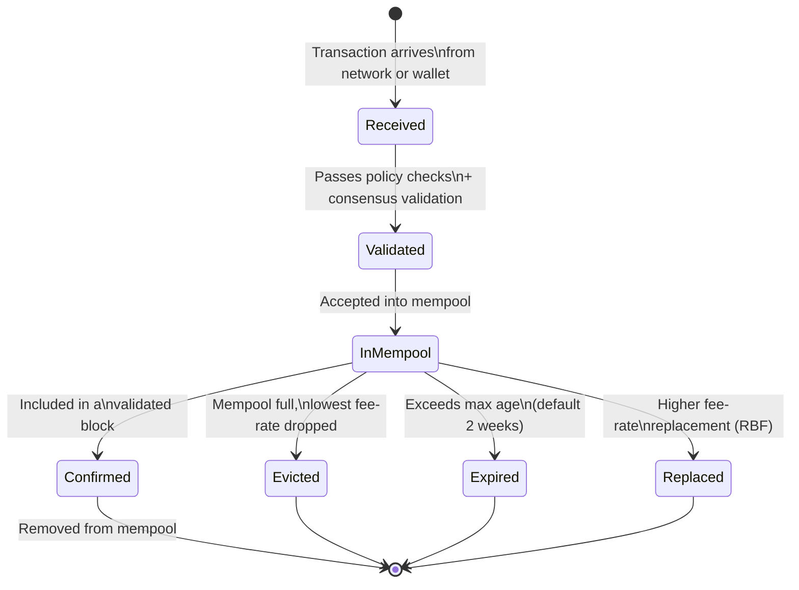
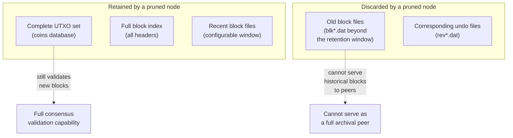
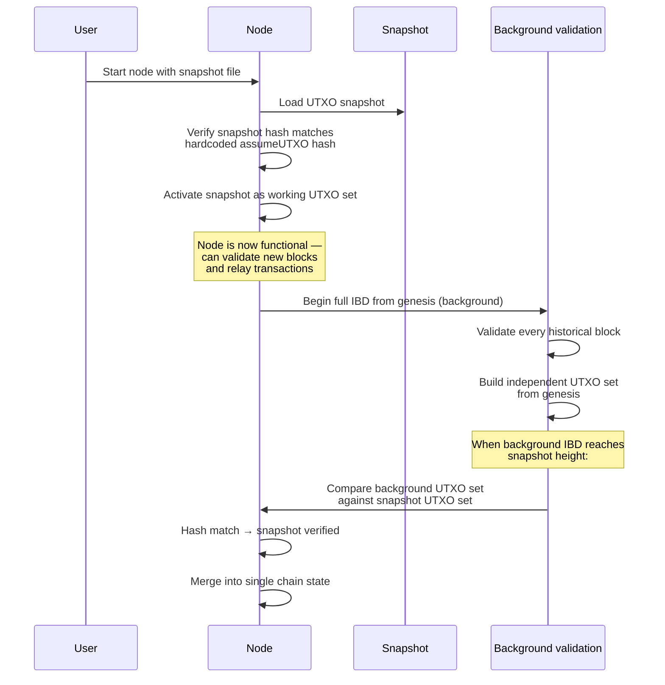

## はじめに

本ページは[設計文書シリーズ](/BitcoinArchive/ja/entries/design/2009-01-03-bitcoin-system-design-overview/)の L1 第 7 編であり、ストレージ層を扱う: Bitcoin Core ノードが検証済みデータをディスクにどう永続化するか、使用可能なコインをメモリーとディスク上でどう追跡するか、状態をどう復旧またはブートストラップするか。

[トランザクション設計](/BitcoinArchive/ja/entries/design/2009-01-03-bitcoin-transaction-design/)ページでは UTXO とは何かを説明した。[ブロックとチェーン設計](/BitcoinArchive/ja/entries/design/2009-01-03-bitcoin-block-chain-design/)ページではブロックがチェーンにどう連結されるかを説明した。本ページは一段階下に移る: これらの抽象概念を耐久的かつ検索可能にするディスク上およびメモリー内の構造。

4 つの問いが内容を構成する:

1. **ブロックはどこに保存されるか?** ディスク上のフラットファイル（`blk*.dat`）に保存され、再編成を可能にする付随の取り消しファイル（`rev*.dat`）を伴う。
2. **UTXO セットはどこにあるか?** LevelDB データベース（コインデータベース）に置かれ、パフォーマンスのためにメモリー内にライトバックキャッシュを持つ。
3. **ノードはブロックをどう素早く見つけるか?** ブロックハッシュをファイル位置にマッピングする LevelDB ブロックインデックスを通じて。
4. **ノードはすべてを永久に保存することをどう回避するか?** 剪定（古いブロックファイルの破棄）と assumeUTXO（信頼された UTXO スナップショットからのブートストラップ）によって。

サトシ時代の実装（v0.1、2009 年 1 月）と現代の Bitcoin Core（v27 以降を基準）で挙動が異なる箇所は、双方を記載する。

## 1. ストレージアーキテクチャの概要

以下の図はフルノード内部のすべての永続データストアとそれらの間のデータフローを示す。

| ストア | エンジン | 内容 | おおよそのサイズ（2025 年） |
|---|---|---|---|
| **ブロックファイル** | フラットバイナリーファイル | 生のシリアライズされたブロック、追記専用 | 約 650 GB |
| **取り消しファイル** | フラットバイナリーファイル | 各使用済み入力の以前のコイン状態（ブロックファイルごとに 1 つ） | 約 100 GB |
| **コインデータベース** | LevelDB | すべての未使用トランザクション出力（UTXO セット） | 約 7 GB |
| **ブロックインデックス** | LevelDB | ブロックヘッダーメタデータとファイル位置ポインター | 約 500 MB |
| **コインキャッシュ** | メモリー内ハッシュマップ | コインデータベースのライトバックキャッシュ | 設定可能（既定約 450 MiB、`-dbcache` で指定） |
| **メモリープール** | メモリー内データ構造 | ブロック掲載を待つ未承認トランザクション | 設定可能（既定 300 MB、`-maxmempool` で指定） |

## 2. ブロックファイル

検証済みブロックは、データディレクトリの `blocks/` サブディレクトリに保存される `blk00000.dat`、`blk00001.dat` 等の名前の一連のフラットバイナリーファイルに順次書き込まれる。各ファイルは新しいファイルが開かれるまでにおよそ 128 MiB までの生のブロックデータを保持する。

### ブロックファイルのレイアウト

ファイル内の各ブロックエントリーは、4 バイトのネットワークマジックナンバー（ネットワーク — メインネット、テストネット等 — を識別する）で始まり、4 バイトのリトルエンディアンサイズフィールドが続き、その後に完全なシリアライズされたブロック（ヘッダー + トランザクション + 証人データ）が格納される。

### 取り消しファイル (rev*.dat)

各ブロックファイル `blk0NNNN.dat` に対して、対応する `rev0NNNN.dat` が存在する。取り消しファイルは、対応するブロック内のすべてのトランザクションが消費したすべての UTXO の**以前の状態**を保存する。このデータはチェーン再編成時のブロックの**切断**に不可欠である: ノードは使用された UTXO を復元し、作成された UTXO を除去しなければならない。

| ファイルペア | 目的 |
|---|---|
| `blk0NNNN.dat` | 順方向データ: 受信・検証された生のブロック |
| `rev0NNNN.dat` | 逆方向データ: ブロックの UTXO セットへの影響を取り消すために必要なコイン状態 |

取り消しデータがなければ、再編成にはジェネシスブロックからチェーン全体を再検証する必要がある — 現代のハードウェアでも数時間を要する操作である。

## 3. UTXO セット（コインデータベース）

UTXO セットは Bitcoin Core で最もパフォーマンスが重要なデータ構造である。すべてのトランザクション検証において、参照された入力が存在し未使用であるかの検索が必要となる。コインデータベースは `chainstate/` サブディレクトリにある LevelDB キーバリューストアにすべての未使用トランザクション出力を格納する。

### UTXO 検索フロー

### キーバリュー構造

コインデータベースの各エントリーは**アウトポイント**（トランザクションハッシュ + 出力インデックス）をキーとし、コインのサトシ単位の額面、作成されたブロック高、コインベース出力かどうか、出力のロックスクリプトを保存する。

### コインキャッシュ

トランザクション入力ごとにディスク上の LevelDB から読み取るのでは遅すぎる。Bitcoin Core は読み取りを吸収し書き込みをバッチ処理するメモリー内ライトバックキャッシュ（コインキャッシュ）を維持する。ブロックが接続されると、使用済みコインはキャッシュ内で消費済みとマークされ、新しいコインが追加される。定期的に — またはキャッシュがサイズ上限に達した時に — 蓄積された変更がディスク上の LevelDB に単一のバッチ書き込みでフラッシュされる。

| パラメーター | 既定値 | 効果 |
|---|---|---|
| `-dbcache` | 450 MiB | メモリー内コインキャッシュのサイズ。値が大きいほど初期ブロックダウンロード時のディスク I/O が減少する。 |
| フラッシュ契機 | キャッシュ満杯またはシャットダウン | ダーティエントリーが LevelDB にバッチ書き込みされる。 |

**初期ブロックダウンロード（IBD）のパフォーマンス。** IBD 中、ノードは数十万のブロックを連続して高速に処理する。`-dbcache` を大きく設定する（例: 4096 MiB 以上）と、UTXO セットのより多くの部分がメモリーに保持され、ディスク読み取りとバッチ書き込み頻度が最小化されるため、IBD 時間が劇的に短縮される。

## 4. ブロックインデックス

ブロックインデックスは `blocks/index/` に保存される独立した LevelDB データベースで、ノードがこれまでに受信したすべてのブロックヘッダー — 古くなったブランチのものも含む — のカタログとして機能する。各ブロックハッシュに対して、インデックスは以下を保存する:

| フィールド | 目的 |
|---|---|
| ブロックヘッダーフィールド | バージョン、前ブロックハッシュ、マークルルート、タイムスタンプ、nBits、ナンス |
| ファイル位置 | どの `blk*.dat` ファイルにこのブロックが格納されているか、どのバイトオフセットか |
| ブロック高 | チェーン内の位置 |
| チェーン仕事量 | このブロックまでの累積プルーフ・オブ・ワーク（`nChainWork`） |
| 検証状態 | ブロックが完全に検証済みか、ヘッダーのみ検証済みか、無効としてマークされているか |

### ブロック取得パス

ブロックインデックスにより、ノードはフラットファイルを走査することなくハッシュで任意のブロックを特定できる。また、チェーン選択に必要なデータも提供する: ノードはディスクからフルブロックを読み込まずに、ブランチ先端間で `nChainWork` 値を比較して最も仕事量の多いチェーンを判定できる。

## 5. メモリープールストレージ

メモリープールは、検証とポリシーチェックに合格したがまだブロックに掲載されていない未承認トランザクションのメモリー内プールである。合意形成データベースには永続化されない — 各ノードが独立に維持するローカルで一時的な構造である。

### メモリープールのライフサイクル

| 特性 | 値（v27 以降基準） |
|---|---|
| **最大サイズ** | 300 MB（`-maxmempool` で設定可能） |
| **除去ポリシー** | プールが容量に達すると最低手数料率のトランザクションから除去 |
| **期限切れ** | 336 時間（約 2 週間）を超えたトランザクションを除去 |
| **永続化** | 正常シャットダウン時に `mempool.dat` に保存; 次回起動時に読み込み |
| **手数料置換** | 完全 RBF が既定のメモリープールポリシー（v28.0 以降） |

**メモリープールと合意形成。** メモリープールはポリシーレベルの構造であり、合意形成レベルのものではない。2 つのノードが全く異なるメモリープールを持っていても、どのブロックが有効かについては合意できる。トランザクションがメモリープールに存在することはブロックへの掲載を保証しない — ローカルノードがそれを有効と見なし、中継する意思があることを意味するだけである。

## 6. 剪定

フルアーカイブノードはこれまでに生成されたすべてのブロックを保存する — 2025 年時点で 650 GB 超、年間約 50〜80 GB ずつ増加する。**剪定**により、ノードは古いブロックファイルと取り消しファイルを破棄しつつ、完全な UTXO セットと新規ブロック検証能力を保持できる。

### 剪定が保持するものと破棄するもの

| 側面 | アーカイブノード | 剪定ノード |
|---|---|---|
| **ブロックデータ** | ジェネシスからチップまでの全ブロック | 最新の N MiB のみ（最小 550 MiB） |
| **UTXO セット** | 完全 | 完全（アーカイブと同一） |
| **ブロックインデックス** | 完全（全ヘッダー） | 完全（全ヘッダー） |
| **新規ブロック検証** | 完全 | 完全（アーカイブと同一） |
| **過去のブロック提供** | 可能 — ピアに任意のブロックを提供可 | 不可 — 保持ウィンドウ内のブロックのみ提供可 |
| **ディスク使用量（2025 年）** | 約 650 GB 超 | 最小約 10 GB |

**要点。** 剪定ノードはフル検証ノードである。アーカイブノードとまったく同じように、すべての新規ブロックにすべての合意規則を適用する。唯一失われる能力は、初期ブロックダウンロードを行うピアに古いブロックを提供することである。剪定は `-prune=<MiB>`（最小 550）で設定する。

## 7. assumeUTXO

初期ブロックダウンロード（IBD）— ジェネシスブロックから現在のチップまですべてのブロックを検証すること — は、ハードウェアとネットワーク速度に応じて数時間から 1 日以上かかる。**assumeUTXO**（`loadtxoutset` RPC は v26.0 で導入; メインネットのスナップショットパラメーター（高さ 840,000）は v28.0 で追加）は代替のブートストラップパスを提供する: ノードは事前計算された UTXO スナップショットを読み込み、スナップショット高から即座に新規ブロックの検証を開始し、バックグラウンドで完全な過去のチェーンを検証する。

### assumeUTXO のブートストラッププロセス

### 信頼モデル

| フェーズ | 検証レベル | 信頼の前提 |
|---|---|---|
| **スナップショット読み込み済み、バックグラウンド IBD 未完了** | 新規ブロックはスナップショット UTXO セットに対して完全に検証される | ノードはハードコードされたスナップショットハッシュ（Bitcoin Core 開発者がバイナリーにコンパイルしたもの）を信頼する。スナップショットが悪意あるものであった場合、バックグラウンド検証が不一致を検出するまで、ノードは無効なトランザクションを受け入れる可能性がある。 |
| **バックグラウンド IBD 完了、ハッシュ一致** | ジェネシスからチップまですべてのブロックの完全な検証 | 追加の信頼なし — ノードはチェーン履歴全体を独立に検証しており、従来の IBD ノードと同一。 |

assumeUTXO は合意規則を変更しない。検証が行われる**順序**を変更する: 新規ブロックが最初（即座に有用）、過去のブロックが二番目（バックグラウンド検証）。最終状態は従来の IBD を実行したノードと同一である。

## 8. 二つの時代の比較

| 機能 | サトシ時代（v0.1、2009 年 1 月） | 現代の Bitcoin Core、v27 以降基準 |
|---|---|---|
| **主要データベース** | Berkeley DB (BDB) がすべての永続的状態を管理 | UTXO セットとブロックインデックスに LevelDB; ブロックにフラットファイル |
| **UTXO ストレージ** | トランザクション全体を BDB に保存; すべての出力（使用済み・未使用）を保持 | 未使用出力のみを LevelDB に保存; 使用済み出力は破棄 |
| **UTXO 表現** | トランザクションインデックス型: 出力ごとの使用済みフラグベクトル付きフルトランザクション | アウトポイントインデックス型: 各 UTXO を (txid, 出力インデックス) でキーとしコンパクトにシリアライズ |
| **コインキャッシュ** | 独立したキャッシュ層なし; BDB がすべての読み書きを処理 | 専用のメモリー内ライトバックキャッシュ（`-dbcache`、既定 450 MiB） |
| **ブロックストレージ** | 単一の一体型 BDB データベース | 連続的なフラットファイル（`blk*.dat`）、各約 128 MiB |
| **取り消しデータ** | 保存なし; 再編成にはフォークポイントからの再検証が必要 | 専用の `rev*.dat` ファイルが高速なロールバックのための以前のコイン状態を保存 |
| **ブロックインデックス** | BDB ベースのインデックス | `nChainWork` 追跡付き LevelDB ベースのインデックス |
| **剪定** | 利用不可; すべてのノードがフルチェーンを保存 | v0.11（2015 年）以降利用可能; 最小保持量 550 MiB |
| **assumeUTXO** | 利用不可 | バックグラウンド検証付きスナップショットベースのブートストラップ（v26 で導入; メインネットパラメーターは v28） |
| **メモリープールの永続化** | 再起動時に永続化しない | シャットダウン時に `mempool.dat` に保存; 起動時に再読み込み |
| **データベース移行** | 該当なし | v0.8（2013 年）で BDB → LevelDB 移行; Bitcoin Core のストレージ層における最大の変更 |
| **初期ブロックダウンロード** | 数分（ブロック数が少なかった） | assumeUTXO なしで数時間〜1 日超; assumeUTXO スナップショット使用で数分 |
| **ディスク上のサイズ** | 無視できる程度（チェーンが小さかった） | アーカイブで約 650 GB 超; 剪定で約 10 GB; コインデータベースで約 7 GB |

**BDB → LevelDB 移行（v0.8、2013 年 3 月）。** サトシのオリジナル実装はすべて — ブロックデータ、トランザクションインデックス、UTXO 状態 — を単一の Berkeley DB データベースに保存していた。チェーンの成長に伴い、BDB のロック制限とメモリー特性がボトルネックとなった。v0.8 リリースは UTXO セットとブロックインデックスの BDB を LevelDB に置き換え、ブロックデータを現在も使用されているフラットファイル形式に移した。この移行は事件を伴った: 2013 年 3 月 11 日、v0.7（BDB）を実行するノードと v0.8（LevelDB）を実行するノードが、LevelDB にはない BDB のロックカウント制限に起因してブロックの有効性について不一致となり、合意形成の分裂フォークが発生した。フォークはマイナーの協調行動により、長い v0.8 チェーンを放棄することで解決された — ビットコイン史上数少ない意図的なチェーン再編成の 1 つである。

## 9. 本ページの範囲

本ページはストレージ層を単独で扱う。以下のトピックは範囲外であり、[設計文書シリーズ](/BitcoinArchive/ja/entries/design/2009-01-03-bitcoin-system-design-overview/)内のそれぞれの専門ページで扱う:

- **トランザクション構造と UTXO モデル** — UTXO がどう作成、使用、検証されるか。[トランザクション設計ページ](/BitcoinArchive/ja/entries/design/2009-01-03-bitcoin-transaction-design/)で扱う。
- **ブロック構造とチェーン選択** — ブロックがどう構成され、最も仕事量の多いチェーンがどう選択されるか。[ブロックとチェーン設計ページ](/BitcoinArchive/ja/entries/design/2009-01-03-bitcoin-block-chain-design/)で扱う。
- **合意規則** — ブロックがストレージ層に到達する前に受け入れるかどうかを決定する検証規則。
- **ネットワーク層のブロックリレー** — ブロックがディスクに書き込まれる前にノード間でどう伝送されるか。
- **ウォレットストレージ** — 鍵導出、記述子データベース、ウォレットバックアップはここで記述した合意データとは別のストレージパスを使用する。
