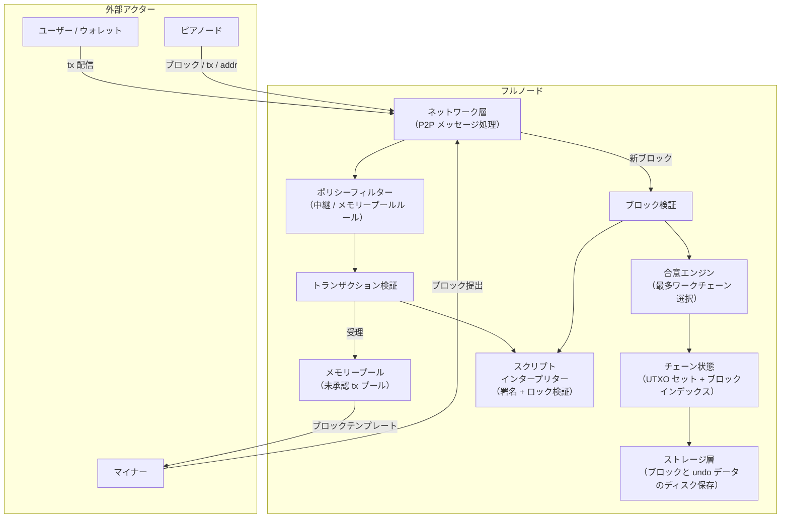
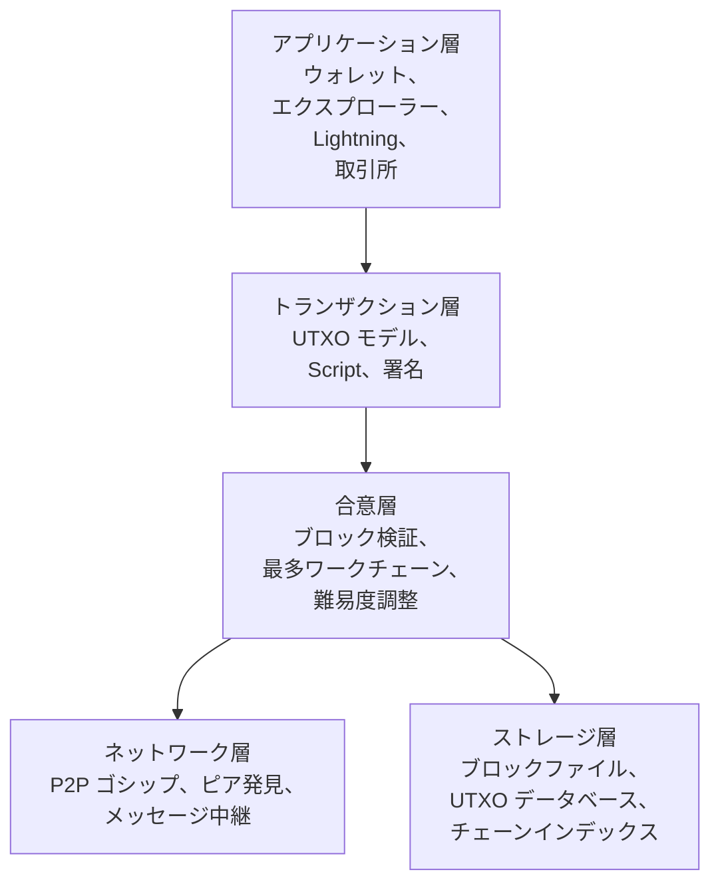
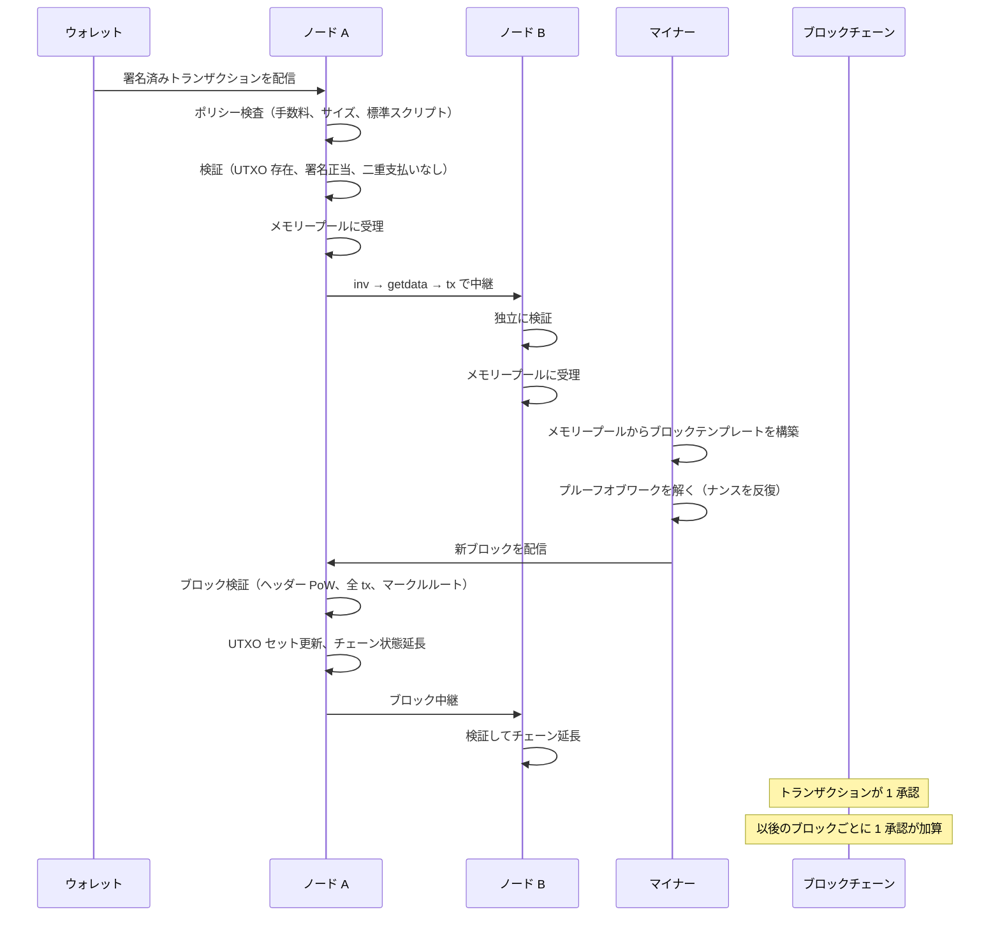
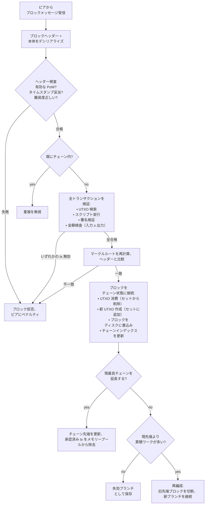
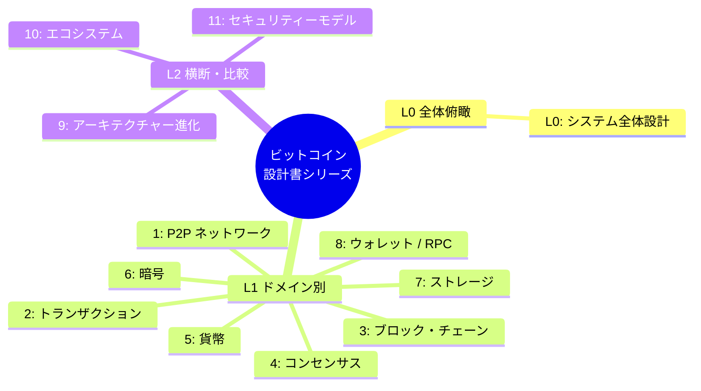

## 本文書シリーズについて

これは Bitcoin Institute が執筆したビットコインの技術設計書であり、システムを構成要素に分解してそれらがどのように組み合わさるかを説明する全 12 ページのシリーズである。プロトコル仕様ではなく、規範的な権威を持つものでもない。[ホワイトペーパー](/BitcoinArchive/ja/entries/emails/cryptography/2008-10-31-bitcoin-whitepaper-final/)、[仕組み図解](/BitcoinArchive/ja/entries/analysis/2026-05-23-how-bitcoin-works-visual-glossary/)、および参照実装のソースコードを補完する分析的ガイドである。

**基準線。** 特に断りのない限り、「現行の Bitcoin Core」は v27 以降のコードベースを指す。サトシ時代の記述は v0.1（2009 年 1 月）を指す。両者の挙動が異なる場合は、両方を記す。

**範囲。** 本シリーズはビットコインのプロトコルとその参照実装を対象とする。レイヤー 2 システム（Lightning Network、サイドチェーン）やアプリケーション層のソフトウェア（ウォレット、取引所、インデクサー）は接続境界で言及するが、詳細な分解は行わない。

本ページは設計文書シリーズの **L0 — システム全体設計** である。システム全体像を示し、各ドメインページへのリンクを提供する。

## 1. システム構造

以下の図は主要なサブシステムとそれらの間のデータパスを示す。各ボックスはシリーズ内の 1 つ以上のページに対応する。

| サブシステム | 役割 | 設計ページ |
|---|---|---|
| ネットワーク層 | P2P ゴシップ、ピア管理、メッセージ直列化 | [L1 #1 P2P](/BitcoinArchive/ja/entries/design/2009-01-03-bitcoin-p2p-network-design/) |
| トランザクション層 | UTXO モデル、スクリプト、入力/出力、署名 | [L1 #2 トランザクション](/BitcoinArchive/ja/entries/design/2009-01-03-bitcoin-transaction-design/) |
| ブロック/チェーン層 | ヘッダー、マークルツリー、チェーン構造、コインベース | [L1 #3 ブロック/チェーン](/BitcoinArchive/ja/entries/design/2009-01-03-bitcoin-block-chain-design/) |
| 合意形成エンジン | PoW、難易度調整、フォーク処理、検証 | [L1 #4 合意形成](/BitcoinArchive/ja/entries/design/2009-01-03-bitcoin-consensus-design/) |
| 貨幣層 | 発行計画、手数料市場、マイナーのインセンティブ | [L1 #5 貨幣](/BitcoinArchive/ja/entries/design/2009-01-03-bitcoin-monetary-design/) |
| 暗号層 | 鍵、署名、ハッシュ、アドレス導出 | [L1 #6 暗号](/BitcoinArchive/ja/entries/design/2009-01-03-bitcoin-cryptography-design/) |
| ストレージ層 | ブロックファイル、UTXO データベース、チェーン状態 | [L1 #7 ストレージ](/BitcoinArchive/ja/entries/design/2009-01-03-bitcoin-storage-design/) |
| ウォレット/インターフェース | 鍵管理、コイン選択、PSBT、RPC | [L1 #8 ウォレット](/BitcoinArchive/ja/entries/design/2009-01-03-bitcoin-wallet-design/) |

## 2. レイヤーモデル

ビットコインの設計は 5 つの層に積層される。各層はその下の層にのみ依存する。

| 層 | 決定する内容 | 主要データ構造 |
|---|---|---|
| **アプリケーション** | ユーザー向けの挙動: アドレス生成、コイン選択、手数料推定、ペイメントチャネル | HD 鍵ツリー (BIP 32/44/84)、PSBT |
| **トランザクション** | 有効な支払いの形式: 入力、出力、ロックスクリプト、証人データ | `CTxIn`、`CTxOut`、`CScript`、証人スタック |
| **合意形成** | どのブロックが受理され、どのチェーン先端が勝つか | ブロックヘッダー、マークルツリー、難易度ターゲット、`nChainWork` |
| **ネットワーク** | ノードが互いを発見しデータを交換する方法 | `version`、`inv`、`getdata`、`block`、`tx` メッセージ |
| **ストレージ** | 検証済みデータのディスク永続化と取得方法 | LevelDB (UTXO 集合)、`blk*.dat` / `rev*.dat` フラットファイル |

## 3. データフロー: トランザクションからブロックチェーンへ

以下のシーケンスは、ユーザーが署名した 1 件のトランザクションが承認の下に埋まるまでの経路を追う。

**このフローに見える主要な設計特性:**

- **中央のチェックポイントが存在しない。** すべてのノードが独立して検証する。すなわち、トランザクションが通過しなければならない権威者は存在しない。
- **二段階の受理。** トランザクションはまずメモリープールに受理され（未承認）、次にブロックに受理される（承認済み）。メモリープールはローカルかつ拘束力を持たない。ブロックへの組み込みだけが合意形成の対象となる。
- **最大作業量チェーンが勝つ。** 2 人のマイナーがほぼ同時にブロックを発見すると、ネットワークは一時的にフォークする。ノードはプルーフ・オブ・ワークの累積量が最大のチェーンに従う。敗れたブロックは失効（孤立）し、そのトランザクションはメモリープールに戻る。

## 4. コンポーネント相互作用マップ

以下のフローチャートは、ノードがネットワークから新規ブロックを受信した際に、主要なコードレベルのコンポーネントがどのように相互作用するかを示す。

## 5. 二時代比較

以下の表は、サトシ時代の v0.1 実装と現行の Bitcoin Core（v27 以降基準）の構造的な比較を簡潔にまとめたものである。各行は[§ 7](#7-設計文書索引) に記載されたドメインページで詳述される。

| 側面 | サトシ v0.1 (2009 年 1 月) | 現行 Bitcoin Core、v27 以降基準 |
|---|---|---|
| **合意規則の適用** | 単一の `CheckBlock` / `CheckTransaction` パス | 合意形成、ポリシー、検証の各層に分離 |
| **チェーン選択** | 最長チェーン（ブロック高の比較、`nBestHeight`） | 最大作業量チェーン（`nChainWork`）、v0.3.3 以降 |
| **スクリプト系** | `OP_CAT`、`OP_MUL` 等を含む全オペコード集 | 多数のオペコードを無効化（2010 年）。SegWit 証人バージョニングを追加（2017 年） |
| **トランザクション形式** | バージョン 1、証人なし | SegWit 証人フィールド (BIP 141)、バージョン 2 (BIP 68 / 112 / 113) |
| **ブロックサイズ** | v0.1 に明示的上限なし（2010 年に 1 MB 追加） | 4 MWU 重量上限 (BIP 141)、実測約 1.5〜2 MB |
| **ネットワークプロトコル** | 12 種のメッセージ型 | 27 種以上。コンパクトブロック (BIP 152)、addr v2 (BIP 155) |
| **ピア発見** | ハードコードされた IRC チャネル + `addr` メッセージ | DNS シード、`addrv2`、Tor/I2P/CJDNS 対応 |
| **ストレージ** | 索引とウォレットは BDB; 生ブロックはフラットファイル (`blk*.dat`) | LevelDB (UTXO 集合)、フラットブロックファイル (`blk*.dat`)、取消ファイル (`rev*.dat`) |
| **マイニング** | CPU のみ、クライアント内蔵マイナー | `getblocktemplate` (BIP 22/23) 経由で外部化。エコシステムに Stratum v2 |
| **ウォレット** | ノードバイナリに統合、ランダム鍵 | ディスクリプターウォレット (BIP 380 以降)、論理分離（実験的マルチプロセス進行中） |
| **暗号** | ECDSA は OpenSSL; 採掘 SHA-256 は同梱 Crypto++ | libsecp256k1（独自 ECDSA/シュノア）、内蔵 SHA-256 |

*[補足：一次資料を伴う各変化の詳細な比較は[アーキテクチャ進化のエントリー](/BitcoinArchive/ja/entries/design/2009-01-03-bitcoin-architecture-evolution/)にある。]*

## 6. 読者ガイド

読者の属性によって、シリーズを読み進める最適な順序が異なる。

| 読者層 | 推奨読書順序 |
|---|---|
| **ビットコイン初心者** | まず[仕組み図解](/BitcoinArchive/ja/entries/analysis/2026-05-23-how-bitcoin-works-visual-glossary/)を読み、ここに戻り、L1 #2（トランザクション）→ #3（ブロック）→ #4（合意形成）の順 |
| **開発者** | 本概観 → L1 #2（トランザクション）→ #3（ブロック）→ #4（合意形成）→ #1（P2P）→ #7（ストレージ） |
| **研究者/経済学者** | 本概観 → L1 #5（貨幣）→ #4（合意形成）→ #2（トランザクション）→ L2 #9（構造進化） |
| **セキュリティ監査者** | L1 #2（トランザクション）→ #4（合意形成）→ #1（P2P）→ #6（暗号）→ L2 #11（セキュリティモデル） |

## 7. 設計文書索引

本シリーズは 3 つのレベルで構成される:

- **L0** — 本ページ（システム概観）
- **L1** — 8 つのドメインページ。各ページが 1 つのサブシステムを端から端まで解説
- **L2** — 3 つの横断的深掘りページ

### L1 — ドメインページ

| # | ページ | 範囲 |
|---|---|---|
| 1 | [**P2P ネットワーク**](/BitcoinArchive/ja/entries/design/2009-01-03-bitcoin-p2p-network-design/) | ピア発見、接続ライフサイクル、メッセージ形式、ゴシップ中継、コンパクトブロック、BIP 324 トランスポート |
| 2 | [**トランザクション**](/BitcoinArchive/ja/entries/design/2009-01-03-bitcoin-transaction-design/) | UTXO ライフサイクル、トランザクション構造、スクリプト評価、署名 (ECDSA/シュノア)、SegWit、Taproot |
| 3 | [**ブロック/チェーン**](/BitcoinArchive/ja/entries/design/2009-01-03-bitcoin-block-chain-design/) | ヘッダーフィールド、マークルツリー、チェーン構造、最大作業量チェーン選択、ブロック重量、コインベース |
| 4 | [**合意形成**](/BitcoinArchive/ja/entries/design/2009-01-03-bitcoin-consensus-design/) | PoW の仕組み、難易度調整、ブロック検証、フォーク種別、有効化メカニズム、ファイナリティモデル |
| 5 | [**貨幣**](/BitcoinArchive/ja/entries/design/2009-01-03-bitcoin-monetary-design/) | 2,100 万枚上限の算術、半減期スケジュール、手数料市場、マイナーのインセンティブ、手数料のみの将来 |
| 6 | [**暗号**](/BitcoinArchive/ja/entries/design/2009-01-03-bitcoin-cryptography-design/) | secp256k1、ECDSA/シュノア、SHA-256d、アドレス導出、HD ウォレット、量子耐性 |
| 7 | [**ストレージ**](/BitcoinArchive/ja/entries/design/2009-01-03-bitcoin-storage-design/) | ブロックファイル、UTXO データベース (LevelDB)、チェーン状態、メモリープール、剪定、assumeUTXO |
| 8 | [**ウォレット / RPC**](/BitcoinArchive/ja/entries/design/2009-01-03-bitcoin-wallet-design/) | ディスクリプターウォレット、コイン選択、PSBT、手数料推定、RPC/REST/ZMQ インターフェース |

### L2 — 横断的深掘り

| # | ページ | 範囲 |
|---|---|---|
| 9 | [**構造進化**](/BitcoinArchive/ja/entries/design/2009-01-03-bitcoin-architecture-evolution/) | v0.1 対 v27 以降の全 8 ドメイン横断比較 |
| 10 | [**エコシステム**](/BitcoinArchive/ja/entries/design/2009-01-03-bitcoin-ecosystem-design/) | Lightning Network、サイドチェーン (Liquid)、L1 拡張 (Ordinals)、マイニングプール |
| 11 | [**セキュリティモデル**](/BitcoinArchive/ja/entries/design/2009-01-03-bitcoin-security-model/) | 信頼の前提、攻撃分類、防御層、経済的安全性、量子脅威 |
