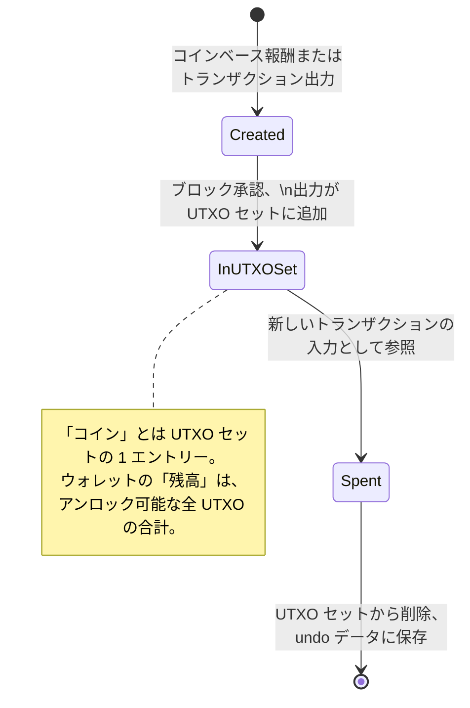
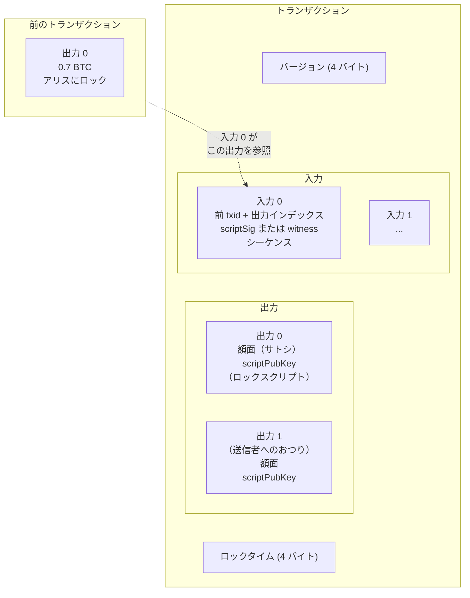
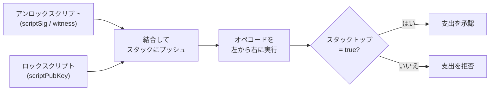
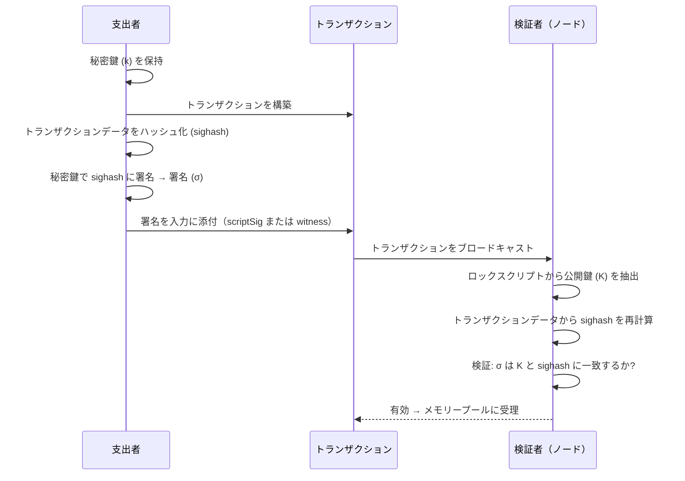
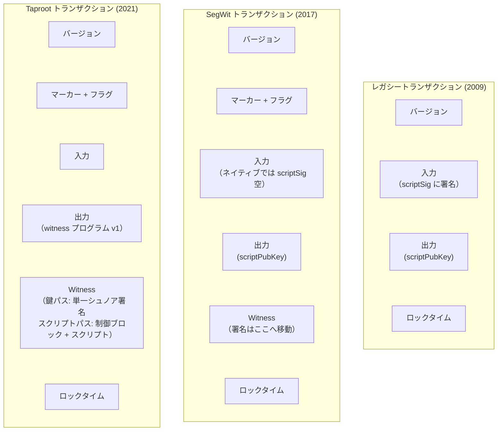

## はじめに

本ページは[設計文書シリーズ](/BitcoinArchive/ja/entries/design/2009-01-03-bitcoin-system-design-overview/)の **L1 #2 — トランザクション設計** である。トランザクション層を端から端まで解説する。価値がどのように表現され、転送され、ロックされ、アンロックされるかを扱う。マイニングのインセンティブ、ブロック重量、手数料市場、ウォレットの使い勝手など、ビットコインのあらゆる要素は、ここで解説する構造の上に成り立っている。

これらの概念がはじめての方は、[ビットコインを持つとは、実際どういうことか](/BitcoinArchive/ja/entries/analysis/2026-09-06-what-owning-a-bitcoin-actually-means/)が UTXO・鍵・トランザクションを事前知識ゼロで紹介している。本ページは同じトランザクション層を、そちらでは扱わない Bitcoin Script の仕組みも含めて設計文書として扱う。

トランザクション層は 3 つの疑問に答える:

1. **コインとは何か?** 未使用トランザクション出力 (UTXO) であり、口座残高ではない。
2. **有効な支払いとはどのような形式か?** 既存の UTXO を消費し、暗号署名で認可を証明し、新しい UTXO を作成するトランザクション。
3. **認可はどのように表現されるか?** ロック条件とアンロック条件を評価するスタックベース言語、ビットコインスクリプトによって表現される。

サトシ時代の実装（v0.1、2009 年 1 月）と現行の Bitcoin Core（v27 以降基準）で挙動が異なる場合は、両方を記す。

### v0.1 のトランザクション経路をソースでたどる

v0.1 のソースコードを読むと、UTXO モデルが具体的な処理として見えてくる。固定コミット `4184ab2` の `src/main.h` 193–363 行にある `CTransaction` は入力、出力、ロックタイムを保持し、`src/main.cpp` 772–854 行の `ConnectInputs` は参照された各出力をたどり、未成熟のコインベースを拒否し、署名を検証し、出力が使用済みか確認し、使用済みとして記録し、入力額から出力額を引いて手数料を計算する。スクリプト側は別の経路だが、接続している。`src/script.cpp` 692–897 行の `OP_CHECKSIG` は署名対象のスクリプトから署名自体を取り除き、レガシー署名ハッシュを構成し、そのダイジェストを公開鍵に対して検証する。

これらのリンクが記録するのは 2009 年 1 月の実装であり、現行 Bitcoin Core が同じ内部コード経路をたどるという主張ではない。そのため、後続の節では v0.1 と現行基準を分けて記載する。

別の [v0.1 直列化境界分析](/BitcoinArchive/ja/entries/analysis/2009-01-09-bitcoin-v01-serialization-boundaries/)では、トランザクション・ブロック・署名ハッシュに入るバイトと、ネットワーク・ディスク経路でオブジェクトが再利用される仕組みを対応付けている。

## 1. UTXO モデル

ビットコインは残高を追跡しない。代わりに、すべてのトランザクションが 1 つ以上の離散的な出力を作成し、各出力は特定の金額とロック条件を持つ。後のトランザクションでまだ消費されていない出力が**未使用トランザクション出力** (UTXO) である。ある時点でのすべての UTXO の集合が、誰が何を支払えるかの完全な全体像となる。

### UTXO ライフサイクル

### UTXO モデルとアカウントモデルの比較

| 特性 | UTXO モデル (ビットコイン) | アカウントモデル ([イーサリアム](/BitcoinArchive/ja/entries/currency/2026-07-27-ethereum-currency-overview/)) |
|---|---|---|
| **状態表現** | 離散的な未使用出力の集合 | アドレスから残高へのマッピング |
| **支払い** | UTXO 全体を消費し、新しい UTXO を作成（おつりを含む） | 送信者の残高を減額、受信者の残高を増額 |
| **プライバシー** | 各トランザクションで新しいアドレスを使用可能。出力は既定でリンク不能 | アドレスに履歴が蓄積。残高がアカウント単位で可視 |
| **並列検証** | 入力は異なる UTXO を参照 — 異なる UTXO に触れるトランザクションは独立して検証可能 | アカウントごとのナンス順序が逐次依存を生む |
| **二重支払い検出** | 参照された UTXO が存在し未使用であることを検査 | 送信者のナンスが正しく残高が十分であることを検査 |
| **状態サイズ** | 未使用出力とともに成長（2025 年時点で約 1.8 億 UTXO） | アカウントとコントラクトストレージとともに成長 |
| **おつり出力** | 入力合計が支払額を超える場合に必要 | 不要。残高はその場で調整 |

## 2. トランザクション構造

トランザクションは、1 つ以上の既存 UTXO（入力）を消費し、1 つ以上の新しい UTXO（出力）を作成する署名済みメッセージである。入力値合計と出力値合計の差がトランザクション手数料となり、そのトランザクションをブロックに含めるマイナーが徴収する。

### トランザクションの構造

### フィールド別の詳細

| フィールド | サイズ | 説明 |
|---|---|---|
| **バージョン** | 4 バイト | トランザクション形式のバージョン。v1 が標準。v2 は BIP 68 の相対的タイムロックを有効化。 |
| **マーカー + フラグ** | 2 バイト | SegWit 識別子 (`0x00 0x01`)。従来型トランザクションには存在しない。 |
| **入力数** | 可変長整数 | 入力の数。 |
| **入力** | 可変長 | 各入力: 前のトランザクション ID (32 バイト) + 出力インデックス (4 バイト) + scriptSig (可変長) + シーケンス (4 バイト)。 |
| **出力数** | 可変長整数 | 出力の数。 |
| **出力** | 可変長 | 各出力: サトシ単位の金額 (8 バイト) + scriptPubKey (可変長)。 |
| **証人** | 可変長 | 入力ごとの証人スタック。SegWit トランザクションにのみ存在。 |
| **ロックタイム** | 4 バイト | トランザクションがブロックに含まれ得る最早の時刻またはブロック高。 |

### サトシ時代と v27 以降基準: トランザクション形式

| 側面 | サトシ時代 (v0.1) | 現行 Bitcoin Core、v27 以降基準 |
|---|---|---|
| **形式** | 従来型: バージョン + 入力 + 出力 + ロックタイム | SegWit: バージョン + マーカー/フラグ + 入力 + 出力 + 証人 + ロックタイム |
| **証人データ** | 存在しない。署名は scriptSig に埋め込み | 証人フィールドに分離 (BIP 141) |
| **トランザクション ID** | トランザクション全体の直列化の SHA-256d | `txid` は証人データを除外。`wtxid` は証人データを含む |
| **展性** | あり — 第三者が scriptSig を変更してもトランザクションは無効にならない | 修正済み — 証人は txid 計算から除外 |
| **バージョン** | 常に 1 | v1 または v2。v2 は相対的タイムロック (BIP 68) を有効化 |

## 3. ビットコインスクリプト

ビットコインのトランザクションは公開鍵に直接ロックされるのではない。代わりに、各出力は**ロックスクリプト**（`scriptPubKey`）と呼ばれる小さなプログラムを持ち、各入力はロック条件を満たす**アンロックスクリプト**（`scriptSig` または証人データ）を提供する。ビットコインスクリプトはこれらのプログラムが書かれるスタックベース言語である。

### スクリプト評価フロー

インタープリターはオペコードを順次処理する。データ項目をスタックにプッシュし、スタック要素を消費・生成する操作を実行する。すべてのオペコード処理後にスタック最上位の要素がゼロでない（真）であれば、支払いは有効である。

### 一般的なスクリプトパターン

| パターン | 導入時期 | ロック機構 | 代表的な用途 |
|---|---|---|---|
| **P2PKH** (公開鍵ハッシュ宛支払い) | v0.1 (2009 年) | 公開鍵のハッシュ。支払者は鍵 + ECDSA 署名を提供 | `1` で始まる従来型アドレス |
| **P2SH** (スクリプトハッシュ宛支払い) | BIP 16 (2012 年) | 償還スクリプトのハッシュ。支払者はスクリプト + 満たすデータを提供 | マルチシグ、ラップされた SegWit。`3` で始まるアドレス |
| **P2WPKH** (証人公開鍵ハッシュ宛支払い) | BIP 141 (2017 年) | 証人プログラム v0、20 バイトの鍵ハッシュ。署名は証人内 | `bc1q` で始まるネイティブ SegWit アドレス |
| **P2WSH** (証人スクリプトハッシュ宛支払い) | BIP 141 (2017 年) | 証人プログラム v0、32 バイトのスクリプトハッシュ。証人がスクリプト + データを提供 | ネイティブ SegWit マルチシグおよび複雑なスクリプト |
| **P2TR** (Taproot 宛支払い) | BIP 341 (2021 年) | 証人プログラム v1、32 バイトの調整済み公開鍵。鍵パスまたはスクリプトパスで支払い | `bc1p` で始まる Taproot アドレス |

### スクリプトの進化: v0.1 から v27 以降へ

| 側面 | サトシ時代 (v0.1) | 現行 Bitcoin Core、v27 以降基準 |
|---|---|---|
| **利用可能なオペコード** | `OP_CAT`、`OP_MUL`、`OP_LSHIFT` 等を含む完全な集合 | 多数を無効化（2010 年のセキュリティパッチ）。Tapscript (BIP 342) で一部を再有効化 |
| **スクリプト型** | P2PK と P2PKH のみ | P2PKH、P2SH、P2WPKH、P2WSH、P2TR |
| **実行モデル** | scriptSig + scriptPubKey を連結して実行 | 分離された評価。証人プログラムは独自の検証規則を持つ |
| **サイズ制限** | 起動時は上限なし。10,000 バイトのスクリプトサイズ上限、201 オペコード上限は 2010 年のセキュリティパッチで追加 | 同じ基本制限。Tapscript では署名操作回数の計算方法を緩和 |

## 4. 署名方式

暗号署名は、支払者が UTXO のロック条件に対応する秘密鍵を管理していることを証明するメカニズムである。ビットコインはその歴史を通じて 2 つの署名方式を使用してきた。

### ECDSA とシュノアの比較

| 特性 | ECDSA (secp256k1) | シュノア (BIP 340) |
|---|---|---|
| **導入** | v0.1 (2009 年) | Taproot 有効化 (2021 年) |
| **楕円曲線** | secp256k1 | secp256k1（同一の曲線） |
| **署名サイズ** | 70〜72 バイト（DER 符号化） | 64 バイト（固定長） |
| **検証** | 署名ごとに 1 つの方程式 | 署名ごとに 1 つの方程式。一括検証可能 |
| **鍵集約** | ネイティブ非対応 | MuSig2 により n-of-n 集約を単一の鍵と署名に |
| **線形性** | 非線形 — 集約に複雑なプロトコルが必要 | 線形 — `s₁ + s₂` が結合鍵の有効な署名 |
| **証明可能な安全性** | 離散対数問題を超えた追加の仮定に依存 | ランダムオラクルモデルでの離散対数仮定の下で証明可能 |
| **ライブラリ** | 当初 OpenSSL。libsecp256k1 に移行 | libsecp256k1（同一ライブラリ、シュノアモジュール） |

### 署名と検証のフロー

## 5. SegWit と Taproot

SegWit（Segregated Witness、2017 年）と Taproot（2021 年）は、ビットコインのトランザクション形式に対する誕生以来最大の 2 つの構造的変更である。どちらも後方互換性のあるソフトフォークである。以下で述べる展性の修正は、ビットコイン最大の保管崩壊事案である [Mt. Gox 倒産](/BitcoinArchive/ja/entries/aftermath/2014-02-28-mt-gox-bankruptcy/)の背景にあった窃盗で悪用された経路を塞いだものである。

### 構造比較

### 主要な革新

| 革新 | 仕組み | 利点 |
|---|---|---|
| **証人ディスカウント** | 証人バイトは 1/4 の重量で計算 (4 WU ではなく 1 WU) | 署名の多いトランザクションの実効手数料を削減。データを証人に移すインセンティブ |
| **トランザクション展性の修正** | 証人を txid 計算から除外 | 信頼性のあるトランザクション連鎖が可能に (Lightning Network の前提条件) |
| **スクリプトバージョニング** | 証人バージョンフィールドにより新規スクリプト規則をソフトフォークで導入可能 | 将来のアップグレード（Taproot 自体が証人 v1 を使用）が既存ノードを壊さない |
| **鍵パス支払い** | 単一のシュノア署名で出力鍵を直接検証 | マルチシグ、タイムロック、複雑な条件がすべてチェーン上では単一鍵の支払いに見える — 最大限のプライバシー |
| **スクリプトパス支払い (MAST)** | 代替スクリプトのマークルツリー。実行された分岐のみが公開される | 複雑なコントラクトが使用したパスだけを露出。未使用の分岐はプライベートなまま |
| **一括検証の可能性** | シュノア署名は線形に集約可能 | ノードが複数の署名を個別検証より高速に検証できる |

## 6. コイン選択

ウォレットがトランザクションを構築する際、入力としてどの UTXO を支払うかを選択する必要がある。これが**コイン選択**問題である。この選択はトランザクションサイズ（したがって手数料）、プライバシー（どの UTXO がチェーン上でリンクされるか）、ウォレットの UTXO プールの将来の形状に影響する。

| 戦略 | アプローチ | トレードオフ |
|---|---|---|
| **最大額優先** | 支払いをカバーする最大の UTXO を選ぶ | 単純で統合傾向。ウォレット残高を暴露する大きなおつり出力を生む |
| **分岐限定法** (BnB) | 完全一致の組み合わせを探索（おつり出力不要） | おつり出力を排除し約 34 バイト節約。完全一致がなければ失敗 |
| **ナップサック** | 支払額 + 最小おつりを目標にランダム選択 | BnB 失敗時のフォールバック。微小おつりが生じる可能性 |
| **コインコントロール** | ユーザーが支払う UTXO を手動選択 | 最大限のプライバシー制御。ユーザーの専門知識が必要 |
| **無駄指標** (v27 以降) | 現在と長期的な手数料コストおよびおつりコストで候補を評価 | 即時の手数料と将来のおつり UTXO 支払いコストのバランスを取る |

現行の Bitcoin Core（v27 以降基準）は複数戦略のパイプラインを使用する。まず BnB を試行し（おつりなしトランザクション）、ナップサックにフォールバックし、無駄指標ですべての候補を評価して最低コストの選択肢を採用する。サトシの v0.1 はより単純な最大額優先方式を使用していた。

## 7. 二時代比較

| 機能 | サトシ時代 (v0.1、2009 年 1 月) | 現行 Bitcoin Core、v27 以降基準 |
|---|---|---|
| **価値表現** | UTXO（未使用トランザクション出力） | 同一 |
| **トランザクション形式** | 従来型（バージョン + 入力 + 出力 + ロックタイム） | SegWit（+ マーカー/フラグ + 証人） |
| **トランザクション ID** | 完全直列化トランザクションの SHA-256d | `txid`（証人除外）+ `wtxid`（証人含む） |
| **スクリプト型** | P2PK、P2PKH | P2PKH、P2SH、P2WPKH、P2WSH、P2TR |
| **署名方式** | OpenSSL 経由の ECDSA | ECDSA + シュノア（libsecp256k1 経由） |
| **署名サイズ** | 70〜72 バイト (DER) | ECDSA: 70〜72 バイト。シュノア: 64 バイト（固定長） |
| **鍵集約** | 利用不可 | MuSig2（n-of-n シュノア集約） |
| **オペコードの利用可能性** | 完全な集合（後に無効化されたオペコードを含む） | 縮小された集合。Tapscript で一部のオペコードを再有効化 |
| **展性** | 脆弱 — 第三者が scriptSig を変更可能 | 修正済み — 証人は txid から除外 |
| **重量/サイズ制限** | トランザクション単位の重量なし。2010 年にブロックサイズ上限を追加 | 最大 400,000 WU の標準トランザクション重量 |
| **タイムロック** | 絶対ロックタイムのみ（ブロック高または Unix 時刻） | 絶対（ロックタイム）+ 相対 (BIP 68 シーケンス) + スクリプトレベル (`OP_CLTV`、`OP_CSV`) |
| **手数料引上げによる置換** | 未実装。先着順ポリシー | オプトイン RBF（BIP 125、v0.12）。`-mempoolfullrbf` は v24.0 で追加され、完全 RBF は v28.0 以降の既定ポリシー |
| **手数料推定** | なし（実質的にトランザクションは無料） | `estimatesmartfee` — バケットベースのメモリープール手数料推定 |
| **コイン選択** | 単純な最大額優先 | BnB + ナップサック + 無駄指標パイプライン |
| **暗号ライブラリ** | OpenSSL | libsecp256k1（定数時間、正式監査済み） |
| **UTXO ストレージ** | Berkeley DB | LevelDB（インメモリーキャッシュ付き、コインキャッシュ） |

## 8. 本ページの範囲

本ページはトランザクション層を独立して扱う。以下のトピックは本ページの範囲外であり、[設計文書シリーズ](/BitcoinArchive/ja/entries/design/2009-01-03-bitcoin-system-design-overview/)内のそれぞれのドメインページで扱う:

- **ブロック構造とマークルツリー**: トランザクションがブロックにバッチされマークルルートでコミットされる仕組み。
- **マイニングとプルーフ・オブ・ワーク**: どのトランザクションがブロックチェーンに入るかを選択するインセンティブメカニズム。
- **メモリープールポリシー**: 中継規則、手数料率の下限、承認前のトランザクション伝播を制御するパッケージ中継。
- **ネットワーク層のトランザクション中継**: `inv`、`getdata`、`tx` メッセージが P2P ネットワーク上でトランザクションを伝播させる仕組み。
- **Lightning Network とペイメントチャネル**: ここで説明したトランザクション基本要素の上に構築されるレイヤー 2 構成。
- **ウォレットの鍵導出**: ロックスクリプトで使用されるアドレスを生成する BIP 32/44/84/86 の HD 鍵ツリーとディスクリプターウォレット。

トランザクションは、他のすべての設計ページが触れる対象である。[ブロックチェーン設計](/BitcoinArchive/ja/entries/design/2009-01-03-bitcoin-block-chain-design/)ではブロックの中身、[暗号設計](/BitcoinArchive/ja/entries/design/2009-01-03-bitcoin-cryptography-design/)では署名とハッシュの消費者、[貨幣設計](/BitcoinArchive/ja/entries/design/2009-01-03-bitcoin-monetary-design/)ではコインベースと手数料の仕組み、[P2P ネットワーク設計](/BitcoinArchive/ja/entries/design/2009-01-03-bitcoin-p2p-network-design/)では伝播される中身、[ストレージ設計](/BitcoinArchive/ja/entries/design/2009-01-03-bitcoin-storage-design/)では UTXO 集合を更新する単位、[ウォレット設計](/BitcoinArchive/ja/entries/design/2009-01-03-bitcoin-wallet-design/)では組み立てて署名する対象、[エコシステム設計](/BitcoinArchive/ja/entries/design/2009-01-03-bitcoin-ecosystem-design/)では手数料市場とライトニングが扱う単位である。
