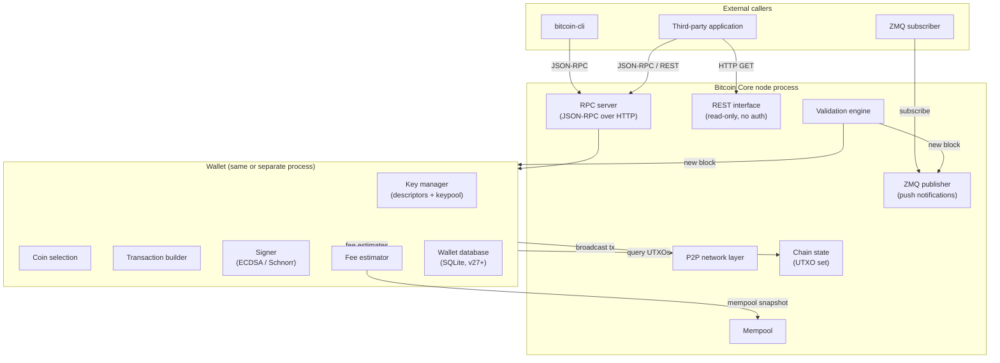
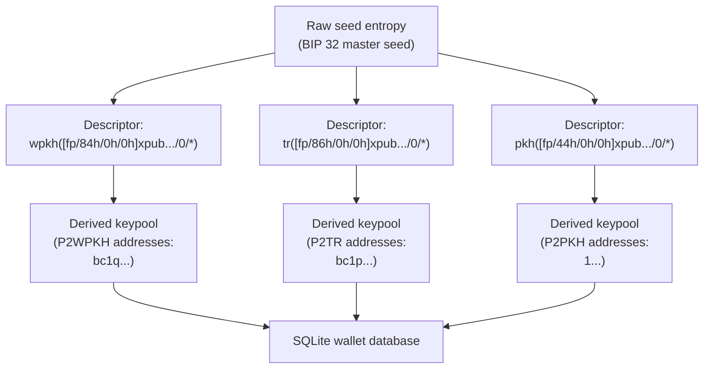
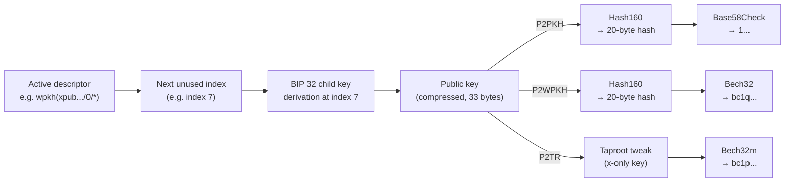
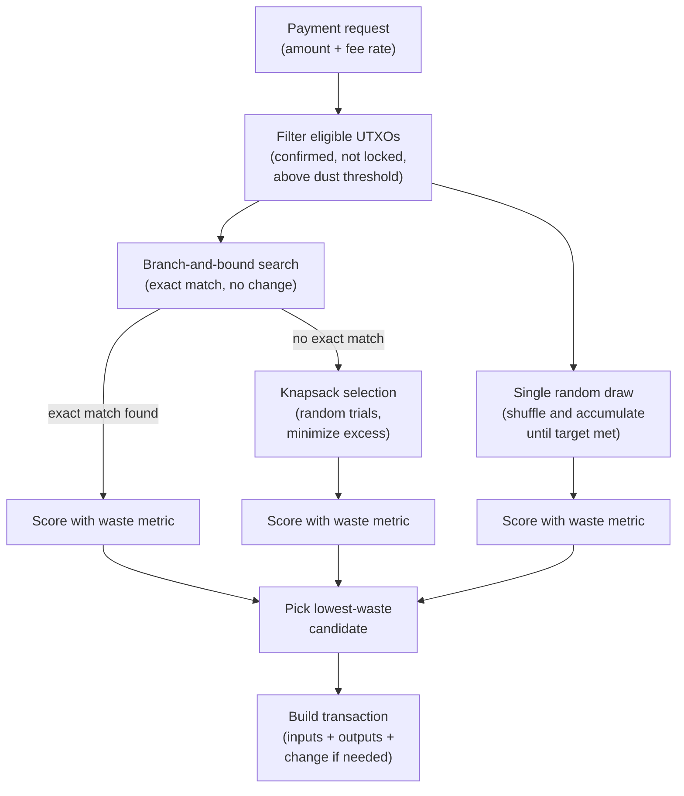
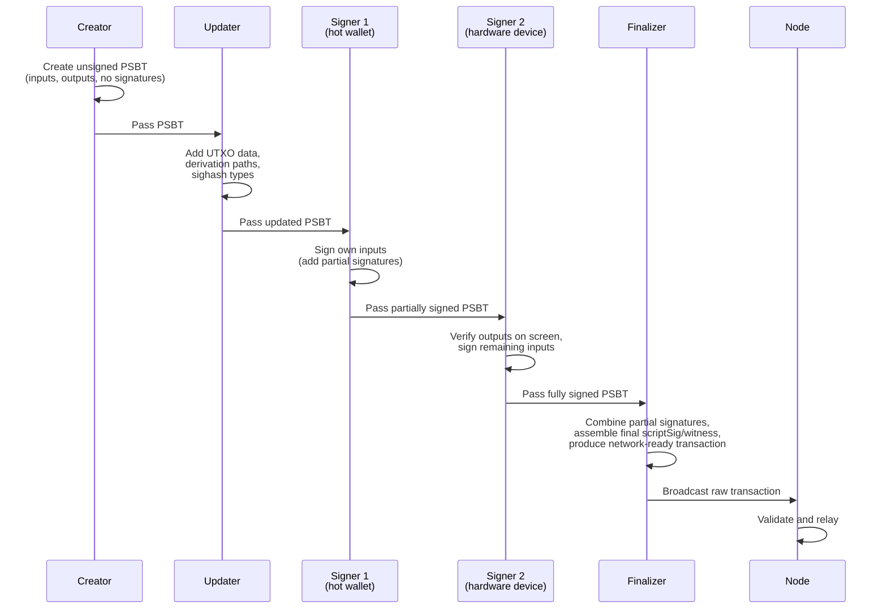
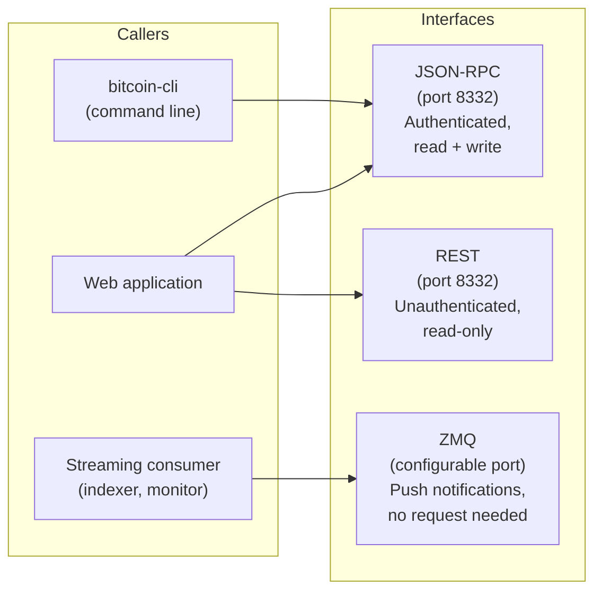
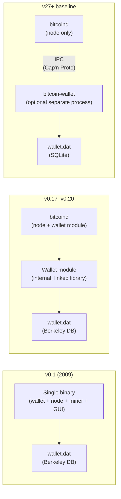

## はじめに

本ページは[設計文書シリーズ](/BitcoinArchive/ja/entries/design/2009-01-03-bitcoin-system-design-overview/)の第 8 編であり、Bitcoin Core のアプリケーション層を扱う: ソフトウェアが鍵をどう管理し、アドレスをどう導出し、コインをどう選択し、トランザクションをどう構築・署名し、手数料をどう推定し、外部呼び出し元にどう機能を公開するか。[トランザクション設計ページ](/BitcoinArchive/ja/entries/design/2009-01-03-bitcoin-transaction-design/)の UTXO モデルとスクリプトタイプ、および[暗号設計ページ](/BitcoinArchive/ja/entries/design/2009-01-03-bitcoin-cryptography-design/)の鍵導出と署名の基本要素に依存する。

ウォレットはビットコインにおいて秘密鍵に触れる唯一のサブシステムである。他のすべてのコンポーネント — 検証、中継、ストレージ、合意形成 — は公開データのみで動作する。この非対称性が、ウォレットをノードバイナリー内の密結合モジュールから論理的に（そして次第に物理的にも）分離されたプロセスへと進化させる原動力となった。

サトシ時代の実装（v0.1、2009 年 1 月）と現代の Bitcoin Core（v27 以降を基準）で挙動が異なる箇所は、双方を記載する。

## 1. ウォレットアーキテクチャの概要

以下の図はウォレットの Bitcoin Core プロセス内での位置と、通信するインターフェースを示す。v27 以降ではウォレットは任意で IPC 経由でノードに接続する別プロセスとして動作できる。

### サトシ時代のアーキテクチャ

v0.1 ではウォレットはインターフェース境界なしにノードバイナリーに組み込まれていた。GUI、鍵ストア、マイナー、検証エンジンがすべて単一のプロセスと単一の Berkeley DB ファイル（`wallet.dat`）を共有していた。初回リリース時には RPC サーバーは存在せず、JSON-RPC は稼働開始後の最初の数週間以内に追加された。

## 2. 鍵管理

鍵管理はウォレットの最も重要な責務である。秘密鍵を失うことは、それが管理する資金を永久に失うことを意味する — 訴える先の復旧機関は存在しない。

### レガシー鍵プール（v0.1〜v0.20）

サトシの v0.1 ウォレットは鍵を独立に生成していた: 各秘密鍵は `wallet.dat` に保存される新規乱数だった。100 鍵の事前生成プール（「鍵プール」）が先読みを提供し、今日取得されたバックアップが近い将来に生成されるアドレスもカバーできるようにしていた。しかし、最後のバックアップ以降に作成された鍵は、ウォレットファイルが破壊されると失われた。

### 記述子ウォレット（v0.21 以降、v23 以降で既定）

現代の Bitcoin Core はレガシー鍵モデルを**出力記述子**（BIP 380〜386）で置き換える: ウォレットがアドレスをどう導出し、自身の出力をどう認識するかを完全に指定する合成可能な式。

| 特性 | レガシーウォレット | 記述子ウォレット（v27 以降） |
|---|---|---|
| **鍵の出所** | 独立した乱数鍵 | 記述子からの決定性導出 |
| **バックアップモデル** | 新しい鍵のたびに `wallet.dat` をエクスポート | 1 回のシードバックアップで将来のすべての鍵をカバー |
| **スクリプトタイプ認識** | ウォレットが鍵のコンテキストからタイプを推測 | 記述子がスクリプトタイプを明示的に宣言 |
| **監視専用サポート** | 別の監視専用ウォレットをインポート | `xpub` のみ（秘密鍵なし）の任意の記述子が監視専用になる |
| **マルチスクリプト対応** | 暗黙的（BIP 44/49/84/86 規約） | 明示的 — 各記述子が個別の導出規則 |
| **ストレージバックエンド** | Berkeley DB（`wallet.dat`） | SQLite（新形式の `wallet.dat`） |
| **移行パス** | — | `migratewallet` RPC でレガシー → 記述子に変換 |

## 3. アドレス生成

ビットコインアドレスはロックスクリプトのペイロードをユーザー向けにエンコードしたものである。ウォレットはアクティブな記述子からアドレスを生成し、アドレスが払い出されるたびに鍵プールを循環させる。

ウォレットは**ギャップリミット** — 最後に使用されたアドレスの先に導出する連続未使用アドレスの数 — を維持する。インデックス `n` のアドレスを使用するトランザクションが検出されると、ウォレットは常に未使用アドレスが利用可能になるよう鍵プールを拡張する。これにより、シードフレーズからの復元時に、トランザクションが見つからなくなるまでギャップリミット分を前方走査することで、すべての資金付きアドレスを再発見できる。

鍵導出の暗号学的詳細（BIP 32 HMAC-SHA512、強化導出と通常導出、secp256k1 スカラー乗算）およびエンコード形式（Base58Check、Bech32、Bech32m）は[暗号設計ページ](/BitcoinArchive/ja/entries/design/2009-01-03-bitcoin-cryptography-design/)で扱う。

## 4. コイン選択

ウォレットがトランザクションを構築する際、どの UTXO を入力として使用するかを選択しなければならない。コイン選択の問題は手数料最適化、プライバシー、UTXO プールの健全性の交差点に位置する。[トランザクション設計ページ](/BitcoinArchive/ja/entries/design/2009-01-03-bitcoin-transaction-design/)で戦略を紹介した。本節では現代の選択パイプラインを詳述する。

### 選択パイプライン（v27 以降）

### 浪費指標

浪費指標は、選択されたコインを今使う場合のコストと、仮想的な長期手数料率で使う場合のコストを比較して各候補選択を採点する。不必要なお釣り出力を罰し、完全一致（お釣りなし）の解を報酬する。計算式は 3 つの要素のバランスをとる:

| 要素 | 計測対象 | 効果 |
|---|---|---|
| **入力コスト** | 選択された入力のウェイト × (現在の手数料率 − 長期手数料率) | 長期レートに対して過払いの場合に正; 現在の手数料が低い場合に負（統合の好機） |
| **お釣りコスト** | お釣り出力の作成と後の使用にかかるコスト | 常に正 — お釣りは今の追加出力と後の追加入力 |
| **超過分** | お釣りなしトランザクションで手数料として失われる目標超過額 | 分枝限定法のわずかな超過分を手数料に充てる解にのみ適用 |

浪費スコアが低いほど良い。ウォレットは異なる戦略からのすべての候補選択を評価し、最も低い浪費の選択を採用する。

## 5. PSBT ワークフロー

部分署名ビットコイントランザクション（BIP 174 / BIP 370）はトランザクション構築と署名を分離する。PSBT は署名者が必要とするすべてのメタデータ — UTXO データ、導出パス、償還スクリプト — を持ち運び、ブロックチェーンへのアクセスがないデバイスでも署名できるようにする。

### PSBT の役割

| 役割 | 処理内容 | 通常の担当者 |
|---|---|---|
| **作成者** | 入力と出力を定義; 未署名 PSBT を生成 | ウォレットソフトウェア、`createpsbt` RPC |
| **更新者** | UTXO 詳細、導出情報、スクリプトを添付 | 同じウォレットまたはコーディネーター; `walletprocesspsbt` RPC |
| **署名者** | 管理する入力に部分署名を追加 | ハードウェアウォレット、エアギャップマシン、または `walletprocesspsbt` |
| **結合者** | 複数署名者からの部分署名を 1 つの PSBT に統合 | `combinepsbt` RPC |
| **完了者** | すべての署名から最終的な scriptSig / witness を組み立て | `finalizepsbt` RPC |
| **抽出者** | 完了済み PSBT から完成したネットワーク送信可能なトランザクションを取り出す | `finalizepsbt`（PSBT と生の 16 進数の両方を返す） |

**PSBT が重要な理由。** BIP 174 以前は、マルチデバイス署名にはアドホックな形式やベンダー固有のプロトコルが必要だった。PSBT は、準拠するどのウォレットでも生成、更新、署名、完了できる単一のポータブルで自己記述的なコンテナーを提供する。ハードウェアウォレット統合、マルチシグワークフロー、CoinJoin 調整、トランザクションを構築するデバイスが鍵を保持するデバイスではないあらゆるシナリオの基盤である。

## 6. 手数料推定

ビットコインのトランザクションは限られたブロック空間を競う。ウォレットは目標ブロック数以内でトランザクションが承認される可能性の高い手数料率（仮想バイトあたりのサトシ数）を推定しなければならない。

### 推定メカニズム

Bitcoin Core の `estimatesmartfee` はトランザクションがメモリープールに入った時の手数料率を追跡し、各トランザクションが承認までに何ブロック待ったかを記録する。トランザクションは手数料率でバケットに分類され、各バケットについて推定器は成功率 — その手数料率のトランザクションのうち `n` ブロック以内に承認された割合 — を維持する。指定された承認目標に対する推定値は、成功率が閾値（経済的モードで 85%、保守的モードで 95%）を超える最低手数料率バケットである。

| モード | 閾値 | 挙動 | 典型的な用途 |
|---|---|---|---|
| **経済的** | 85% 成功率 | 低手数料、承認がやや遅れるリスク | 緊急でない支払い |
| **保守的** | 95% 成功率 | 高手数料、より確実な承認 | 時間に敏感な支払い |

### 手数料推定の進化

| 側面 | サトシ時代（v0.1） | 現代の Bitcoin Core、v27 以降基準 |
|---|---|---|
| **手数料の要件** | トランザクションは無料; 手数料は任意 | 必須; 手数料なしのトランザクションはメモリープールポリシーで拒否 |
| **推定** | なし — 手数料市場が存在しなかった | バケットベースのメモリープール追跡（`estimatesmartfee`） |
| **手数料引き上げ** | 利用不可 | RBF（`bumpfee` RPC）、CPFP（低手数料出力を高手数料の子で使用） |
| **最低中継手数料** | 0.01 BTC（後に引き下げ） | 1 sat/vB 既定（`minrelaytxfee`） |

## 7. RPC・REST・ZMQ インターフェース

Bitcoin Core は外部呼び出し元に 3 つのインターフェースを公開する。それぞれ異なるアクセスパターンに対応する。

### RPC コマンドカテゴリー

| カテゴリー | コマンド例 | 処理内容 |
|---|---|---|
| **ブロックチェーン** | `getblockchaininfo`、`getblock`、`gettxoutsetinfo` | チェーン状態、ブロックデータ、UTXO セット統計の問い合わせ |
| **ウォレット** | `getnewaddress`、`sendtoaddress`、`listunspent`、`walletprocesspsbt` | 鍵管理、トランザクション構築、コイン選択 |
| **トランザクション** | `getrawtransaction`、`decoderawtransaction`、`sendrawtransaction` | 生のトランザクションの検査、作成、ブロードキャスト |
| **マイニング** | `getblocktemplate`、`submitblock`、`getmininginfo` | ブロックテンプレート構築と提出（プール運営者向け） |
| **ネットワーク** | `getpeerinfo`、`addnode`、`getnetworkinfo` | ピア管理、接続状態、帯域幅統計 |
| **制御** | `stop`、`uptime`、`logging`、`getmemoryinfo` | ノードのライフサイクルと診断 |
| **手数料** | `estimatesmartfee` | 目標承認ウィンドウに対する手数料率推定 |
| **PSBT** | `createpsbt`、`walletprocesspsbt`、`combinepsbt`、`finalizepsbt` | 秘密鍵に直接触れない完全な PSBT ワークフロー |

### インターフェース比較

| 特性 | JSON-RPC | REST | ZMQ |
|---|---|---|---|
| **プロトコル** | HTTP POST（JSON 本文） | HTTP GET（URL パス） | TCP プッシュ（パブ/サブ） |
| **認証** | クッキーまたはユーザー名/パスワード（`rpcauth`） | なし（設計上読み取り専用） | なし（ローカルネットワーク前提） |
| **方向** | 要求 → 応答 | 要求 → 応答 | サーバーがサブスクライバーにプッシュ |
| **書き込みアクセス** | あり（トランザクション送信、ウォレット管理） | なし | なし（通知のみ） |
| **データ形式** | JSON | JSON、バイナリー、または 16 進数（呼び出し元の選択） | 生のバイナリー（ブロックハッシュ、トランザクションハッシュ、または完全なシリアライズされたブロック/トランザクション） |
| **典型的な呼び出し元** | `bitcoin-cli`、ウォレットアプリ、取引所バックエンド | ブロックエクスプローラー、軽量モニター | インデクサー、リアルタイムダッシュボード、Lightning ノード |
| **ZMQ トピック** | — | — | `hashblock`、`hashtx`、`rawblock`、`rawtx`、`sequence` |

## 8. ノードからのウォレット分離

サトシの v0.1 はウォレット、マイナー、GUI、検証エンジンを単一のバイナリーにコンパイルしていた。現代の Bitcoin Core はウォレットをノードから漸進的に分離してきた。

| マイルストーン | バージョン | 変更内容 |
|---|---|---|
| **ウォレットインターフェース定義** | v0.17（2018 年） | 内部の `interfaces::Wallet` 抽象化がウォレットロジックをノードロジックから分離 |
| **`-disablewallet` オプション** | v0.8（2013 年） | ウォレットを読み込まずにノードを実行可能 |
| **マルチウォレット対応** | v0.17（2018 年） | 単一のノードが複数のウォレットファイルを同時に読み込み管理 |
| **記述子ウォレット** | v0.21（2021 年） | 新しいウォレット形式; v23 以降で新規ウォレットの既定 |
| **Berkeley DB 非推奨** | v26（2023 年） | 新規ウォレットは SQLite のみを使用; レガシー BDB ウォレットは移行可能だが BDB サポートはまだ完全には削除されていない |
| **マルチプロセス化（実験的）** | v27 以降（2024 年） | 実験的な `bitcoin-node` / `bitcoin-wallet` プロセス分離（IPC は Cap'n Proto）。`bitcoin-wallet` CLI ツールはオフラインウォレット操作を処理; 完全な IPC ベースの実行時分離は進行中で既定ではない |

**分離が重要な理由。** ウォレットは秘密鍵 — システム内で最も機密性の高いデータ — を扱う。論理的分離（既に達成済み）と最終的な物理的プロセス分離により、鍵を保持するコンポーネントを制限された環境で動作させ、ノードは公開的に検証可能なチェーンデータを処理する。

## 9. 二つの時代の比較

| 機能 | サトシ時代（v0.1、2009 年 1 月） | 現代の Bitcoin Core、v27 以降基準 |
|---|---|---|
| **アーキテクチャ** | ウォレットが単一バイナリーノードに組み込み | 論理的に分離済み; 実験的マルチプロセス分離が進行中 |
| **鍵生成** | ランダム鍵プール（100 個の独立鍵） | 記述子ウォレット: マスターシードからの決定性導出 |
| **鍵ストレージ** | Berkeley DB（`wallet.dat`） | SQLite（新形式の `wallet.dat`） |
| **バックアップモデル** | 新しい鍵のたびにファイルをエクスポート; バックアップ後の新しい鍵は復元不能 | 記述子バックアップがすべての導出鍵をカバー（BIP 39 ではなく生の BIP 32 シード） |
| **アドレスタイプ** | P2PK、P2PKH のみ | P2PKH、P2SH、P2WPKH、P2WSH、P2TR |
| **アドレスエンコード** | Base58Check | Base58Check（レガシー）、Bech32、Bech32m |
| **コイン選択** | 単純な最大額優先 | 分枝限定法 + ナップサック + 単一ランダム抽出; 浪費指標による採点 |
| **トランザクション署名** | 内部、同一プロセス | 内部、PSBT（BIP 174/370）、またはハードウェアウォレット（HWI 経由） |
| **マルチデバイス署名** | 未対応 | PSBT ワークフロー: 作成 → 更新 → 署名 → 結合 → 完了 |
| **手数料推定** | なし（大半のトランザクションが無料） | バケットベースのメモリープール追跡; 経済的モードと保守的モード |
| **手数料引き上げ** | 利用不可 | 手数料置換（`bumpfee`）、CPFP |
| **インターフェース** | リリース時はなし; 直後に基本的な JSON-RPC を追加 | JSON-RPC（完全）、REST（読み取り専用）、ZMQ（プッシュ通知） |
| **マルチウォレット** | ノードあたり 1 ウォレット | 複数ウォレットを同時に読み込み; `loadwallet` / `unloadwallet` |
| **暗号化** | 利用不可 | `encryptwallet` — 保存時の秘密鍵を AES-256-CBC で暗号化 |
| **監視専用** | 未対応 | `xpub` のみ（秘密鍵なし）の任意の記述子 |
| **プロセスモデル** | 一体型（ウォレット + ノード + マイナー + GUI） | モジュール型: `bitcoind`（ノード）、`bitcoin-wallet`（ウォレット）、`bitcoin-qt`（GUI） |

## 10. 本ページの範囲

本ページは Bitcoin Core のウォレットとインターフェース層を扱う。以下のトピックは範囲外であり、[設計文書シリーズ](/BitcoinArchive/ja/entries/design/2009-01-03-bitcoin-system-design-overview/)内のそれぞれのページで扱う:

- **トランザクション構造とスクリプト** — 入力、出力、ロックスクリプトがプロトコルレベルでどう機能するか。[トランザクション設計ページ](/BitcoinArchive/ja/entries/design/2009-01-03-bitcoin-transaction-design/)で扱う。
- **暗号学的基本要素** — 楕円曲線数学、ハッシュ関数、HD 導出の内部（BIP 32 HMAC-SHA512）、署名アルゴリズム。[暗号設計ページ](/BitcoinArchive/ja/entries/design/2009-01-03-bitcoin-cryptography-design/)で扱う。
- **メモリープールポリシー** — 中継規則、手数料率の下限、パッケージリレー、手数料置換の適用。[ネットワーク設計ページ](/BitcoinArchive/ja/entries/design/2009-01-03-bitcoin-p2p-network-design/)で扱う。
- **マイニングとブロックテンプレート** — マイナーがメモリープールからトランザクションを選択し候補ブロックをどう構築するか。[合意形成設計ページ](/BitcoinArchive/ja/entries/design/2009-01-03-bitcoin-consensus-design/)で扱う。
- **サードパーティーウォレット** — Electrum、Sparrow、ハードウェアウォレット、モバイルウォレットは Bitcoin Core リファレンス実装の外部のアプリケーション層ソフトウェア。
- **Lightning Network** — ここで記述したトランザクションと PSBT の基本要素の上に構築されるが、別のプロトコルで動作するレイヤー 2 決済チャネル。
